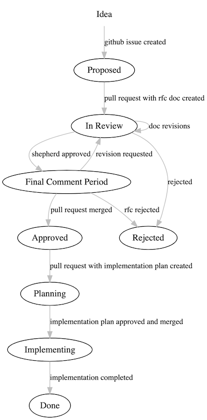

# Contribution Guide

**cdk8s** is licensed under [Apache 2.0](./LICENSE) and accepts contributions via
GitHub pull requests. This document outlines some of the conventions on commit
message formatting, contact points for developers, and other resources to help
get contributions into cdk8s.

You can contribute to **cdk8s** in many ways. Contributions of all shapes and sizes are
welcome and celebrated:

- [Reporting Issues](#reporting-issues)
- [Code Contributions](#code-contributions)
- [RFCs](#rfcs)

We follows the [CNCF Community Code of
Conduct](https://github.com/cncf/foundation/blob/master/code-of-conduct.md)

## Reporting Issues

If any part of the project has bugs or documentation mistakes, please let us
know by raising an issue. We treat bugs and mistakes very seriously
and believe no issue is too small. Before creating a bug report, please check
that an issue reporting the same problem does not already exist.

In addition, make sure you are submitting the issue to the correct repository.
If you know your issue petains to a specific cdk8s package, it better belongs in the respective repository.

> For a list of the repositories, see [Repositories](https://github.com/cdk8s-team/cdk8s#repositories)

An issue can either be a **bug report** or a **feature-request**. If you wish to ask
a question or seek guidance, please consider one of the other [support
channels](#getting-help).

### Bug reports

To make the bug report accurate and easy to understand, please try to create bug
reports that are:

- **Specific**: Include as much details as possible: which version, what
  environment, what configuration, etc.
- **Reproducible**: Include the steps to reproduce the problem. We understand
  some issues might be hard to reproduce, please includes the steps that might
  lead to the problem. If possible, please provide a minimal code snippet that
  reproduces the bug.
- **Isolated**: Please try to isolate and reproduce the bug with minimum
  dependencies. It would significantly slow down the speed to fix a bug if too
  many dependencies are involved in a bug report.
- **Unique**: Do not duplicate existing bug report.
- **Scoped**: One bug per report. Do not follow up with another bug inside one
  report.

We might ask for further information to locate a bug. A duplicated bug report
will be closed.

Submit a bug report [here](new-issue).

### Feature Requests

We also accept suggestions for new features or missing capabilities as GitHub
issues. The most important aspect of a suggestion issue is to provide as many
details as possible about your **use case** and less focus on the solution. It
is usually possible to support different use cases in many different ways, and
we need to understand the motivation before we dive into a solution.

If you wish to suggest a major change to the project, please consider to submit
an [RFC](#rfcs) instead of a simple issue. An RFC also starts with a GitHub
issue.

Submit a suggestion [here](new-issue)

## Code Contributions

The general workflow for code contributions:

1. Submit/find an issue in **this repository**
2. Clone [the relevant repo](#repositories)
3. Make your code change
4. Write tests & update docs
5. Build & test locally
6. Submit a pull request
7. (Iterate)
8. Your PR will be approved and merged

### Tracking issue

All pull requests should be tracked with a GitHub issue.

You should search for an [existing
issue](https://github.com/cdk8s-team/cdk8s/issues) or raise a [new
bug or suggestion](#reporting-issues).


Add a comment indicating you are willing to pick it up in order to ensure no one
else is currently working on it.

If this is a major contribution, consider submitting an [RFC](#rfcs) to obtain
feedback from the community and maintainers.

### Repositories

This project consists of multiple modules, maintained and released via the following repositories:

- [cdk8s-cli](https://github.com/cdk8s-team/cdk8s-cli): command-line interface
- [cdk8s-core](https://github.com/cdk8s-team/cdk8s-core): core library
- [cdk8s-plus](https://github.com/cdk8s-team/cdk8s-plus): high-level constructs for Kubernetes core.

### Pull Requests

We use the PR title when we automatically generate the change log for each
release. Therefore please following these guidelines to the letter:

- **PR title**:
  - Must adhere to [conventional
    commits](https://www.conventionalcommits.org/en/v1.0.0/).
  - All lowercase with no period at the end of the title
  - If this is a `fix` (bug) the title should describe the bug
  - If this is a `feat` (feature) the title should describe the feature
- **PR description**:
  - Describe how did you fix the bug or what changes you had to make in order to
    implement the feature
  - Indicate `fixes #NNN` or `resolves #NNN` with the tracking issue number.
  - If you *had* to test your change manually, describe how you tested it and
    paste the test results.
  - If this is a breaking change, the last paragraph should describe the
    breaking change with the prefix `BREAKING CHANGE: xxxxxx`.

#### Developer Certificate Of Origin (DCO)

Every commit should be signed-off in compliance with the [Developer Certificate Of Origin](./DCO).
You can sign your commits by using the `git commit -s` command.

> To configure automatic signoff, see [git-hooks](./git-hooks/README.md).

## Documentation

Documentation is rendered from markdown using
[mkdocs-material](https://squidfunk.github.io/mkdocs-material/) and sourced from
the [`docs`](https://github.com/cdk8s-team/cdk8s/tree/master/docs) directory.

API documentation for `cdk8s` and all `cdk8s-plus-*` packages is auto-generated from inline
docstrings during build.

To test locally, install python3 deps:

```shell
pip3 install -r docs/requirements.txt
```

And then:

```shell
mkdocs serve
```

This will serve a local web server with the website.

> A good reference for syntax and capabilities is the [mkdocs-material](https://squidfunk.github.io/mkdocs-material) website.

## Examples

https://github.com/cdk8s-team/cdk8s-examples

## RFCs

To start an RFC process, create a [new tracking issue] and follow the
instructions in the issue template. It includes a checklist of the various
stages an RFC goes through.

[new tracking issue]: https://github.com/cdk8s-team/cdk8s/issues/new?assignees=&labels=enhancement&template=rfc.md&title=%5BRFC%5D+describe+your+RFC

This section describes each stage in detail, so you can refer to it for
guidance.

### 1. Tracking Issue

Each RFC has a GitHub issue which tracks it from start to finish. The issue is
the hub for conversations, community signal (+1s) and the issue number is used
as the unique identifier of this RFC.

> Before creating a tracking issue, please search for similar or related ideas in
the RFC table above or in the issue list of this repo. If there is a relevant
RFC, collaborate on that existing RFC, based on its current stage.

Our [tracking issue template] includes a checklist of all the steps an RFC goes
through and it's the driver's responsibility to update the checklist and assign
the correct label to on the RFC throughout the process.

[tracking issue template]: https://github.com/cdk8s-team/cdk8s/blob/master/.github/ISSUE_TEMPLATE/rfc.md

When the issue is created, it is required to fill in the following information:

1. **Title**: the name of the feature or change - think changelog entry.
2. **Description**: a _short_ description of feature, as if it was already implemented.
3. **Proposed by**: fill in the GitHub alias of the person who proposed the idea
   under "Proposed by".

### 2. API Bar Raiser

Reach us via [#cdk8s](https://cdk-dev.slack.com/archives/C0184GCBY4X) to get an "API Bar Raiser" assigned to your RFC.

For each RFC, cdk8s leadership will assign an **API Bar Raiser** who reviews and
approves the public API of the feature. API Bar Raisers have veto rights on
API-related design decisions, such as naming, structure, options, CLI commands
and others.

The public API of a feature represents the surface through which users interact
with it, and we want to make sure these APIs are consistent, ergonomic and
designed based on the intent and the mental model of our users. Additionally,
once we announce that a feature is "stable" (1.0, GA, etc) any breaking change
to its public API will require releasing a new major version, so we like think
of API decisions as "one way doors".

API Bar Raisers will be assigned using a tiering model which is generally based
on the size of the user base that will likely get exposed to the feature. As a
general rule, the more "significant" the feature is, we will assign a bar raiser
with a wider and longer-term context of the project.

To merge an RFC, a [sign-off](#6-api-sign-off) from the bar raiser is required
on the public API of the feature, so we encourage to engage with them early in
the process to make sure you are aligned on how the API should be designed.

> NOTE: The technical solution proposed in an RFC *does not* require approval
> beyond the normal pull request approval model (e.g. a core team member needs
> to approve the RFC PR and any subsequent changes to it).

### 3. Kick-off

Before diving into writing the RFC, it is highly recommended to organize a
kick-off meeting that includes the API Bar Raiser and any stakeholders that
might be interested in this RFC or can contribute ideas and direction. The goal
of the meeting is to discuss the feature, its scope and general direction for
implementation.

If you are not part of the cdk8s team at Amazon, reach out to us via [#cdk8s](https://cdk-dev.slack.com/archives/C0184GCBY4X) and we will help to organize the kick-off meeting.

Our experience shows that such a meeting can save a lot of time and energy.

You can use the tracking issue to record some initial API and design ideas and
collect early feedback and use cases as a preparation for the kick-off meeting
and RFC document itself. You can start the meeting by letting participants
obtaining context from the tracking issue.

At the end of the meeting, record any ideas and decisions in the tracking issue
and update the checklist to indicate that the kick-off meeting has happened.

### 4. RFC Document

The next step is to write the first revision of the RFC document itself.

Create a file under `rfc/NNNN-name.md` based off of the template under
[`0000-template.md`](./rfc/0000-template.md) (where `NNNN` is your tracking issue
number). Follow the template. It includes useful guidance and tips on how to
write a good RFC.

**What should be included in an RFC?** The purpose of an RFC is to reduce
ambiguity and risk and get approval for public-facing interfaces (APIs), which
are "one-way doors" after the feature is released. Another way to think about it
is that the goal and contents of the document should allow us to create a
*high-confidence* implementation plan for a feature or a change.

In many cases, it is useful to develop a **prototype** or even start coding the
actual implementation while you are writing the RFC document. Take into account
that you may need to throw your code away or refactor it substantially, but our
experience shows that good RFCs are the ones who dive into the details. A
prototype is great way to make sure your design "holds water".

### 5. Feedback

Once you have an initial version of your RFC document (it is completely fine to
submit an unfinished RFC to get initial feedback), submit it as a pull request
against this repo and start collecting feedback.

Contact the cdk8s core team at [#cdk8s](https://cdk-dev.slack.com/archives/C0184GCBY4X) (or via email/Slack if you are part of the core team) and reach out to the public and Amazon internal communities
via various Slack channels in [cdk.dev](https://cdk.dev), Twitter and any other
relevant forum.

This is the likely going to be the longest part of your RFC process, and where
most of the feedback is collected. Some RFCs resolve quickly and some can take
months (!!). *Take into account at least 1-2 weeks to allow community and
stakeholders to provide their feedback.*

A few tips:

- If you decide to resolve a comment without addressing it, take the time to
  explain.
- Try to understand where people are coming from. If a comment seems off, ask
  folks to elaborate and describe their use case or provide concrete examples.
- Work with your API bar raiser: if there are disagreements, @mention them in a
  comment and ask them to provide their opinion.
- Be patient: it sometimes takes time for an RFC to converge. Our experience
  shows that some ideas need to "bake" and solutions oftentimes emerge via a
  healthy debate. We've had RFCs that took months to resolve.
- Not everything must be resolved in the first revision. It is okay to leave
  some things to resolve later. Make sure to capture them clearly and have an
  agreement about that. We oftentimes update an RFC doc a few times during the
  implementation.

### 6. API Sign-off

Before you can merge your RFC, you will need the API Bar Raiser to sign-off on
the public API of your feature. This is will normally be described under the
**Working Backwards** section of your RFC.

To sign-off, the API bar raiser will add the **api-approved** label to the RFC
pull request.

Once the API was signed-off, update your RFC document and add a `[x]` the
relevant location in the RFC document. For example:

```
[x] Signed-off by API Bar Raiser @foobar
```

### 7. Final Comments Period

At some point, you've reached consensus about most issues that were brought up
during the review period, and you are ready to merge. To allow "last call" on
feedback, the author can announce that the RFC enters "final comments period",
which means that within a ~week, if no major concerns are raised, the RFC will
be approved and merged.

Add a comment on the RFC pull request, tracking issue (and possibly slack/email
if relevant) that the RFC entered this stage so that all relevant stakeholders
will be notified.

Once the final comments period is over, seek an approval of one of the core team
members, and you can merge your PR to the main branch. This will move your RFC
to the "approved" state.

### 8. Implementation

For large changes, we highly recommend creating an implementation plan which
lists all the tasks required. In many cases, large implementation  should be
broken down and released via multiple iterations. Devising a concrete plan to
break down the break can be very helpful.

The implementation plan should be submitted through a PR that adds an addendum
to the RFC document and seeks the approval of any relevant stakeholders.

Throughout this process, update the tracking issue:

- Add the alias of the "implementation lead"
- Execution plan submitted (label: `status/planning`)
- Plan approved and merged (label: `status/implementing`)
- Implementation complete (label: `status/done`)

## State Diagram

The following state diagram describes the RFC process:



<!--
digraph states {
    node [shape=ellipse];
    edge [color=gray, fontsize=12]

    idea [label = "Idea", shape = plaintext]
    proposed [label = "Proposed"];
    review [label = "In Review"];
    fcp [label = "Final Comment Period"];
    approved [label = "Approved"];
    plannning [label = "Planning"];
    implementing [label = "Implementing"];
    done [label = "Done"];
    rejected [label = "Rejected"];

    idea -> proposed [label = "github issue created"]
    proposed -> review [label = "pull request with rfc doc created"];
    review -> review [label = "doc revisions"];
    review -> fcp [label = "shepherd approved"];
    review -> rejected [label = "rejected"];
    fcp -> review [label = "revision requested"];
    fcp -> approved [label = "pull request approved and merged"];
    fcp -> rejected [label = "rfc rejected"];
    approved -> plannning [label = "pull request with implementation plan created"];
    plannning -> implementing [label = "rfc with implementation plan approved and merged"];
    implementing -> done [label = "implementation completed"];
}
-->

1. **Proposed** - A tracking issue has been created with a basic outline of the
   proposal.
2. **Review** - An RFC document has been written with a detailed design and a PR is
   under review. At this point the PR will be assigned a **shepherd** from the core
   team.
3. **Final Comment Period** - The shepherd has approved the RFC PR, and announces
   that the RFC enters a period for final comments before it will be approved (~1wk).
   At this stage, if major issues are raised, the RFC may return to **Review**.
4. **Approved** - The RFC PR is approved and merged to `master`, and the RFC is now
   ready to be implemented.
5. **Planning** - A PR is created with the **Implementation Plan** section of the RFC.
6. **Implementing** - Implemetation plan is approved and merged and the RFC is actively
   being implemented.
7. **Done** - Implementation is complete and merged across appropriate
   repositories.
8. **Rejected** - During the review period, the RFC may be rejected and then it will
   be marked as such.

## Community Meeting

> Note: Community meetings are currently on hold. We will be back soon. Keep an eye out for announcements on the #cdk8s channel in [cdk.dev](https://cdk.dev/) workspace.

Join us for the cdk8s community meeting which takes place the [2nd Monday of the
month at 9:00am Pacific
Time](https://www.thetimezoneconverter.com/?t=9:00&tz=PT%20%28Pacific%20Time%29).

- Meeting link: [https://chime.aws/7929414778](https://chime.aws/7929414778)
- [Agenda](https://docs.google.com/document/d/1QmZS2_cphxbs2VPfDCkrUVcoDwiawryh704hEfAyrBk/edit?usp=sharing)

---

Portions of this guide were adopted from the contribution guides of the [AWS
CDK](https://github.com/aws/aws-cdk) and [etcd](https://github.com/etcd-io/etcd).
