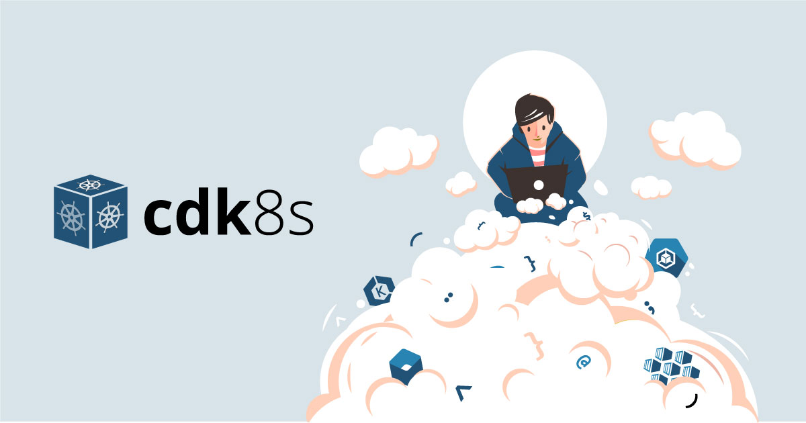

# Cloud Development Kit for Kubernetes




[](https://badge.fury.io/js/cdk8s)
[](https://badge.fury.io/py/cdk8s)
[](https://badge.fury.io/nu/Org.Cdk8s)
[](https://maven-badges.herokuapp.com/maven-central/org.cdk8s/cdk8s)
[](https://formulae.brew.sh/formula/cdk8s#default)


**cdk8s** is a software development framework for defining Kubernetes
applications and reusable abstractions using familiar programming languages and
rich object-oriented APIs. cdk8s generates pure Kubernetes YAML - you can use
cdk8s to define applications for any Kubernetes cluster running anywhere.

This is an early-stage, experimental project built with ❤️ by AWS. We encourage you to [try it out](#getting-started), [leave feedback](#help--feedback), and [jump in to help](#contributing)!

### Contents

- [Overview](#overview)
- [At a glance](#at-a-glance)
- [Getting Started](#getting-started)
- [Help & Feedback](#help--feedback)
- [Examples](#examples)
- [Roadmap](#roadmap)
- [Community](#community)
- [Contributing](#contributing)
- [License](#license)

## Overview

**cdk8s** apps are programs written in one of the supported programming
languages. They are structured as a tree of
[constructs](https://github.com/aws/constructs).

The root of the tree is an `App` construct. Within an app, users define any
number of charts (classes that extend the `Chart` class). Each chart is
synthesized into a separate Kubernetes manifest file. Charts are, in turn,
composed of any number of constructs, and eventually from resources, which
represent any Kubernetes resource, such as `Pod`, `Service`, `Deployment`,
`ReplicaSet`, etc.

cdk8s apps only ***define*** Kubernetes applications, they don't actually apply
them to the cluster. When an app is executed, it *synthesizes* all the charts
defined within the app into the `dist` directory, and then those charts can be
applied to any Kubernetes cluster using `kubectl apply -f dist/chart.k8s.yaml` or a GitOps tool like [Flux](https://fluxcd.io/).

> **cdk8s** is based on the design concepts and technologies behind the [AWS
Cloud Development Kit](https://aws.amazon.com/cdk), and can interoperate with
AWS CDK constructs to define cloud-native applications that include both
Kubernetes resources and other CDK constructs as first class citizens.

Read [our blog](https://aws.amazon.com/blogs/containers/introducing-cdk-for-kubernetes/) or [watch our CNCF webinar](https://www.cncf.io/webinars/end-yaml-engineering-with-cdk8s/) to learn more and see a live demo of cdk8s in action.

## At a glance


## Getting Started

Choose your weapon:

- [TypeScript](./docs/getting-started/typescript.md)
- [Python](./docs/getting-started/python.md)

## Advanced

### Escape Hatches

In the case where `cdk8s+` doesn't satisfy your needs or importing a custom resource doesn't work, you can always fall back to `cdk8s` escape hatches. Escape hatches can also help you migrate your infrastructure to `cdk8s` by providing a way to mix your legacy YAML with `cdk8s` constructs.

`cdk8s` offers two ways for you to use escape hatches:

#### Overrides

Overrides are great when you want _most_ of what a `cdk8s+` (or other) construct offers, but you want to change some property. Here's an example:

Perhaps you are creating a `kplus.Deployment`

```ts
import * as kplus from 'cdk8s-plus';

const deployment = new kplus.Deployment(chart, 'Deployment', {
  spec: {
    replicas: 3,
    podSpecTemplate: {
      containers: [ container ]
    }
  },
});
```

`cdk8s+` lets you set set replicas and the pod spec, but does not have an option for `strategy`. It leaves it to the default `RollingUpdate`. If you want to specify this, but still want to use `cdk8s+` constructs, you can use an override like so:

```ts
deployment.addOverride('spec.strategy', 'Recreate')
```

#### Raw k8s Template Insertion

Let's now say that you're in the middle of migrating your infrastructure to `cdk8s`. You can mix YAML or JSON into your `cdk8s` app like so:

```ts
import { Construct } from 'constructs';
import { Chart, Raw } from 'cdk8s';

class MyChart extends Chart {
 constructor(scope: Construct, name: string) {
    super(scope, name);

    new Raw(this, 'raw', {
      apiVersion: 'apps/v1',
      kind: 'Deployment',
      .
      .
      .
    })
  }
}
```

You can also mix raw YAML or JSON from a file:

```ts
import { Construct } from 'constructs';
import { Chart, Raw, RawOptions } from 'cdk8s';

class MyChart extends Chart {
 constructor(scope: Construct, name: string) {
    super(scope, name);

    const options = new RawOptions({ file: './example.yaml' })

    new Raw(this, 'raw', options)
  }
}
```


## Help & Feedback

Interacting with the community and the development team is a great way to
contribute to the project. Please consider the following venues (in order):

* Search [open issues](https://github.com/awslabs/cdk8s/issues)
* Stack Overflow: [cdk8s](https://stackoverflow.com/questions/tagged/cdk8s)
* File a [new issue](https://github.com/awslabs/cdk8s/issues/new/choose)
* Mailing list: [cdk8s](https://groups.google.com/forum/#!forum/cdk8s)
* Slack: [cdk8s.slack.com](https://join.slack.com/t/cdk8s/shared_invite/enQtOTY0NTMzMzY4MjU3LWMyYzM2ZmQzOTAyZjAzY2E5MGNjNmJlMDgwZWQwM2M0YTAwMTE5MmE3ZGM3OWY2N2ZkYjQ3NjBkOWYwMDg0ZWU)

## Examples

See our [Examples Directory](./examples/README.md).

## Roadmap

See our [roadmap](https://github.com/awslabs/cdk8s/projects/1) for details about our plans for the project.

## Community

See [Awesome cdk8s](https://github.com/dungahk/awesome-cdk8s).

## Contributing

The cdk8s project adheres to the [CNCF Code of
Conduct](https://github.com/cncf/foundation/blob/master/code-of-conduct.md).

We welcome community contributions and pull requests. See our [contribution
guide](./CONTRIBUTING.md) for more information on how to report issues, set up a
development environment and submit code.

## License

This project is distributed under the [Apache License, Version 2.0](./LICENSE).
