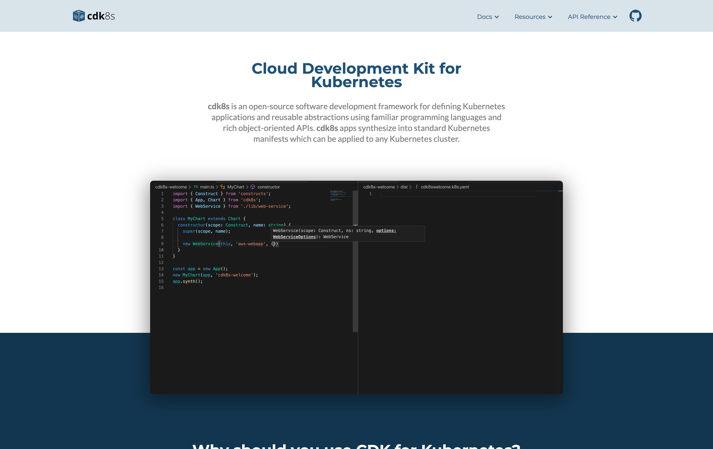

<h1>CDK8s.io</h1>
<kbd>
  
</kbd>
<br />
<br />

- [:building\_construction: Architecture](#building_construction-architecture)
- [⚠️ Prerequisites](#️-prerequisites)
- [:rocket: Quick start](#rocket-quick-start)
- [📦 Building the production site](#-building-the-production-site)
- [:house: cdk8s.io landing page](#house-cdk8sio-landing-page)
- [📖 cdk8s.io/docs/\* pages](#-cdk8siodocs-pages)
- [:heavy\_plus\_sign: Where do the cdk8s-plus-\* docs come from?](#heavy_plus_sign-where-do-the-cdk8s-plus--docs-come-from)
- [📄 Adding, removing, reordering or renaming pages](#-adding-removing-reordering-or-renaming-pages)
- [🖼️ Assets and custom CSS](#️-assets-and-custom-css)
- [🔌 Plugins, features, and global configuration](#-plugins-features-and-global-configuration)
- [👨‍💻 Development resources](#-development-resources)

## :building_construction: Architecture

[CDK8s.io](https://cdk8s.io) a [static site](https://gohugo.io/about/benefits/) split into two parts:

- The landing page for [CDK8s.io](https://cdk8s.io) is built using [Hugo](https://gohugo.io/) from the [`cdk8s/website`](../website/) directory.
- The documentation pages that are served under [cdk8s.io/docs/*](https://cdk8s.io/docs) are built using [MkDocs](https://www.mkdocs.org/) in the [`cdk8s/docs/`](.) directory (same location as the README.md file that you're currently reading).

## ⚠️ Prerequisites

- [Node.js](https://nodejs.org/en/download/)
- [Yarn v1](https://classic.yarnpkg.com/en/docs/install#mac-stable)
- [Python3](https://www.python.org/downloads/)
- [Hugo](https://gohugo.io/installation/)

## :rocket: Quick start

**1. Install the Node dependencies**

From the root of this repo (`cdk8s/`) run:

```bash
# Root of repo
yarn install
```

> This will…
>
> - Install the latest release of the currently supported `cdk8s-plus-*` packages. We'll need this later to copy the doc files from each package into the [`cdk8s/docs/`](.) directory.

**2. Build the documentation pages**

Run the [build docs script](./build.sh):

```bash
# Root of repo
./docs/build.sh
```

> This will…
>
> - Install the pip dependencies.
> - Copy the cdk8s-plus doc files from each `cdk8s/node_modules/cdk8s-plus-*` package into [`cdk8s/docs/plus/`](./plus/).
> - Copy the [`cdk8s/Roadmap.md`](../ROADMAP.md), [`cdk8s/CONTRIBUTING.md`](../CONTRIBUTING.md) and [`cdk8s/CHANGELOG.md`](../CHANGELOG.md) files into the [`cdk8s/docs/`](.) directory.
> - Build the documentation pages using MkDocs and copy them to the [`cdk8s/website/public/docs/latest`](../website/public/docs/latest) directory.

**3. Run the MkDocs server to preview the documentation content of the site.**

```bash
# Root of repo
mkdocs serve
```

> This should start the server at [http://127.0.0.1:8000](http://127.0.0.1:8000/)

**4. (Optional) Run the Hugo server to preview the landing page**

You'll need to have [Hugo](https://gohugo.io/getting-started/installing/) installed. Then in a new terminal run:

```bash
# Root of repo
cd website && hugo server && cd -
```

> This should start the server at [http://127.0.0.1:1313](http://127.0.0.1:1313/)

> Changes made to the docs content in `cdk8s/docs/*` will not be reflected in the Hugo server. You'll need to re-run the [build docs script](./build.sh) to see the changes or use the MkDocs server from step 3.

## 📦 Building the production site

**1. Build the landing page.**

```bash
# Root of repo
cd website && ./build.sh && cd -
```

**2. Build the MkDocs pages and copy them to Hugo's public directory.**

Run the [build docs script](./docs/build.sh):

```bash
# Root of repo
./docs/build.sh
```

> The site's static files should now be available in the `cdk8s/website/public/*` directory ready for deployment.

## :house: cdk8s.io landing page

The content of the [landing page](https://cdk8s.io/) is maintained in [`cdk8s/website/config.yaml`](../website/config.yaml). You'll see the various sections, and some commentary from the theme authors on where images are loaded from.

Sections can be removed by simply omitting their `section` key from `config.yaml`.

> The code for the landing page is located in [`cdk8s/website/static/js/webflow.js`](../website/static/js/webflow.js). However it is not recommended to edit this file. It was generated using [Webflow](https://webflow.com/) and is difficult to read. It's source Webflow project is no longer available. _This is obviously not an ideal implementation. It stands as one of the major justifications that a revamp is due for this website._

## 📖 cdk8s.io/docs/* pages

The documentation content is located in the [`cdk8s/docs/`](.) directory. This content is written in Markdown and is built using MkDocs. Here are a few pointers to help save you time.

## :heavy_plus_sign: Where do the cdk8s-plus-* docs come from?

In the [cdk8s-plus](https://github.com/cdk8s-team/cdk8s-plus) repo, documentation from [`cdk8s-plus/docs/plus/*`](https://github.com/cdk8s-team/cdk8s-plus/tree/k8s-25/main/docs/plus) is included in the auto published NPM package. This way documentation can be version specific and easily maintained alongside the source code.

If you'd like to modify the content of any cdk8s-plus-* docs, you'll need to do so in the respective [cdk8s-plus](https://github.com/cdk8s-team/cdk8s-plus) release branch.

> e.g. To update the cdk8s-plus-24 docs you'll need to
> 1. Commit changes to the [cdk8s-plus/k8s-24/main](https://github.com/cdk8s-team/cdk8s-plus/tree/k8s-24/main/docs/plus) branch.
> 2. Wait for the [release-k8s.24](https://github.com/cdk8s-team/cdk8s-plus/actions/workflows/release-k8s.24.yml) GitHub workflow to auto publish a new NPM package.
> 3. Bump this project's dependencies by running the [cdk8s upgrade](https://github.com/cdk8s-team/cdk8s/actions/workflows/upgrade.yml) GitHub workflow.
> 4. Re-run the yarn install and docs build script (see [:rocket: Quick start](#rocket-quick-start) section).

## 📄 Adding, removing, reordering or renaming pages

A `.pages` file can be used in each directory to describe the page structure of the site. This is a feature provided by the [Awesome pages plugin](https://henrywhitaker3.github.io/mkdocs-material-dark-theme/plugins/awesome-pages/). Check out their docs for more info.

To hide a file, omit the file from the parent directory's `.pages` file.

> Notice how the README.md file that you're reading is located in the [`cdk8s/docs/`](.) directory but it will not be included in the site unless we add it to the [`cdk8s/docs/.pages`](./.pages) file.

## 🖼️ Assets and custom CSS

The [`cdk8s/docs/assets/`](./assets/) directory is to store assets that are used in the documentation (e.g. images). The [`cdk8s/docs/assets/extra.css`](./assets/extra.css) is a file we've defined to apply custom CSS should you need it.

## 🔌 Plugins, features, and global configuration

The [`cdk8s/mkdocs.yaml`](../mkdocs.yml) file is used to define MkDocs configuration.

This is where you can define:
- The logo
- Site name
- Favicon
- Theme colors
- Footer content
- Extensions (e.g. multi-tab content block, table of content settings)
- Plugins (e.g. search)

Check out the [MkDocs config documentation](https://www.mkdocs.org/user-guide/configuration/) for more info.

## 👨‍💻 Development resources

- [MkDocs material theme setup](https://squidfunk.github.io/mkdocs-material/setup/changing-the-colors/) - This is the MkDocs theme that we use. This is also where you'll find APIs that enable you to customize the color theme, fonts, logo, and site search.
- [MkDocs material theme API](https://squidfunk.github.io/mkdocs-material/reference/) - Create Admonitions, Annotations, Buttons, Code blocks, Content tabs, Icons, Images, and more.
- [MkDocs site config docs](https://www.mkdocs.org/user-guide/configuration/) - Lists the global MkDocs configuration options that can be defined in `cdk8s/mkdocs.yaml`.
- [MkDocs plugin docs](https://www.mkdocs.org/dev-guide/plugins/) - Defines the plugin API that can be used to extend MkDocs.
- [Site search plugin docs](https://henrywhitaker3.github.io/mkdocs-material-dark-theme/plugins/search/) - This is the search plugin we use and is where you'll find APIs that allow you to customize the search experience.
- [Awesome pages plugin docs](https://henrywhitaker3.github.io/mkdocs-material-dark-theme/plugins/awesome-pages/) - Used to define the page structure of the site using `.pages` files.
