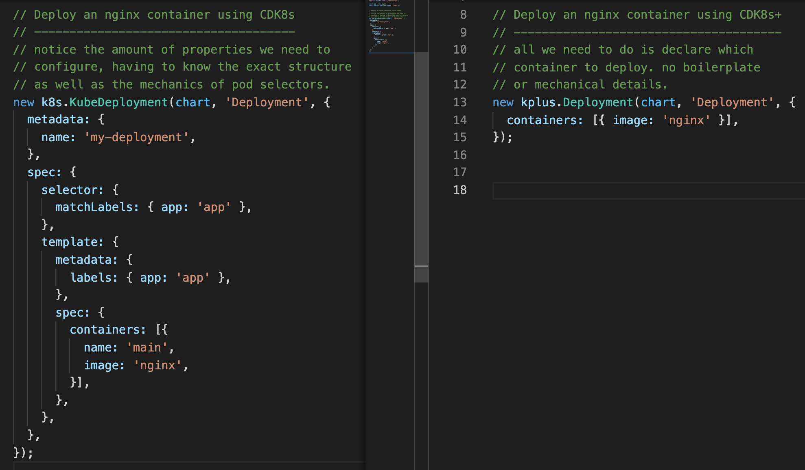

# Overview

**cdk8s+** is a library with high level abstractions for authoring Kubernetes
applications.

Built on top of the auto-generated building blocks provided by cdk8s, this
library includes a hand crafted *construct* for each native kubernetes object,
exposing richer API's with reduced complexity.

Here is an example of how we would deploy a simple nginx container, once with the low-level API (on the left), and once with the high level abstraction (on the right).



**cdk8s+** is vended as a separate library for each kubernetes spec version. The documentation presented here represents version [1.22.0](https://github.com/kubernetes/kubernetes/tree/v1.22.0/api/openapi-spec)
and is vended as the `cdk8s-plus-22` library.

### Naming conventions

- Stable resources are represented by a *construct* of the same *kind*. For example, the `io.k8s.api.core.v1.Pod` resource maps to the `Pod` *construct*.
- Non stable resources are suffixed with their *api version*. For example, the `io.k8s.api.networking.v1beta1.Ingress` maps to the `IngressV1Beta1` *construct*.

### Spec compatibility

Per kubernetes [compatibility guarantees](https://kubernetes.io/docs/concepts/overview/kubernetes-api/#api-groups-and-versioning), **stable** resources in this library are compatible with
any spec version higher or equal to `1.22.0`. **Non-stable** resources are not guaranteed to be compatible, as they may be removed in future spec versions.

!!! notice

    If you are deploying manifests produced by `cdk8s-plus-22` onto clusters of a lower version, you might encounter some unsupported spec properties or invalid manifests.

## FAQ

### What's the difference between `cdk8s-plus-20`, `cdk8s-plus-21`, and `cdk8s-plus-22`?

These are separately vended libraries that each target a different kubernetes
version, marked by the `-XX` suffix. For example, `cdk8s-plus-22` targets
kubernetes version `1.22.0`.

We offer a dedicated package per Kubernetes version to allow users to match
their manifests to the Kubernetes version they are operating. This way, users
are only exposed to a set of capabilities offered by their specific cluster,
preventing deployment errors caused by version mismatches.

For example, imagine we had published a single library for all Kubernetes versions (call it `cdk8s-plus`).
This library would have had support for the [`namespaceSelector`](https://kubernetes.io/docs/concepts/scheduling-eviction/assign-pod-node/#namespace-selector) property when configuring pod affinity rules. This property was only added in Kubernetes 1.21.0.

Now imagine you operate Kubernetes 1.20.0. In such a case, you would have access to the `namespaceSelector` property, even though
it is unsupported, and will result in a deployment failure if you use it. With a dedicated package, this property would not be available
for you to (mis)use.

### I operate Kubernetes version `1.XX` - which cdk8s+ library should I be using?

If there is a `cdk8s-plus-XX` library that matches your target Kubernetes
version, we recommend using it since all Kubernetes manifests generated using it
will be compatible.

If there is not a matching `cdk8s-plus-XX` library, we recommend using the
closest matching version. The manifests generated by `cdk8s-plus-XX` may also
work for older versions of Kubernetes, but you might encounter some unsupported
spec properties or invalid manifests.

### I'm using `cdk8s-plus-XX` - which kubernetes versions will my manifest work on?

If you are using stable APIs (those that are not in alpha or beta), manifests
generated in `cdk8s-plus-XX` will work in Kubernetes versions `1.XX.0` and
above. Unstable APIs (which are always labeled in cdk8s+ using a suffix, e.g.
`IngressV1Beta1`) may work in newer versions of Kubernetes, but it is also
possible they have been removed.

The manifests generated by `cdk8s-plus-XX` may also work for older versions of
Kubernetes, but you might encounter some unsupported spec properties or invalid
manifests.

## At a glance

```typescript
import * as kplus from 'cdk8s-plus-22';
import * as cdk8s from 'cdk8s';
import * as path from 'path';

// our cdk app
const app = new cdk8s.App();

// our kubernetes chart
const chart = new cdk8s.Chart(app, 'my-chart');

// lets create a volume that contains our app.
// we use a trick with a config map!
const appData = new kplus.ConfigMap(chart, 'AppData');
appData.addDirectory(path.join(__dirname, 'app'));

const appVolume = kplus.Volume.fromConfigMap(appData);

// lets create a deployment to run a few instances of a pod
const deployment = new kplus.Deployment(chart, 'Deployment', {
  replicas: 3,
});

// now we create a container that runs our app
const appPath = '/var/lib/app';
const port = 80;
const container = deployment.addContainer({
  image: 'node:14.4.0-alpine3.12',
  command: ['node', 'index.js', `${port}`],
  port: port,
  workingDir: appPath,
});

// make the app accessible to the container
container.mount(appPath, appVolume);

// finally, we expose the deployment as a load balancer service and make it run
deployment.expose(8080, {serviceType: kplus.ServiceType.LOAD_BALANCER})

// we are done, synth
app.synth();
```

??? "dist/my-chart.yaml"
    ```yaml
    apiVersion: v1
    data:
      index.js: |-
        var http = require('http');

        var port = process.argv[2];

        //create a server object:
        http.createServer(function (req, res) {
          res.write('Hello World!'); //write a response to the client
          res.end(); //end the response
        }).listen(port); //the server object listens on port 80
    kind: ConfigMap
    metadata:
      annotations: {}
      labels: {}
      name: chart-appdata-configmap-da4c63ab
    ---
    apiVersion: apps/v1
    kind: Deployment
    metadata:
      annotations: {}
      labels: {}
      name: chart-deployment-pod-d4285cc9
    spec:
      replicas: 3
      selector:
        matchLabels:
          cdk8s.deployment: ChartDeploymentCFC2E30C
      template:
        metadata:
          annotations: {}
          labels:
            cdk8s.deployment: ChartDeploymentCFC2E30C
        spec:
          containers:
            - command:
                - node
                - index.js
                - "80"
              env: []
              image: node:14.4.0-alpine3.12
              name: main
              ports:
                - containerPort: 80
              volumeMounts:
                - mountPath: /var/lib/app
                  name: configmap-chart-appdata-configmap-da4c63ab
              workingDir: /var/lib/app
          volumes:
            - configMap:
                name: chart-appdata-configmap-da4c63ab
              name: configmap-chart-appdata-configmap-da4c63ab
    ---
    apiVersion: v1
    kind: Service
    metadata:
      annotations: {}
      labels: {}
      name: chart-deployment-service-pod-42f50c26
    spec:
      externalIPs: []
      ports:
        - port: 8080
          targetPort: 80
      selector:
        cdk8s.deployment: ChartDeploymentCFC2E30C
      type: LoadBalancer
    ```

## Getting Started

=== "TypeScript/JavaScript"

    `❯ npm install cdk8s-plus-22 cdk8s`

    ```typescript
    import * as kplus from 'cdk8s-plus-22';
    import * as cdk8s from 'cdk8s';

    const app = new cdk8s.App();
    const chart = new cdk8s.Chart(app, 'Chart');

    new kplus.Deployment(chart, 'Deployment', {
      replicas: 3,
      containers: [{
        image: 'ubuntu',
      }],
    });

    app.synth();
    ```

=== "Python"

    `❯ pip install --pre cdk8s-plus-22 cdk8s`

    ```python
    import cdk8s_plus_22 as kplus
    import cdk8s

    app = cdk8s.App()
    chart = cdk8s.Chart(app, 'Chart')

    kplus.Deployment(chart, 'Deployment',
      replicas=1,
      containers=[kplus.ContainerProps(image='ubuntu')]
    )

    app.synth()
    ```

=== "Java"

    ```xml
    <dependency>
      <groupId>org.cdk8s</groupId>
      <artifactId>cdk8s</artifactId>
      <version>1.0.0-beta.46</version>
    </dependency>
    <dependency>
      <groupId>org.cdk8s</groupId>
      <artifactId>cdk8s-plus-22</artifactId>
      <version>1.0.0-beta.1</version>
    </dependency>
    ```

    ```java
    import org.cdk8s.App;
    import org.cdk8s.Chart;
    import org.cdk8s.plus22.Deployment;
    import org.cdk8s.plus22.ContainerProps;

    App app = new App();
    Chart chart = new Chart(app, "Chart");

    Deployment.Builder.create(this, "Deployment")
      .replicas(3)
      .containers(Arrays.asList(ContainerProps.builder()
        .image("ubuntu")
        .build()))
      .build();

    app.synth();
    ```

=== "Go"

    ```go
    import (
      "github.com/aws/constructs-go/constructs/v10"
      "github.com/aws/jsii-runtime-go"
      "github.com/cdk8s-team/cdk8s-core-go/cdk8s/v2"
      "github.com/cdk8s-team/cdk8s-plus-go/cdk8splus22"
    )
    ```

    ```go
    app := cdk8s.NewApp(nil)
    chart := cdk8s.NewChart(app, jsii.String("ubuntu"), nil)

    cdk8splus22.NewDeployment(chart, jsii.String("Deployment"), &cdk8splus22.DeploymentProps{
      Replicas: jsii.Number(3),
      Containers: &[]*cdk8splus22.ContainerProps{{
        Image: jsii.String("ubuntu"),
      }},
    })

    app.Synth()
    ```
