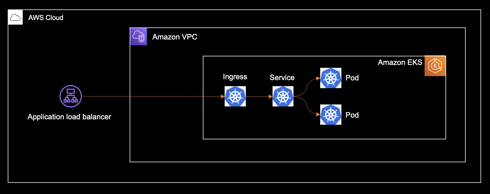

# Kubernetes End-2-End | AWS

In this example, we will walk through an end-to-end guide for deploying
a Kubernetes application from scratch to AWS. We will:

1. Provision an Amazon EKS cluster.
3. Install the KubeView cluster visualizer onto the cluster.
4. Deploy a Kubernetes application.

Since we are deploying to AWS, we will use the AWS CDK as our framework. AWS CDK integrates
with Helm, which we will use for common middleware, and cdk8s, which we will use for our application definition. This allows us to define all our components in the same codebase, and deploy it all with a single tool.

> **If you're just interested in the final code, it is available [here](./main.ts).**

## Architecture



> The above diagram doesn't contain the KubeView visualizer.

## Definition

### 0) Setting Up

Create a new directory and install the necessary dependencies:

```console
mkdir kubernetes-end-to-end
cd kubernetes-end-to-end
npm install aws-cdk aws-cdk-lib cdk8s cdk8s-plus-25 @aws-cdk/lambda-layer-kubectl-v25 constructs
```

> Don't worry if some dependencies are not clear just yet, they will be.

Also, to make sure we run the expected tools, add the directory to your $PATH.

```console
export PATH=./node_modules/.bin:${PATH}
```

From this point on, run the commands in the `kubernetes-end-to-end` directory.

For simplicity, we will write all the code in a single file. Call it `main.ts`
and open in your favorite editor. Add the follwing AWS CDK stack skeleton, this
if where we'll add our resources to:

```ts
import { Construct } from 'constructs';
import * as k8s  from 'cdk8s';
import * as kplus from 'cdk8s-plus-25';
import * as aws from 'aws-cdk-lib';
import * as eks from 'aws-cdk-lib/aws-eks';
import * as kubectl from '@aws-cdk/lambda-layer-kubectl-v25'

export class KubernetesEnd2End extends aws.Stack {
  constructor(scope: Construct, name: string) {
    super(scope, name);
  }
}

const app = new aws.App();
new KubernetesEnd2End(app, 'kubernetes-end-to-end');
app.synth();
```

Each of the following steps describes a component and provides the code snippets
you need to add (inside the constructor of the stack) to define it.
As you go through, copy-paste them sequentially into your file.

### 1) Define an Amazon EKS cluster

AWS CDK provides a construct library for defining EKS clusters. All you need to do
is specify a version, and it will create a 2 node cluster inside a dedicated VPC.

In order to access applications inside the clusters from the internet,
the cluster needs the ability to provision on-demand AWS load balancers that
route to internal Kubernetes resources. The [AWS Load Balancer Controller](https://kubernetes-sigs.github.io/aws-load-balancer-controller) enables just that,
and can be installed via the `albController` property. So, our complete cluster definition is:

In addition, the `eks.Cluster` construct is able to apply Kubernetes manifests onto the
cluster (we will use that capability later) via the `kubectl` utility.
Kubernetes recommends to always match the version of `kubectl` to the version of your
cluster, which can be done via the `kubectlLayer` property.

```ts
const cluster = new eks.Cluster(this, 'Cluster', {
  version: eks.KubernetesVersion.V1_25,

  // match the cluster version to kubectl version
  kubectlLayer: new kubectl.KubectlV25Layer(this, 'Kubectl'),

  // allows the cluster to provision load balancers
  // for kubernetes service and ingress resources.
  albController: {
    version: eks.AlbControllerVersion.V2_4_1,
  },
});
```

### 2) Define KubeView

Kubernetes clusters often contain common middleware that has cross-application concerns
such as observability, certificate management, and more. Such middleware can be easily installed with [helm](https://helm.sh/), which is natively supported by the `eks.Cluster` construct.

> In fact, the AWS CDK uses helm internally to install the AWS Load Balancer Controller,
which is also a common middleware component.

In this example, we install [KubeView](https://artifacthub.io/packages/helm/kubeview/kubeview), a visualizer that helps you understand the relationships between Kubernetes
resources in your cluster.

```ts
// https://artifacthub.io/packages/helm/kubeview/kubeview
cluster.addHelmChart('KubeView', {
  repository: 'https://benc-uk.github.io/kubeview/charts',
  chart: 'kubeview',
  namespace: 'kube-system',
  values: {
    // control the service name since we will need to
    // reference to it from our app
    fullnameOverride: 'kubeview'
  }
});
```

Kubeview is exposed via an ELB, and to access it, we need to fetch its generated DNS address.
The address is stored in the state of the Kubernetes service that is backed by the ELB, and can be fetched using the `getServiceLoadBalancerAddress` method:

```ts
// the helm chart creates a load balancer backed service by default.
// the load balancer is provisioned using the alb controller we configured
// on the cluster
const kubeViewAddress = cluster.getServiceLoadBalancerAddress('kubeview', {
  namespace: 'kube-system',
});
```

We also define a CloudFormation output for this value, so that we can see it once
deployment finishes successfully.

```ts
new aws.CfnOutput(this, 'KubeViewEndpoint', {
  value: `http://${kubeViewAddress}`
});
```

### 3) Define the Application

Now its time to define our application workload. We use a very simple [http-echo](https://hub.docker.com/r/hashicorp/http-echo/) server that responds to requests with whatever
message it was configured with at launch. To define this workload, we'll use [cdk8s-plus](https://github.com/cdk8s-team/cdk8s-plus):

```ts
const chart = new k8s.Chart(new k8s.App(), 'HttpEcho');

const deployment = new kplus.Deployment(chart, 'Deployment', {
  containers: [{
    image: 'hashicorp/http-echo',
    portNumber: 5678,
    args: ['-text', 'hello'],
    securityContext: {
      // required because the default image runs with a root user
      // and cdk8s-plus forbids that by default.
      user: 1005,
    }
  }],
});
```

To expose this deployment to the outside world, we will use a
Kubernetes ingress resource:

```ts
const ingress = new kplus.Ingress(chart, 'Ingress');
const service = deployment.exposeViaService({ serviceType: kplus.ServiceType.NODE_PORT });
ingress.addRule('/', kplus.IngressBackend.fromService(service));
```

Deploying this workload onto the cluster is done via the `addCdk8sChart` method:

```ts
cluster.addCdk8sChart(chart.node.id, chart, {
  ingressAlb: true,
  ingressAlbScheme: eks.AlbScheme.INTERNET_FACING,
});
```

There are two properties worth noting here:

- `ingressAlb:` Ingress resources need to be specially annotated for them to be picked up and implemented by the AWS Load Balancer Controller. Setting this property to `true` will make the cluster automatically detect `Ingress` resources, and add the necessary annotation.
- `ingressAlbScheme:` By default, the provisioned ALB is `internal`, so we need explicitly make it `internet-facing`.

And, similarly to the KubeView endpoint, we need to fetch the generated address of the ALB,
this time from the state of the ingress resource:

```ts
// our cluster is configured to automatically annotate ingress resource
// such that they are backed by the alb controller.
const appAddress = cluster.getIngressLoadBalancerAddress(ingress.name);

new aws.CfnOutput(this, 'ApplicationEndpoint', {
  value: `http://${appAddress}`,
})
```

## Deployment

As mentioned before, this entire stack, comprised out of both AWS and Kubernetes resource
can be deployment with a single AWS CDK command:

```console
cdk deploy
```

Once the deployment finishes, you should see the following output:

```console

```

It contains:

- ``

### Including Application Code

AWS CDK can build docker images and upload it to an ECR repository. This allows us to deploy
local application code as well, not just images hosted on remote registries.

To see it in action, we will write a simple http server with nodejs. Create a `server/server.js` file and paste the following code to it:

```js
#!/usr/bin/env node
const http = require('http');
const os = require('os');

const server = http.createServer((req, res) => {
  res.write('hello, world\n');
  res.write(`url=${req.url}\n`);
  res.write(`host=${os.hostname()}`);

  res.end();
});

process.on('SIGINT', () => process.exit(1));

const port = process.env.PORT ?? 5678;
server.listen(port);
console.error(`listening on port ${port}`);
```

To define a Docker image from this code, add the following to the `main.ts` file (place it appropriately):

```ts
const image = new ecr.DockerImageAsset(this, 'Image', {
  directory: path.join(__dirname, 'server'),
});
image.repository.grantPull(cluster.defaultNodegroup!.role)
```

Now, instead of hard-coding an image URI, you can pass a dynamic value to cdk8s:

```ts
const deployment = new kplus.Deployment(chart, 'Deployment', {
  containers: [{
    image: image.imageUri,
    portNumber: 5678,
  }],
});
```

Deploying this code is done exactly the same as we just did.

### Imported Clusters

In some cases, the pipeline that creates the EKS cluster will not be the same as the
one that deploys the Kubernetes application. That is, a cluster may have already been
provisioned when it comes time for the application pipeline to run.

To support this use-case, you can use [imported clusters](https://github.com/aws/aws-cdk/tree/main/packages/%40aws-cdk/aws-eks#using-existing-clusters).

```ts
const cluster = eks.Cluster.fromClusterAttributes(this, 'Cluster', {
  clusterName: 'my-cluster-name',
  kubectlRoleArn: 'arn:aws:iam::1111111:role/iam-role-that-has-masters-access',
});
```

With this code, an new EKS cluster will not be provisioned. Instead, the existing cluster
is referenced, and is used to apply Kubernetes manifests to.

Deploying this code is done exactly the same as we just did.

## Destroying

Not much to it here, just run `cdk destroy`.


