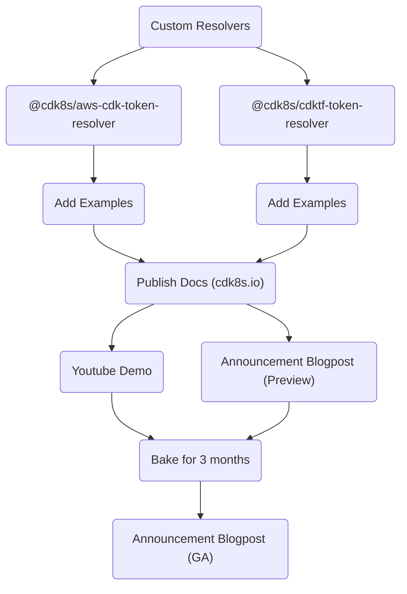
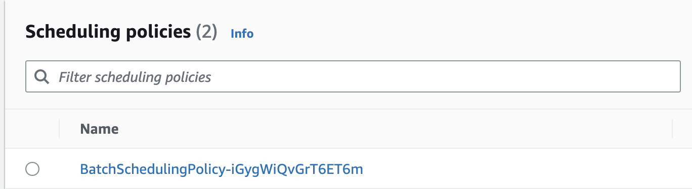
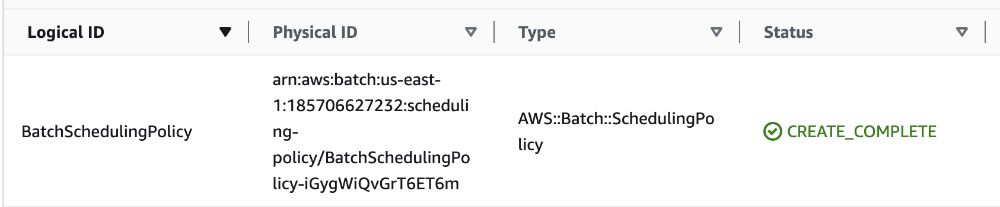
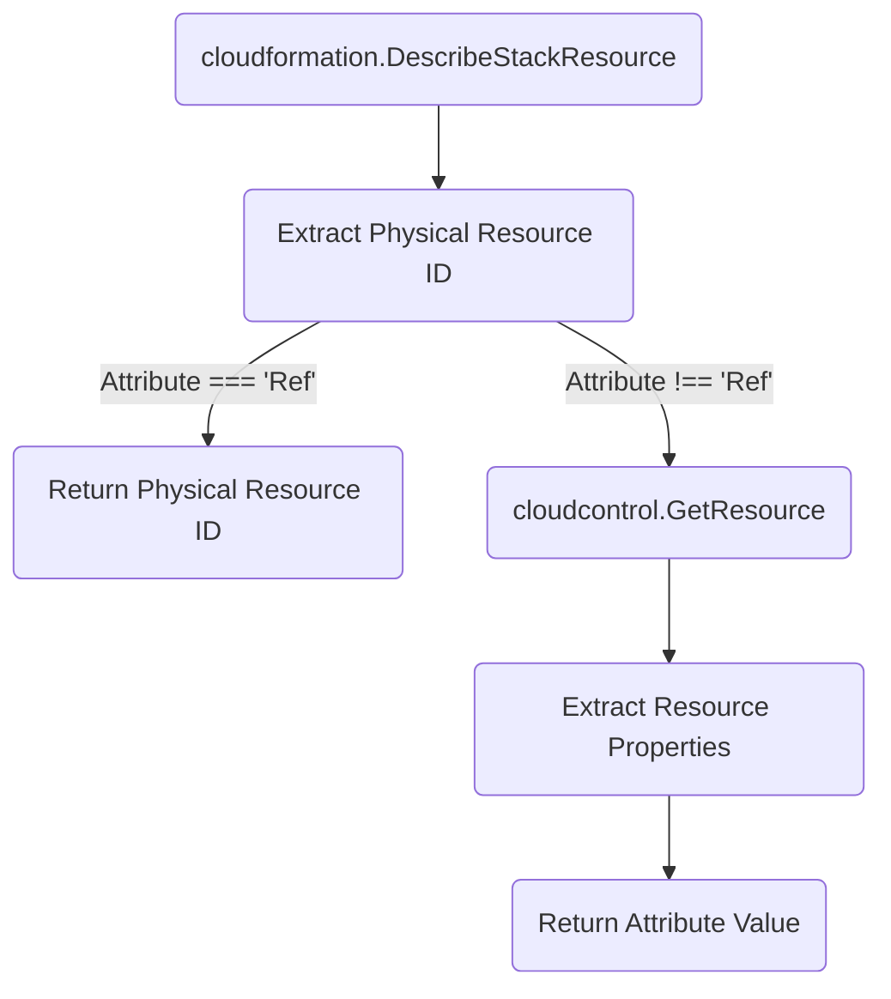
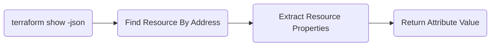

# Resolve Cloud Tokens

* **Original Author(s):** @iliapolo
* **Tracking Issue**: https://github.com/cdk8s-team/cdk8s/issues/1216
* **API Bar Raiser**: @rix0rrr

Users can now author cdk8s applications that rely on cloud
resources defined with the AWS CDK or the CDK For Terraform.

## Working Backwards

### CHANGELOG

`feat(synth): custom resolvers`

### README

Custom resolvers are a mechanism to inject custom logic into the cdk8s value resolution process. 
It allows to transform any value just before being written to the Kubernetes manifest.

To define a custom resolver, fist create a class that implements the `ITokenResolver` interface:

```ts
import { ITokenResolver, ResolutionContext } from 'cdk8s';

export class MyCustomResolver implements ITokenResolver {

  public resolve(context: ResolutionContext, value: any): any {
    // run some custom logic
  }

}
```

Where the `context` argument contains information about the value that is 
currently being resolved:

- **obj**: `ApiObject` currently being resolved.
- **key**: Array containing the JSON path elements of they keys leading up to the value.

Then, when you create a cdk8s `Chart`, pass the resolver instance to it via the `resolver` property:

```ts
import { App, Chart } from 'cdk8s'

const app = new App();
new Chart(app, 'Chart', { resolver: new MyCustomResolver() });
```

When you run `cdk8s synth`, your custom logic will be invoked, and the return 
value will replace the original value and be written to the manifest.

For example, if you define a Kubernetes service like so:

```ts
new KubeService(this, 'Service', {
  spec: {
    type: 'LoadBalancer',
  }
});
```

Your resolver will be invoked with the following arguments:

- **context**
  - *obj*: The `KubeService` instance of type `ApiObject`.
  - *key*: `['spec', 'type']`
- **value**: `LoadBalancer`


One common use-case for this feature is to automatically resolve deploy time 
attributes of cloud resources, and pass them to your Kubernetes workloads. To that end, 
cdk8s provides a resolver for the following CDK frameworks:

#### AWS Cloud Development Kit

In this example, we create an S3 `Bucket` with the AWS CDK, and pass its (deploy time generated) name 
as an environment variable to a Kubernetes `CronJob` resource.

```ts
import * as aws from 'aws-cdk-lib';
import * as k8s from 'cdk8s';
import * as kplus from 'cdk8s-plus-26';

import { AwsCdkTokenResolver } from '@cdk8s/aws-cdk-token-resolver';

const awsApp = new aws.App();
const stack = new aws.Stack(awsApp, 'Stack');

const resolver = new AwsCdkTokenResolver(stack);

const k8sApp = new k8s.App();
const manifest = new k8s.Chart(k8sApp, 'Manifest', { resolver });

const bucket = new aws.aws_s3.Bucket(stack, 'Bucket');

new kplus.CronJob(manifest, 'CronJob', {
  schedule: k8s.Cron.daily(),
  containers: [{
    image: 'job',
    envVariables: {
      // passing the bucket name via an env variable
      BUCKET_NAME: kplus.EnvValue.fromValue(bucket.bucketName),
    }
 }]
});

awsApp.synth();
k8sApp.synth();
```

Notice we create two applications: one for our cdk8s constructs, and one for our AWS CDK constructs.
Both are defined and synthesized in the same file, but can be separated as needed.
Since your Kubernetes resources now depend on AWS CDK deploy tokens, you'll first need to run `cdk deploy`, 
and only then `cdk8s synth`.

> Otherwise, the Kubernetes manifests will contain a string representation of the tokens (e.g `${Token[TOKEN.25]}`), 
> instead of the concrete values. To learn more AWS CDK tokens, see [here](https://docs.aws.amazon.com/cdk/v2/guide/tokens.html).

#### CDK For Terraform

In this example, we create an S3 `Bucket` with the CDKTF, and pass its (deploy time generated) name 
as an environment variable to a Kubernetes `CronJob` resource.

```ts
import * as tf from "cdktf";
import * as aws from "@cdktf/provider-aws";
import * as k8s from 'cdk8s';
import * as kplus from 'cdk8s-plus-26';

import { CdkTfTokenResolver } from '@cdk8s/cdktf-token-resolver';

const awsApp = new tf.App();
const stack = new tf.TerraformStack(awsApp, 'Stack');

const resolver = new CdkTfTokenResolver(stack);

const k8sApp = new k8s.App();
const manifest = new k8s.Chart(k8sApp, 'Manifest', { resolver });

const bucket = new aws.s3Bucket.S3Bucket(stack, 'Bucket');

new kplus.CronJob(manifest, 'CronJob', {
  schedule: k8s.Cron.daily(),
  containers: [{
    image: 'job',
    envVariables: {
      // passing the bucket name via an env variable
      BUCKET_NAME: kplus.EnvValue.fromValue(bucket.bucket),
    }
 }]
});

awsApp.synth();
k8sApp.synth();
```

Notice we create two applications: one for our cdk8s constructs, and one for our CDKTF constructs.
Both are defined and synthesized in the same file, but can be separated as needed.
Since your Kubernetes resources now depend on CDKTF tokens, you'll first need to run `cdk deploy`, 
and only then `cdk8s synth`.

> Otherwise, the Kubernetes manifests will contain a string representation of the tokens (e.g `${TfToken[TOKEN.0]}`), 
> instead of the concrete values. To learn more CDKTF tokens, see [here](https://developer.hashicorp.com/terraform/cdktf/concepts/tokens).

---

Ticking the box below indicates that the public API of this RFC has been
signed-off by the API bar raiser (the `api-approved` label was applied to the
RFC pull request):

```
[ ] Signed-off by API Bar Raiser @xxxxx
```

## Public FAQ

### What are we launching today?

This launch consists of three deliverables:

- A new feature in the `cdk8s` core library that allows injecting custom resolution logic during synthesis.
- A new package called `@cdk8s/aws-cdk-token-resolver` containing a resolver that knows to detect 
AWS CDK tokens, and fetch its concrete values from AWS.
- A new package called `@cdk8s/cdktf-token-resolver` containing a resolver that knows to detect 
CDKTF tokens, and fetch its concrete values from terraform state files.

### Why should I use this feature?

If you need to perform some sort of automatic transformation on user defined resource 
definitions, before they get written to the Kubernetes manifest.

More concretely, if your Kubernetes workloads rely on resources offered by a 
cloud provider, you can use this new feature to define cloud infrastructure 
and Kubernetes resources in the same application. You can leverage either the 
AWS CDK or the CDK For Terraform for your cloud infrastructure, and seamlessly 
reference it in your cdk8s application.

## Internal FAQ

### Why are we doing this?

It is common for Kubernetes applications to leverage cloud resources for their operation.
Those cloud resources are often defined and provisioned using other CDK frameworks, 
such as the AWS CDK or the CDKTF. Since cdk8s is built on the same technologies, and supports the 
same programming languages, it stands to reason that users would want to define both cloud and 
Kubernetes resources within the same codebase. As an example, consider a Kubernetes `CronJob` 
that needs an S3 `Bucket` to store periodic computation results.

When the bucket name is known during synthesis (by explicitly setting the name of the bucket), 
this can be achieved fairly easily, for instance using the AWS CDK:

```ts
import * as aws from 'aws-cdk-lib';
import * as k8s from 'cdk8s';
import * as kplus from 'cdk8s-plus-26';

const k8sApp = new k8s.App();
const awsApp = new aws.App();

const stack = new aws.Stack(awsApp, 'Stack');
const manifest = new k8s.Chart(k8sApp, 'Manifest');

const bucketName = 'my-bucket';

// define the bucket with a well known name
new aws.aws_s3.Bucket(stack, 'Bucket', { bucketName });

// pass the bucket name to the CronJob container
new kplus.CronJob(manifest, 'CronJob', {
 containers: [{ 
   image: 'job',
   envVariables: {
     BUCKET_NAME: kplus.EnvValue.fromValue(bucketName),
   }
 }]
});

k8sApp.synth();
awsApp.synth();
```

This application with synthesize a proper Kubernetes manifest containing the name of bucket:

```yaml
apiVersion: batch/v1
kind: CronJob
metadata:
  name: manifest-cronjob-c86481e8
spec:
  jobTemplate:
    spec:
      template:
        metadata:
          labels:
            cdk8s.io/metadata.addr: Manifest-CronJob-c89809bc
        spec:
          containers:
            - env:
                - name: BUCKET_NAME
                  value: my-bucket
              image: job
```

However, if the bucket is not explicitly specified (as mentioned by the 
[AWS CDK best practices guide](https://docs.aws.amazon.com/cdk/v2/guide/best-practices.html)):

```ts
import * as aws from 'aws-cdk-lib';
import * as k8s from 'cdk8s';
import * as kplus from 'cdk8s-plus-26';

const k8sApp = new k8s.App();
const awsApp = new aws.App();

const stack = new aws.Stack(awsApp, 'Stack');
const manifest = new k8s.Chart(k8sApp, 'Manifest');

// define the bucket without an explicit name
new aws.aws_s3.Bucket(stack, 'Bucket');

// pass the bucket name to the CronJob container
new kplus.CronJob(manifest, 'CronJob', {
 containers: [{ 
   image: 'job',
   envVariables: {
     BUCKET_NAME: kplus.EnvValue.fromValue(bucket.bucketName),
   }
 }]
});

k8sApp.synth();
awsApp.synth();
```

The synthesized Kubernetes manifest will not be deployable, as it will not 
contain the actual value of the bucket name, but rather a string 
representation of the AWS CDK token, *representing* the bucket name.

```yaml
apiVersion: batch/v1
kind: CronJob
metadata:
  name: manifest-cronjob-c86481e8
spec:
  jobTemplate:
    spec:
      template:
        metadata:
          labels:
            cdk8s.io/metadata.addr: Manifest-CronJob-c89809bc
        spec:
          containers:
            - env:
                - name: BUCKET_NAME
                  value: ${Token[TOKEN.603]} # whoops, no good
              image: job
```

To generate a deployable manifest, an additional lookup phase is required that will
fetch the value of the bucket name directly from AWS. Currently, customers are forced 
to implement this lookup by themselves, which presents non trivial challenges and burden. 

This feature aims to alleviate that, and make it as easy as possible to author such 
complex applications. 

### Why should we _not_ do this?

There are several mechanisms customers could implement this capability without explicit 
support from the cdk8s team. Given that, one could argue that the effort would not be 
worth the value. Following is an outline of such mechanisms:

#### Explicit Token Resolution

Instead of passing tokens directly to cdk8s, customers could explicitly fetch its 
concrete value with a `fetchAWS` function they implement:

```ts
...

// define the bucket without an explicit name
new aws.aws_s3.Bucket(stack, 'Bucket');

// fetch its name directly from AWS
const bucketName = fetchToken(bucket.bucketName);

// pass the bucket name to the CronJob container
new kplus.CronJob(manifest, 'CronJob', {
 containers: [{ 
   image: 'job',
   envVariables: {
     BUCKET_NAME: kplus.EnvValue.fromValue(bucketName),
   }
 }]
});

...
```

There are several challenges with this:

- Implementing the `fetchAWS` function is not trivial. It requires deep knowledge of 
the AWS CDK token system and must handle premature resolution (i.e when executed before deployment finishes).
- Error prone. Users may forget to call the `fetchAWS` method and mistakenly pass the token instead.
- Not idiomatic / ergonomic. It is unnatural for users to incorporate such code into CDK applications.

#### Explicit Output Resolution

Here, customers defined a `CfnOutput` for each value they would like to expose to the cdk8s application.
Those outputs are then explicitly resolved using a `fetchAWS` function they implement:

```ts
...

// define the bucket without an explicit name
new aws.aws_s3.Bucket(stack, 'Bucket');

const bucketNameOutput = new aws.CfnOutput(this, 'BucketName', {
  value: bucket.bucketName,
});

// fetch its name directly from AWS
const bucketName = fetchAWS(bucketNameOutput);

// pass the bucket name to the CronJob container
new kplus.CronJob(manifest, 'CronJob', {
 containers: [{ 
   image: 'job',
   envVariables: {
     BUCKET_NAME: kplus.EnvValue.fromValue(bucketName),
   }
 }]
});

...
```

This approach simplifies the implementation of the `fetchAWS` function because it only needs 
to detect and interpret `CfnOutput` types, and not general tokens. It also makes the calls to AWS 
simpler because it only requires a single `DescribeStack` call. However, it still isn't trivial.

In addition, the usability challenges still remain:

- Error prone. Users may forget to define and output and call the `fetchAWS` function and mistakenly pass the token instead.
- Not idiomatic / ergonomic. It is unnatural for users to incorporate such code into CDK applications.

#### Out-Of-Band Query

In this approach, customers decouple the definition of cloud infrastructure from the
definition of Kubernetes resources. That is, instead of referencing `bucket.bucketName`
in the Kubernetes spec, they might extract it from an env variable via `process.env.BUCKET_NAME`.

```ts
...

new kplus.CronJob(manifest, 'CronJob', {
 containers: [{ 
   image: 'job',
   envVariables: {
     BUCKET_NAME: kplus.EnvValue.fromValue(process.env.BUCKET_NAME),
   }
 }]
});

...
```

#### Out-Of-Band Provisioning

In this approach, the cloud infrastructure is split into two:

- One part contains independent<sup>*</sup> resources and is defined within
the IaC application (AWS CDK or CDKTF).
- The second part contains the resources being used by Kubernetes resources,
and are provisioned imperatively before synthesis, either as part of the
cdk8s application, or externally.

> <sup>*</sup> Independent with respect to usage in Kubernetes resource definitions.

However, this separation into imperative provisioning essentially re-introduces all
the complexity that IaC aims to solve, and is not desirable.

#### Post Synth Processing

In this approach, cloud infrastructure and Kubernetes resources are defined in the same
application using the standard IaC tooling. The Kubernetes resources are tightly coupled
with their required cloud resources. 

```ts
...

// define the bucket without an explicit name
new aws.aws_s3.Bucket(stack, 'Bucket');

// pass the bucket name to the CronJob container
new kplus.CronJob(manifest, 'CronJob', {
 containers: [{ 
   image: 'job',
   envVariables: {
     BUCKET_NAME: kplus.EnvValue.fromValue(bucket.bucketName),
   }
 }]
});

cdk8sApp.synth();

...
```

To overcome the problem of unresolved tokens, customers have to post-process the result 
of `cdk8sApp.synth()` to produce the final deployable manifest. This post synthesis 
step inspects the manifest for references to cloud resources, interprets them, 
and performs the necessary lookups.

From an application maintenance perspective, this approach is actually pretty robust.
The problem is that implementing and maintaining such a post synthesis step is not at all
trivial. This RFC essentially proposes baking this step into the cdk8s framework, so that
customers don't have to deal with the complexities it poses.

### What is the technical solution (design) of this feature?

The high-level design consists of three parts:

#### Custom Resolvers

When cdk8s applications are synthesized, the [`resolve`](https://github.com/cdk8s-team/cdk8s-core/blob/v2.7.52/src/_resolve.ts#L3) 
function is called for every property of the user defined resource spec. Currently, it handles 
resolving instances of [`Lazy`](https://github.com/cdk8s-team/cdk8s-core/blob/v2.7.52/src/_resolve.ts#L10) 
and [implicit tokens](https://github.com/cdk8s-team/cdk8s-core/blob/v2.7.52/src/_resolve.ts#L16).

To allow the lookups described in this RFC, we will provide a custom resolution hook in this 
function in the form of an interface, that customers can implement:

```ts
import { ApiObject } from './api-object';

export class ResolutionContext {

  public readonly obj: ApiObject;
  public readonly key: string[];

}

export interface IResolver {

  resolve(context: ResolutionContext, value: any): any;
}
```

When a cdk8s chart is defined, a custom resolver can be passed to it:

```ts
new Chart(app, 'Chart', { resolver: new MyClassThatImplementsIResolver() })
```

During synthesis, the `resolve` function of the custom resolver will be invoked on every primitive value.
The return value of this function will replace the original value and be written into the manifest.

**PoC:** https://github.com/cdk8s-team/cdk8s-core/pull/1163

#### Package `@cdk8s/aws-cdk-token-resolver`

A new jsii package containing a class that implements the `IResolver` interface. It can 
identify AWS CDK tokens, and fetch their concrete values by issuing AWS service calls.

> See [Appendix](#implementation-of-aws-cdk-token-resolver) for an implementation outline.

**PoC:** [aws-cdk-resolver.ts](./../examples/typescript/resolve-cloud-tokens/aws-cdk-resolver.ts)

#### Package `@cdk8s/cdktf-token-resolver`

A new jsii package containing a class that implements the `IResolver` interface. It can 
identify CDKTF tokens, and fetch their concrete values by issuing terraform state calls.

> See [Appendix](#implementation-of-cdktf-token-resolver) for an implementation outline.

**PoC:** [cdktf-resolver.ts](./../examples/typescript/resolve-cloud-tokens/cdktf-resolver.ts)

### Is this a breaking change?

No

### What alternative solutions did you consider?

#### Outputs

> The following speaks about AWS CDK as an example, but exactly the same capabilities exist
> in the CDKTF, and therefore the same reasoning applies to it as well.

In this solution, whenever cdk8s encounters a token, instead of trying to 
fetch its corresponding *attribute* value, it will fetch its corresponding *output* value.
If the value doesn't exist, cdk8s will add a corresponding `CfnOutput` resource to the 
AWS CDK stack. It would look something like this:

```ts
// some output id generated from the token
const outputId = 'some-stable-id'

try {
  return fetchOutputValue(stack, outputId)
} catch (error: OutputNotFound) {
  new CfnOutput(stack, outputId, { value: bucket.bucketName });
  // nothing else we can return here...
  return bucket.bucketName
}
```

This solution has the benefit of automatically supporting every value that 
can be defined in an AWS CDK application. It also simplifies the fetching logic because 
it requires a single `cloudformation.DescribeStackResource` call. 

However, this option was discarded because of usability concerns:

- Requires synthesis of the cdk8s app to happen before the AWS CDK app. This can only be 
controlled by the user, and therefore error prone.
- Synthesizing the AWS CDK application separately from the cdk8s application will result in a different cloud assembly.
- The cdk8s application needs to be synthesized twice, once to add the CloudFormation outputs, and once to fetch their values. 
This means that the first synthesis will inherently produce an invalid manifest.
- Will create a cyclic dependency in case the cdk8s and AWS CDK application are in different repositories / packages.

#### Utility Functions

Instead of integrating this lookup into the cdk8s resolution process, we could have offered a couple
of utility function that can perform lookups based on the token they are invoked with.
This would have made is fairly easy for customers to implement either [Explicit Output Resolution](#explicit-output-resolution) 
or [Explicit Token Resolution](#explicit-token-resolution) by themselves.

This option was discarded because it just doesn't satisfy all we wanted to achieve with this feature. 
Also, its engineering effort is not far from the full blown capability we ended choosing, so might as well do the 
the whole thing.


### What are the drawbacks of this solution?

> Describe any problems/risks that can be introduced if we implement this RFC.

### What is the high-level project plan?



### Are there any open issues that need to be addressed later?

There are still some open questions that are under investigation and need 
to be resolved before starting implementation.

1. Since `Ref` is a CloudFormation specific attribute, it does not exist as a key in 
the resource properties as returned by the 
[Cloud Control GetResource](https://docs.aws.amazon.com/cloudcontrolapi/latest/APIReference/API_GetResource.html) API.
In this case, the implementation will return the CloudFormation Physical Resource ID as returned by the [CloudFormation DescribeStackResource](https://docs.aws.amazon.com/AWSCloudFormation/latest/APIReference/API_DescribeStackResource.html) API, assuming they represent the same thing. We know that for 
some resources, `Ref` will return the ARN of the resource, instead of the resource name. For example, for the 
[`AWS::Batch::SchedulingPolicy`](https://docs.aws.amazon.com/AWSCloudFormation/latest/UserGuide/aws-resource-batch-schedulingpolicy.html#aws-resource-batch-schedulingpolicy-return-values) resource.

    This might break the implementation, which would mistakenly return the name 
    of the policy, instead of the ARN. But as it turns out, even though the policy has a name, its 
    CloudFormation Physical Resource ID is actually its ARN.

    

    

    The same behavior was observed for `AWS::SNS::Topic` for example. This assumption 
    seems correct, but hasn't yet been verified. Even if it proves false, it is unlikely to be a blocker. If users are 
    explicitly interested in the ARN, they can use `resource.attrArn` instead of `resource.ref`.

2. When the requested attribute is not `Ref`, the function invokes the 
[Cloud Control GetResource](https://docs.aws.amazon.com/cloudcontrolapi/latest/APIReference/API_GetResource.html) 
API to get access to resource properties. For the `Identifier` argument, we pass the CloudFormation Physical Resource ID. 
Empirical evidence show this assumption is valid, but has yet to be verified. If this assumption proves incorrect, 
we would have to understand which and how many resources behave differently, and either:
    - Snowflake those resources.
    - Not support them (i.e let the mechanism fail)
    - Abandon this solution and go with the [Outputs](#outputs) alternative.

3. CloudFormation attribute values are extracted as is from the result of the [Cloud Control GetResource](https://docs.aws.amazon.com/cloudcontrolapi/latest/APIReference/API_GetResource.html) API. E.g, a `QueueName` property is expected to exist on the 
Cloud Control resource properties which corresponds to the same `QueueName` CloudFormation attribute. 
This assumption needs verification. If it proves incorrect, we would have to understand
which and how many resources behave differently, and either:
    - Snowflake those resources.
    - Not support them (i.e let the mechanism fail)
    - Abandon this solution and go with the [Outputs](#outputs) alternative.


## Appendix

### Implementation of AWS CDK Token Resolver

Following is an overview of the fetching function implementation:



### Implementation of CDKTF Token Resolver


