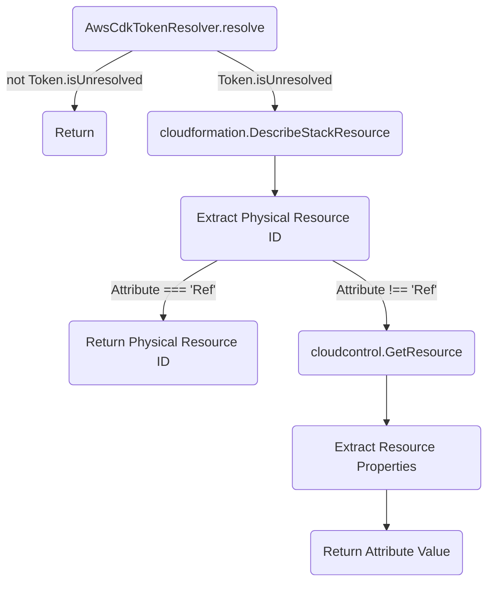
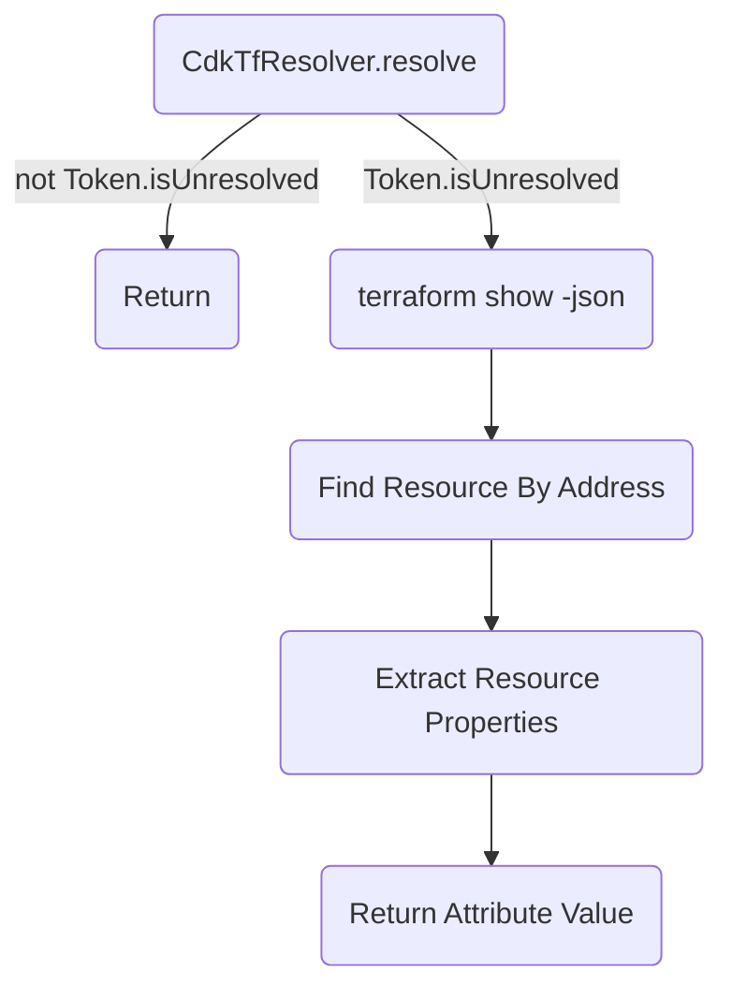
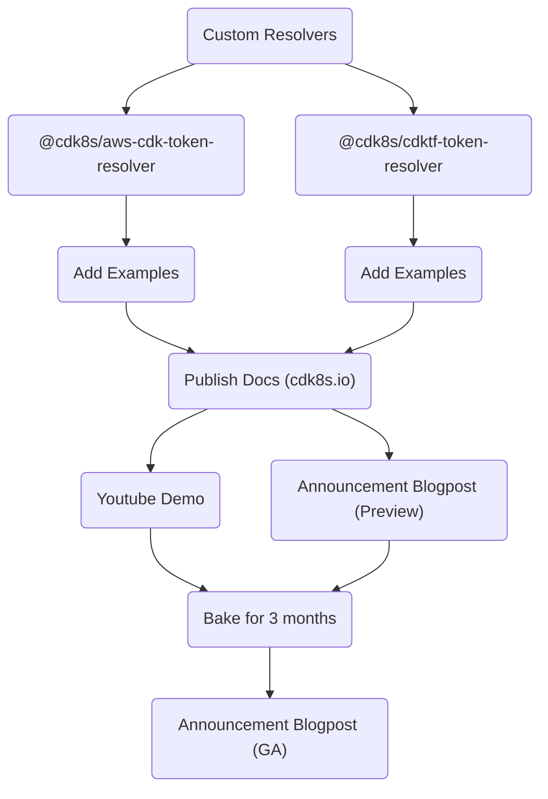

# Resolve Cloud Tokens

* **Original Author(s):** @iliapolo
* **Tracking Issue**: https://github.com/cdk8s-team/cdk8s/issues/1216
* **API Bar Raiser**: @rix0rrr

Users can now configure custom resolvers to control how cdk8s resolves values before writing 
them to the manifest. In addition, custom resolvers for the AWS CDK and CDKTF token system are available, 
allowing users to author Kubernetes applications that leverage cloud resources.

## Working Backwards

### CHANGELOG

`feat(synth): custom resolvers`

### README

Custom resolvers are a mechanism to inject custom logic into the cdk8s value resolution process. 
It allows to transform any value just before being written to the Kubernetes manifest.

To define a custom resolver, first create a class that implements the `IValueResolver` interface:

```ts
import { IValueResolver, ResolutionContext } from 'cdk8s';

export class MyCustomResolver implements IValueResolver {

  public resolve(context: ResolutionContext, value: any): any {
    // run some custom logic
  }

}
```

The `context` argument contains information about the value that is currently being resolved:

- **obj**: `ApiObject` currently being resolved.
- **key**: Array containing the JSON path elements of the keys leading up to the value.

When you create a cdk8s `App`, pass the resolver instance to it via the `resolver` property:

```ts
import { App, Chart } from 'cdk8s'

const app = new App({ resolver: new MyCustomResolver() });
new Chart(app, 'Chart');
```

When you run `cdk8s synth`, your custom logic will be invoked, allowing you to replace the 
original value about to be written to the manifest. For example, if you define a Kubernetes service like so:

```ts
new KubeService(this, 'Service', {
  spec: {
    type: 'LoadBalancer',
  }
});
```

Your resolver will be invoked with the following arguments:

- **context**
  - *obj*: The `KubeService` instance of type `ApiObject`.
  - *key*: `['spec', 'type']`
- **value**: `LoadBalancer`

One common use-case for this feature is to automatically resolve deploy time 
attributes of cloud resources defined by other CDK frameworks.

#### AWS Cloud Development Kit

The `AwsCdkResolver` is able to resolve any [`CfnOutput`](https://docs.aws.amazon.com/cdk/api/v2/docs/aws-cdk-lib.CfnOutput.html) 
defined by your AWS CDK application.

In this example, we create an S3 `Bucket` with the AWS CDK, and pass its (deploy time generated) name 
as an environment variable to a Kubernetes `CronJob` resource.

```ts
import * as aws from 'aws-cdk-lib';
import * as k8s from 'cdk8s';
import * as kplus from 'cdk8s-plus-26';

import { AwsCdkResolver } from '@cdk8s/aws-cdk-resolver';

const awsApp = new aws.App();
const stack = new aws.Stack(awsApp, 'aws');

const k8sApp = new k8s.App({ resolver: new AwsCdkOutputResolver() });
const manifest = new k8s.Chart(k8sApp, 'Manifest');

const bucket = new aws.aws_s3.Bucket(stack, 'Bucket');
const bucketName = new aws.CfnOutput(this, 'BucketName', {
  value: bucket.bucketName,
});

new kplus.CronJob(manifest, 'CronJob', {
  schedule: k8s.Cron.daily(),
  containers: [{
    image: 'job',
    envVariables: {
      BUCKET_NAME: kplus.EnvValue.fromValue(bucketName.value),
    }
 }]
});

awsApp.synth();
k8sApp.synth();
```

During cdk8s synthesis, the custom resolver will detect that `bucketName` is not a concrete value, but rather a `CfnOutput`.
It will then perform AWS service calls in order to fetch the actual value from the deployed infrastructure in your account.

This means that in order for `cdk8s synth` to succeed, it must be executed *after* the AWS CDK resources have been deployed.
So your deployment workflow should conceptually be:

1. `cdk deploy`
2. `cdk8s synth`

If you run `cdk8s synth` before deploying the AWS resources, cdk8s synthesis will fail with the following message:

```console
Failed fetching output value for output key 'BucketName' (stack: aws). Error: Output not found. Are you sure you deployed the CDK stack?
```

Also note that you **must** create a `CfnOutput` for the `bucketName` value. Once you do so, you can pass either `bucket.bucketName` or `bucketName.value`.
If you don't create an appropriate `CfnOutput`, synthesis will fail with the following message:

```console
Error: Unable to find output defined for token: {"Fn::GetAtt":["Bucket4A7E3555","BucketName"]}. Make sure you defined a CfnOutput for this value.
```

This is because `AwsCdkResolver` is only able to fetch values for CloudFormation outputs, and not for every resource attribute.

#### CDK For Terraform

In this example, we create an S3 `Bucket` with the CDKTF, and pass its (deploy time generated) name 
as an environment variable to a Kubernetes `CronJob` resource.

```ts
import * as tf from "cdktf";
import * as aws from "@cdktf/provider-aws";
import * as k8s from 'cdk8s';
import * as kplus from 'cdk8s-plus-26';

import { CdkTfTokenResolver } from '@cdk8s/cdktf-token-resolver';

const awsApp = new tf.App();
const stack = new tf.TerraformStack(awsApp, 'Stack');

const resolver = new CdkTfTokenResolver(stack);

const k8sApp = new k8s.App();
const manifest = new k8s.Chart(k8sApp, 'Manifest', { resolver });

const bucket = new aws.s3Bucket.S3Bucket(stack, 'Bucket');

new kplus.CronJob(manifest, 'CronJob', {
  schedule: k8s.Cron.daily(),
  containers: [{
    image: 'job',
    envVariables: {
      // passing the bucket name via an env variable
      BUCKET_NAME: kplus.EnvValue.fromValue(bucket.bucket),
    }
 }]
});

awsApp.synth();
k8sApp.synth();
```

Notice we create two applications: one for our cdk8s constructs, and one for our CDKTF constructs.
Both are defined and synthesized in the same file, but can be separated as needed.
Since your Kubernetes resources now depend on CDKTF tokens, you'll first need to run `cdktf deploy`, 
and only then `cdk8s synth`.

> Otherwise, the Kubernetes manifests will contain a string representation of the tokens (e.g `${TfToken[TOKEN.0]}`), 
> instead of the concrete values. To learn more CDKTF tokens, see [here](https://developer.hashicorp.com/terraform/cdktf/concepts/tokens).

---

Ticking the box below indicates that the public API of this RFC has been
signed-off by the API bar raiser (the `api-approved` label was applied to the
RFC pull request):

```
[ ] Signed-off by API Bar Raiser @xxxxx
```

## Public FAQ

### What are we launching today?

This launch consists of three deliverables:

- A new feature in the `cdk8s` core library that allows injecting custom resolution logic during synthesis.
- A new package called `@cdk8s/aws-cdk-token-resolver` containing a resolver that knows to detect 
AWS CDK tokens, and fetch its concrete values from AWS.
- A new package called `@cdk8s/cdktf-token-resolver` containing a resolver that knows to detect 
CDKTF tokens, and fetch its concrete values from terraform state files.

### Why should I use this feature?

If you need to perform some sort of automatic transformation on user defined resource 
definitions, before they get written to the Kubernetes manifest.

More concretely, if your Kubernetes workloads rely on resources offered by a 
cloud provider, you can use this new feature to define cloud infrastructure 
and Kubernetes resources in the same application. You can leverage either the 
AWS CDK or the CDK For Terraform for your cloud infrastructure, and seamlessly 
reference it in your cdk8s application.

## Internal FAQ

### Why are we doing this?

It is common for Kubernetes applications to leverage cloud resources for their operation.
Those cloud resources are often defined and provisioned using other CDK frameworks, 
such as the AWS CDK or the CDKTF. Since cdk8s is built on the same technologies, and supports the 
same programming languages, it stands to reason that users would want to define both cloud and 
Kubernetes resources within the same codebase. As an example, consider a Kubernetes `CronJob` 
that needs an S3 `Bucket` to store its periodic computation results.

When the bucket name is known during synthesis (by explicitly setting the name of the bucket), 
this can be achieved fairly easily, for instance using the AWS CDK:

```ts
import * as aws from 'aws-cdk-lib';
import * as k8s from 'cdk8s';
import * as kplus from 'cdk8s-plus-26';

const k8sApp = new k8s.App();
const awsApp = new aws.App();

const stack = new aws.Stack(awsApp, 'Stack');
const manifest = new k8s.Chart(k8sApp, 'Manifest');

const bucketName = 'my-bucket';

// define the bucket with a well known name
new aws.aws_s3.Bucket(stack, 'Bucket', { bucketName });

// pass the bucket name to the CronJob container
new kplus.CronJob(manifest, 'CronJob', {
 containers: [{ 
   image: 'job',
   envVariables: {
     BUCKET_NAME: kplus.EnvValue.fromValue(bucketName),
   }
 }]
});

k8sApp.synth();
awsApp.synth();
```

This application with synthesize a proper Kubernetes manifest containing the name of bucket:

```yaml
apiVersion: batch/v1
kind: CronJob
metadata:
  name: manifest-cronjob-c86481e8
spec:
  jobTemplate:
    spec:
      template:
        metadata:
          labels:
            cdk8s.io/metadata.addr: Manifest-CronJob-c89809bc
        spec:
          containers:
            - env:
                - name: BUCKET_NAME
                  value: my-bucket
              image: job
```

However, if the bucket is not explicitly specified (as recommended by the 
[AWS CDK best practices guide](https://docs.aws.amazon.com/cdk/v2/guide/best-practices.html)):

```ts
import * as aws from 'aws-cdk-lib';
import * as k8s from 'cdk8s';
import * as kplus from 'cdk8s-plus-26';

const k8sApp = new k8s.App();
const awsApp = new aws.App();

const stack = new aws.Stack(awsApp, 'Stack');
const manifest = new k8s.Chart(k8sApp, 'Manifest');

// define the bucket without an explicit name
new aws.aws_s3.Bucket(stack, 'Bucket');

// pass the bucket name to the CronJob container
new kplus.CronJob(manifest, 'CronJob', {
 containers: [{ 
   image: 'job',
   envVariables: {
     BUCKET_NAME: kplus.EnvValue.fromValue(bucket.bucketName),
   }
 }]
});

k8sApp.synth();
awsApp.synth();
```

The synthesized Kubernetes manifest will not be deployable, as it will not 
contain the actual value of the bucket name, but rather a string 
representation of the AWS CDK token, *representing* the bucket name.

```yaml
apiVersion: batch/v1
kind: CronJob
metadata:
  name: manifest-cronjob-c86481e8
spec:
  jobTemplate:
    spec:
      template:
        metadata:
          labels:
            cdk8s.io/metadata.addr: Manifest-CronJob-c89809bc
        spec:
          containers:
            - env:
                - name: BUCKET_NAME
                  value: ${Token[TOKEN.603]} # whoops, no good
              image: job
```

To generate a deployable manifest, an additional lookup phase is required that will
fetch the value of the bucket name directly from AWS. Currently, customers are forced 
to implement this lookup by themselves, which presents non trivial challenges and burden. 

This feature aims to alleviate that, and make it as easy as possible to author such 
complex applications. 

### Why should we _not_ do this?

There are several mechanisms customers could implement this capability without explicit 
support from the cdk8s team. Given that, one could argue that the effort would not be 
worth the value. Following is an outline of such mechanisms:

#### Explicit Token Resolution

Instead of passing tokens directly to cdk8s, customers could explicitly fetch its 
concrete value with a `fetchToken` function they implement:

```ts
...

// define the bucket without an explicit name
new aws.aws_s3.Bucket(stack, 'Bucket');

// fetch its name directly from AWS
const bucketName = fetchToken(bucket.bucketName);

// pass the bucket name to the CronJob container
new kplus.CronJob(manifest, 'CronJob', {
 containers: [{ 
   image: 'job',
   envVariables: {
     BUCKET_NAME: kplus.EnvValue.fromValue(bucketName),
   }
 }]
});

...
```

There are several challenges with this:

- Implementing the `fetchToken` function is not trivial. It requires deep knowledge of 
the AWS CDK token system and must handle premature resolution (i.e when executed before deployment finishes).
- Error prone. Users may forget to call the `fetchToken` method and mistakenly pass the token instead.
- Not idiomatic / ergonomic. It is unnatural for users to incorporate such code into CDK applications.

#### Explicit Output Resolution

Here, customers define a `CfnOutput` for each value they would like to expose to the cdk8s application.
Those outputs are then explicitly resolved using a `fetchOutput` function they implement:

```ts
...

// define the bucket without an explicit name
new aws.aws_s3.Bucket(stack, 'Bucket');

const bucketNameOutput = new aws.CfnOutput(this, 'BucketName', {
  value: bucket.bucketName,
});

// fetch its name directly from AWS
const bucketName = fetchOutput(bucketNameOutput);

// pass the bucket name to the CronJob container
new kplus.CronJob(manifest, 'CronJob', {
 containers: [{ 
   image: 'job',
   envVariables: {
     BUCKET_NAME: kplus.EnvValue.fromValue(bucketName),
   }
 }]
});

...
```

This approach simplifies the implementation of fetching values from AWS, as the function only needs 
to detect and interpret `CfnOutput` types, and not general tokens. It also makes the calls to AWS 
simpler because it only requires a single `DescribeStack` call. However, it still isn't trivial.

In addition, the usability challenges still remain:

- Error prone. Users may forget to define and output and call the `fetchOutput` function and mistakenly pass the token instead.
- Not idiomatic / ergonomic. It is unnatural for users to incorporate such code into CDK applications.

#### Out-Of-Band Query

In this approach, customers decouple the definition of cloud infrastructure from the
definition of Kubernetes resources. That is, instead of referencing `bucket.bucketName`
in the Kubernetes spec, they might extract it from an env variable via `process.env.BUCKET_NAME`.

```ts
...

new kplus.CronJob(manifest, 'CronJob', {
 containers: [{ 
   image: 'job',
   envVariables: {
     BUCKET_NAME: kplus.EnvValue.fromValue(process.env.BUCKET_NAME),
   }
 }]
});

...
```

The responsibility of populating the `BUCKET_NAME` env variable falls to an external 
script that must be executed before calling cdk8s synth. The script will use service 
API's to query for the required information.

Maintaining such a script can be complex because it requires constant coordination 
between two decoupled parts of the application. Every time a new cloud resource is 
utilized, it needs to be added in two places. This makes it clear that such decoupling 
is not natural, and is only caused by technical limitations.

#### Out-Of-Band Provisioning

In this approach, the cloud infrastructure is split into two:

- One part contains independent<sup>*</sup> resources and is defined within
the IaC application (AWS CDK or CDKTF).
- The second part contains the resources being used by Kubernetes resources,
and are provisioned imperatively before synthesis, either as part of the
cdk8s application, or externally. The imperative nature of provisioning allows waiting
on resource creation and passing any required information to downstream processes, 
such as `cdk8s synth`.

> <sup>*</sup> Independent with respect to usage in Kubernetes resource definitions.

However, this separation into imperative provisioning essentially re-introduces all
the complexity that IaC aims to solve, and is not desirable.

#### Post Synth Processing

In this approach, cloud infrastructure and Kubernetes resources are defined in the same
application using the standard IaC tooling. The Kubernetes resources are tightly coupled
with their required cloud resources. 

```ts
...

// define the bucket without an explicit name
new aws.aws_s3.Bucket(stack, 'Bucket');

// pass the bucket name to the CronJob container
new kplus.CronJob(manifest, 'CronJob', {
 containers: [{ 
   image: 'job',
   envVariables: {
     BUCKET_NAME: kplus.EnvValue.fromValue(bucket.bucketName),
   }
 }]
});

cdk8sApp.synth();

...
```

To overcome the problem of unresolved tokens, customers have to post-process the result 
of `cdk8sApp.synth()` to produce the final deployable manifest. This post synthesis 
step inspects the manifest for references to cloud resources, interprets them, 
and performs the necessary lookups.

From an application maintenance perspective, this approach is actually pretty robust.
The problem is that implementing and maintaining such a post synthesis step is not at all
trivial. This RFC essentially proposes baking this step into the cdk8s framework, so that
customers don't have to deal with the complexities it poses.

### What is the technical solution (design) of this feature?

The high-level design consists of three parts:

#### Custom Resolvers

When cdk8s applications are synthesized, the [`resolve`](https://github.com/cdk8s-team/cdk8s-core/blob/v2.7.52/src/_resolve.ts#L3) 
function is called for every property of the user defined resource spec. Currently, it handles 
resolving instances of [`Lazy`](https://github.com/cdk8s-team/cdk8s-core/blob/v2.7.52/src/_resolve.ts#L10) 
and [implicit tokens](https://github.com/cdk8s-team/cdk8s-core/blob/v2.7.52/src/_resolve.ts#L16).

To allow the lookups described in this RFC, we will provide a custom resolution hook in this 
function in the form of an interface, that customers can implement:

```ts
import { ApiObject } from './api-object';

export class ResolutionContext {

  public readonly obj: ApiObject;
  public readonly key: string[];

}

export interface IResolver {

  resolve(context: ResolutionContext, value: any): any;
}
```

When a cdk8s chart is defined, a custom resolver can be passed to it:

```ts
new Chart(app, 'Chart', { resolver: new MyClassThatImplementsIResolver() })
```

During synthesis, the `resolve` function of the custom resolver will be invoked on every primitive value.
The return value of this function will replace the original value and be written into the manifest.

**PoC:** https://github.com/cdk8s-team/cdk8s-core/pull/1163

#### Package `@cdk8s/aws-cdk-token-resolver`

> PoC: [aws-cdk-resolver.ts](./../examples/typescript/resolve-cloud-tokens/aws-cdk-resolver.ts)

A new jsii package containing a class that implements the `IResolver` interface. It can 
identify AWS CDK tokens, and fetch their concrete values by issuing AWS service calls.

Following is an outline of the implementation:



> Note that the PoC code doesn't currently contain the `fetchOutput` method described in the README.
> We assume this function is fairly easy to implement by invoking `cloudformation.DescribeStacks` and extracting
> the output value.

**There are some noteworthy points to pay attention to:**

- Since `Ref` is a CloudFormation specific attribute, it does not exist as a key in 
the resource properties as returned by the [cloudcontrol/GetResource][1] API.
In this case, the implementation will return the *physical id* as returned by 
the [cloudformation/DescribeStackResource][2] API, assuming they represent the same 
thing. See [Appendix](#ref-vs-physicalresourceid) for more details and research on this.

- The implementation uses the *physical id* as the `Identifier` argument when calling 
the [cloudcontrol/GetResource][1] API, assuming they map 1:1. See [Appendix](#physicalresourceid-vs-primaryidentifier) 
for more details and research on this.

#### Package `@cdk8s/cdktf-token-resolver`

> PoC: [cdktf-resolver.ts](./../examples/typescript/resolve-cloud-tokens/cdktf-resolver.ts)

A new jsii package containing a class that implements the `IResolver` interface. It can 
identify CDKTF tokens, and fetch their concrete values by issuing terraform state calls.

Following is an outline of the implementation:



### Is this a breaking change?

No

### What alternative solutions did you consider?

#### Outputs

In this solution, whenever cdk8s encounters an AWS CDK token, instead of trying to 
fetch its corresponding *attribute* value, it will fetch its corresponding *output* value.
If the value doesn't exist, cdk8s will add a corresponding `CfnOutput` resource to the 
stack. It would look something like this:

```ts
// some output id generated from the token (after stack.resolve)
const outputId = 'some-stable-id'

try {
  return fetchOutputValue(stack, outputId)
} catch (error: OutputNotFound) {
  new CfnOutput(stack, outputId, { value: bucket.bucketName });
  // nothing else we can return here...
  return bucket.bucketName
}
```

This solution has the benefit of automatically supporting every value that 
can be defined in an AWS CDK application. It also simplifies the fetching logic because 
it requires a single `cloudformation.DescribeStacks` call. 

However, this option was discarded because of usability concerns:

- Requires synthesis of the cdk8s app to happen before the AWS CDK app. This can only be 
controlled by the user, and therefore error prone.
- Synthesizing the AWS CDK application separately from the cdk8s application will result in a different cloud assembly.
- The cdk8s application needs to be synthesized twice, once to add the CloudFormation outputs, and once to fetch their values. 
This means that the first synthesis will inherently produce an invalid manifest.
- Will create a cyclic dependency in case the cdk8s and AWS CDK application are in different repositories / packages.

**Note that for CDKTF, there's no reason to use outputs because the state file provides all the necessary
information.**

#### Utility Functions

Instead of integrating this lookup into the cdk8s resolution process, we could have offered a couple
of utility functions that can perform lookups based on the token they are invoked with.
This would have made is fairly easy for customers to implement either [Explicit Output Resolution](#explicit-output-resolution) 
or [Explicit Token Resolution](#explicit-token-resolution) by themselves.

This option was discarded because it just doesn't satisfy all we wanted to achieve with this feature. 
Also, its engineering effort is not far from the full blown capability we ended choosing, so might as well do the 
the whole thing.

### What are the drawbacks of this solution?

- The current solution has some quirks and unknowns into which AWS CDK tokens can be
resolved during cdk8s synthesis. If we end up creating many snowflakes in the code, 
the maintenance burden of this capability may be too big.

### What is the high-level project plan?



### Are there any open issues that need to be addressed later?

1. CloudFormation attribute values are extracted as is from the result of the [cloudcontrol/GetResource][1] API. 
E.g, a `QueueName` property is expected to exist on the Cloud Control resource properties which corresponds to 
the same `QueueName` CloudFormation attribute. This assumption needs verification. If it proves incorrect, 
we would have to understand which and how many resources behave differently, and either:
    - Snowflake those resources.
    - Not support them (i.e let the mechanism fail)
    - Abandon this solution and go with the [Outputs](#outputs) alternative.

2. Cloud Control doesn't yet support all CloudFormation resources. For example 
the resource `AWS::SNS::Topic` is not supported (according to this [list][11]). However, 
the PoC referenced in this RFC does utilize this resource, and everything seems to work fine. 
Its not clear yet what is going on. Most likely, the list is out-of-date. 
We need to get an accurate list of unsupported resources and see how this implementation 
behaves on them. If we see there are too many of them, we might decide to abandon this 
solution and go with the [Outputs](#outputs) alternative.

3. The AWS CDK token resolver needs to know which stack contains the resource that is
referenced by the token. Currently, the resolver requires the user explicitly pass the stack
in its constructor. This is somewhat error prone because the user might mistakenly use a token
from a different stack. Consider this:

    ```ts
    const stack1 = new Stack1(...);
    const stack2 = new Stack2(...);

    // create the resolver with stack1
    const resolver = new AwsCdkTokenResolver(stack1);

    new kplus.CronJob(manifest, 'CronJob', {
    containers: [{ 
      image: 'job',
      envVariables: {
        // but pass a token for a resource in stack2
        BUCKET_NAME: kplus.EnvValue.fromValue(stack2.bucket.bucketName),
      }
    }]
    });
    ```

    In this case, the implementation will either error out (best case), or 
    return a value from a different stack in case the in-stack (worst case)
    logical ids are the same. Ideally we would want to instantiate the resolver
    with the app instance, not the stack. The resolver would then somehow 
    automatically identify which stack it needs based on the token. 
    This might be possible but I haven't yet dived deeper into it. One 
    thing worth mentioning though is that the AWS CDK logical IDs [**do not contain the 
    id of the stack**](https://github.com/aws/aws-cdk/blob/main/packages/aws-cdk-lib/core/lib/stack.ts#L1273), 
    contradictory to what the documentation](https://docs.aws.amazon.com/cdk/v2/guide/identifiers.html#identifiers_logical_ids) states:

    > *For example, the Amazon S3 bucket in the previous example that is created within 
    > `Stack2` results in an `AWS::S3::Bucket` resource. The resource's logical ID 
    > is `Stack2MyBucket4DD88B4F` in the resulting AWS CloudFormation template.*

    This makes it impossible to automatically detect which stack a resource belongs to 
    based solely on its logical ID.

## Appendix

### `Ref` vs `PhysicalResourceID`

Assuming `Ref` always maps to the *physical id* can be problematic because 
we know that for some resources, `Ref` will return the ARN of the resource, 
instead of the resource name, which is usually used as the *physical id*. 
This might break the implementation, which would mistakenly return the name of 
the resource, instead of the ARN. However, looking at the [`AWS::Batch::SchedulingPolicy`][3] 
resource as an example, we see that even though the policy has a name, its *physical id* is actually its ARN.


Which means the implementation will behave correctly and return the ARN when 
asked for `Ref`. The same behavior was observed for `AWS::SNS::Topic` for example. 
Even if some resources behave differently, it is unlikely to be a blocker. 
If users are explicitly interested in the ARN, they can use `resource.attrArn` instead 
of `resource.ref`.

### `PhysicalResourceID` vs `PrimaryIdentifier`

Research shows that the primary identifier maps to the physical id when there is a single *primary identifier* 
for the resource, but breaks when its a composite. For example, the *primary identifier* 
for the `AWS::ApiGateway::Stage` resource is, as defined by its schema:

  ```json
  "primaryIdentifier" : [ "/properties/RestApiId", "/properties/StageName" ],
  ```

This means that in order to invoke the [cloudcontrol/GetResource][1] API on a stage, we
must pass a string in the form of `${ApiId}|${StageName}` (See [Using a resource's primary identifier](4)).
However, the *physical id* (and the return value of `Ref`) for a stage is only its name.


Invoking the API with just its name results in an error:

```console
'Identifier prod is not valid for identifier [/properties/RestApiId, /properties/StageName]'
```

This means that for such resources, retrieving any attribute other than `Ref` will not work.
Searching for resources with a composite primary identifier among [resource schemas][5] 
(using the `"primaryIdentifier" : \[.+,.+\]` regex) reveals 321 such resources out of 998 
total resources. However, specifically for the `AWS::ApiGateway::Stage` resource, the only
available attribute is `Ref`, so its impossible to end up in the faulty code path.

Here are some more randomly selected examples, that reveal even more different behaviors:

**AWS::Cassandra::Table**

Primary identifier: `[ "/properties/KeyspaceName", "/properties/TableName" ]`. Looking at 
the [CloudFormation docs][6] we see that `Ref` actually returns `myKeyspace|myTable`, which
incidentally (or not) corresponds to the primary identifier.

**AWS::ECS::TaskSet**

Primary identifier: `[ "/properties/Cluster", "/properties/Service", "/properties/Id" ]`. Looking 
at the [CloudFormation docs][7] we also see that `Ref` returns only the Id, which 
doesn't corresponds to the primary identifier. However, `Id` is also the only attribute on this 
resource, so its actually impossible to request anything else.

**AWS::Kendra::DataSource**

Primary identifier: `[ "/properties/Id", "/properties/IndexId" ]`. Looking at 
the [CloudFormation docs][8] we see that `Ref` actually returns `<data source ID>|<index ID>`, 
which incidentally (or not) corresponds to the primary identifier.

**AWS::Logs::MetricFilter**

Primary identifier: `[ "/properties/LogGroupName", "/properties/FilterName" ]`. Looking 
at [CloudFormation docs][9], we see this resource has no attributes at all.

**AWS::Redshift::EndpointAuthorization**

Primary identifier: `[ "/properties/ClusterIdentifier", "/properties/Account" ]`. Looking 
at the [CloudFormation docs][10] docs, we see many attributes, but it doesn't mention the `Ref` 
attribute. This is probably a documentation mistake because every resource has a `Ref`. 
Its unclear what its return value is, and therefore unclear if it is possible to fetch 
any other attributes. We still need to try and deploy this resource to find out for sure.


[1]: https://docs.aws.amazon.com/cloudcontrolapi/latest/APIReference/API_GetResource.html
[2]: https://docs.aws.amazon.com/AWSCloudFormation/latest/APIReference/API_DescribeStackResource.html
[3]: https://docs.aws.amazon.com/AWSCloudFormation/latest/UserGuide/aws-resource-batch-schedulingpolicy.html#aws-resource-batch-schedulingpolicy-return-values
[4]: https://docs.aws.amazon.com/cloudcontrolapi/latest/userguide/resource-identifier.html#resource-identifier-using
[5]: https://github.com/cdklabs/awscdk-service-spec/tree/main/sources/CloudFormationSchema/us-east-1
[6]: https://docs.aws.amazon.com/AWSCloudFormation/latest/UserGuide/aws-resource-cassandra-table.html#aws-resource-cassandra-table-return-values
[7]: https://docs.aws.amazon.com/AWSCloudFormation/latest/UserGuide/aws-resource-ecs-taskset.html#aws-resource-ecs-taskset-return-values
[8]: https://docs.aws.amazon.com/AWSCloudFormation/latest/UserGuide/aws-resource-kendra-datasource.html#aws-resource-kendra-datasource-return-values
[9]: https://docs.aws.amazon.com/AWSCloudFormation/latest/UserGuide/aws-resource-logs-metricfilter.html
[10]: https://docs.aws.amazon.com/AWSCloudFormation/latest/UserGuide/aws-resource-redshift-endpointauthorization.html#cfn-redshift-endpointauthorization-account
[11]: https://docs.aws.amazon.com/cloudcontrolapi/latest/userguide/supported-resources.html