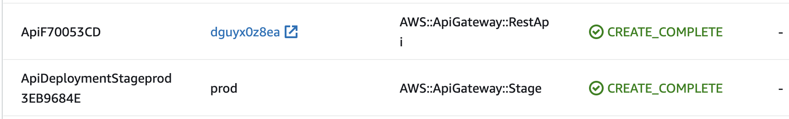

# Resolve Cloud Tokens

* **Original Author(s):** @iliapolo
* **Tracking Issue**: https://github.com/cdk8s-team/cdk8s/issues/1216
* **API Bar Raiser**: @rix0rrr

Users can now configure custom resolvers to control how cdk8s resolves values before writing 
them to the manifest. In addition, custom resolvers for the AWS CDK and CDKTF token systems are available, 
allowing users to natively pass information about cloud resources to Kubernetes applications.

## Working Backwards

### CHANGELOG

`feat(synth): custom resolvers`

### README

Custom resolvers are a mechanism to inject custom logic into the cdk8s value resolution process. 
It allows to transform any value just before being written to the Kubernetes manifest. To define a 
custom resolver, first create a class that implements the `IValueResolver` interface:

```ts
import { IValueResolver, ResolutionContext } from 'cdk8s';

export class MyCustomResolver implements IValueResolver {

  public resolve(context: ResolutionContext): any {
    const newValue = ... // run some custom logic
    context.replaceValue(newValue);
  }

}
```

The `context` argument contains information about the value that is currently being resolved:

- **obj**: `ApiObject` currently being resolved.
- **key**: Array containing the JSON path elements of the keys leading up to the value.
- **value**: The original value.

It also contains the `replaceValue` method you should use to set a replacement value instead of the original.
When you create a cdk8s `App`, pass the resolver instance to it via the `resolver` property:

```ts
import { App, Chart } from 'cdk8s'

const app = new App({ resolver: new MyCustomResolver() });
new Chart(app, 'Chart');
```

When you run `cdk8s synth`, your custom logic will be invoked, allowing you to replace the 
original value. For example, if you define a Kubernetes `Service`` like so:

```ts
new KubeService(this, 'Service', {
  spec: {
    type: 'LoadBalancer',
  }
});
```

Your resolver will be invoked with the following arguments:

- **context**
  - *obj*: The `KubeService` instance.
  - *key*: `['spec', 'type']`
  - *value*: `LoadBalancer`

One common use-case for this feature is to automatically resolve deploy time 
attributes of cloud resources defined by other CDK frameworks.

#### AWS Cloud Development Kit

The `AwsCdkResolver` is able to resolve any [`CfnOutput`](https://docs.aws.amazon.com/cdk/api/v2/docs/aws-cdk-lib.CfnOutput.html) 
defined by your AWS CDK application. In this example, we create an S3 `Bucket` with the AWS CDK, and pass its (deploy time generated) 
name as an environment variable to a Kubernetes `CronJob` resource.

```ts
import * as aws from 'aws-cdk-lib';
import * as k8s from 'cdk8s';
import * as kplus from 'cdk8s-plus-26';

import { AwsCdkResolver } from '@cdk8s/aws-cdk-resolver';

const awsApp = new aws.App();
const stack = new aws.Stack(awsApp, 'aws');

const k8sApp = new k8s.App({ resolver: new AwsCdkResolver() });
const manifest = new k8s.Chart(k8sApp, 'Manifest');

const bucket = new aws.aws_s3.Bucket(stack, 'Bucket');
const bucketName = new aws.CfnOutput(stack, 'BucketName', {
  value: bucket.bucketName,
});

new kplus.CronJob(manifest, 'CronJob', {
  schedule: k8s.Cron.daily(),
  containers: [{
    image: 'job',
    envVariables: {
      // directly passing the value of the `CfnOutput` containing 
      // the deploy time bucket name
      BUCKET_NAME: kplus.EnvValue.fromValue(bucketName.value),
    }
 }]
});

awsApp.synth();
k8sApp.synth();
```

During cdk8s synthesis, the custom resolver will detect that `bucketName.value` is not a concrete value, 
but rather a value of a `CfnOutput`. It will then perform AWS service calls in order to fetch the 
actual value from the deployed infrastructure in your account. This means that in order 
for `cdk8s synth` to succeed, it must be executed *after* the AWS CDK resources 
have been deployed. So your deployment workflow should (conceptually) be:

1. `cdk deploy`
2. `cdk8s synth`

> Note that the `AwsCdkResolver` is **only** able to fetch tokens that have a `CfnOutput` defined for them.

##### Permissions

Since running `cdk8s synth` will now require performing AWS service calls, it must have access 
to a set of AWS credentials. Following are the set of actions the credentials must allow:

- `cloudformation:DescribeStacks`

Note that the actions cdk8s require are far more scoped down than those normally required for the 
deployment of AWS CDK applications. It is therefore recommended to not reuse the same set of credentials, 
and instead create a scoped down `ReadOnly` role dedicated for cdk8s resolvers.

> Credentials can be provided in any way that is [supported by the AWS SDK for JavaScript](https://docs.aws.amazon.com/sdk-for-javascript/v2/developer-guide/setting-credentials-node.html).

#### CDK For Terraform

The `CdkTfResolver` is able to resolve any value defined by your CDKTF application. In this example, 
we create an S3 `Bucket` with the CDKTF, and pass its (deploy time generated) name as 
an environment variable to a Kubernetes `CronJob` resource.

```ts
import * as tf from "cdktf";
import * as aws from "@cdktf/provider-aws";
import * as k8s from 'cdk8s';
import * as kplus from 'cdk8s-plus-26';

import { CdkTfResolver } from '@cdk8s/cdktf-resolver';

const awsApp = new tf.App();
const stack = new tf.TerraformStack(awsApp, 'aws');

const k8sApp = new k8s.App({ resolver: new CdkTfResolver() });
const manifest = new k8s.Chart(k8sApp, 'Manifest', { resolver });

const bucket = new aws.s3Bucket.S3Bucket(stack, 'Bucket');

new kplus.CronJob(manifest, 'CronJob', {
  schedule: k8s.Cron.daily(),
  containers: [{
    image: 'job',
    envVariables: {
      BUCKET_NAME: kplus.EnvValue.fromValue(bucket.bucket),
    }
 }]
});

awsApp.synth();
k8sApp.synth();
```

During cdk8s synthesis, the custom resolver will detect that `bucket.bucket` is not a concrete 
value, but rather a token. It will then use the terraform state file in order to fetch 
the actual value from the deployed infrastructure in your account. This means that in order 
for `cdk8s synth` to succeed, it must be executed *after* the CDKTF resources have been deployed.
So your deployment workflow should (conceptually) be:

1. `cdktf deploy`
2. `cdk8s synth`

> **Note that the `terraform` command line must be available on the machine performing `cdk8s synth`.**

##### Permissions

Since running `cdk8s synth` will now require reading tf state, it must have permissions to do so.
In case a remote state file is used, this means providing a set of credentials for the account that have access
to where the state if stored. This will vary depending on your cloud provider, but in most cases will involve giving 
read permissions on a blob storage device (e.g S3 bucket).

Note that the permissions cdk8s require are far more scoped down than those normally required for the 
deployment of CDKTF applications. It is therefore recommended to not reuse the same set of credentials, 
and instead create a scoped down `ReadOnly` role dedicated for cdk8s resolvers.

To make sure the credential you provide are sufficient, you can validate that the following command succeeds:

`terraform state pull`

#### Cross Repository Workflow

As we've seen, your `cdk8s` application needs access to the objects defined in your cloud application. If both applications
are defined within the same file, this is trivial to achieve. If they are in different files, a simple `import` statement will suffice.
However, what if the applications are managed in two separate repositories? This makes it a little trickier, but still possible. 
For the sake of the example we will use the AWS CDK, but the same approach can be applied for CDKTF.

In this scenario, `cdk.ts` in the AWS CDK application, stored in a dedicated repository.

```ts
import * as aws from 'aws-cdk-lib';

const awsApp = new aws.App();
const stack = new aws.Stack(awsApp, 'aws');

const bucket = new aws.aws_s3.Bucket(stack, 'Bucket');
const bucketName = new aws.CfnOutput(stack, 'BucketName', {
  value: bucket.bucketName,
});

awsApp.synth();
```

In order for the `cdk8s` application to have cross repository access, the AWS CDK object instances that we want to expose need to be available
via a package repository. To do this, break up the CDK application into the following files:

`app.ts`

```ts
import * as aws from 'aws-cdk-lib';

const awsApp = new aws.App();
const stack = new aws.Stack(awsApp, 'aws');

const bucket = new aws.aws_s3.Bucket(stack, 'Bucket');
export const bucketName = new aws.CfnOutput(stack, 'BucketName', {
  value: bucket.bucketName,
});

// note that we don't call awsApp.synth here
```

`main.ts`

```ts
import { awsApp } from './app.ts'

awsApp.synth();
```

Now, publish the `app.ts` file to a package manager, so that your `cdk8s` application can install and import it. 
This approach might be somewhat counter intuitive, because normally we only publish classes to the package manager, 
not instances. Indeed, these types of applications introduce a new use-case that requires the sharing of instances.
Conceptually, this is no different than writing state<sup>*</sup> to an SSM parameter or an S3 bucket, and it allows us to remain 
in the boundaries of our programming language, and the typing guarantees it provides.

> <sup>*</sup> Actually, we are only publishing instructions for fetching state, not the state itself.

Assuming `app.ts` was published as the `my-cdk-app` package, our `cdk8s` application will now look like so:

```ts
import * as k8s from 'cdk8s';
import * as kplus from 'cdk8s-plus-26';

// import the desired instance from the AWS CDK app.
import { bucketName } from 'my-cdk-app';

import { AwsCdkResolver } from '@cdk8s/aws-cdk-resolver';

const k8sApp = new k8s.App({ resolver: new AwsCdkResolver() });
const manifest = new k8s.Chart(k8sApp, 'Manifest');

new kplus.CronJob(manifest, 'CronJob', {
  schedule: k8s.Cron.daily(),
  containers: [{
    image: 'job',
    envVariables: {
      // directly passing the value of the `CfnOutput` containing 
      // the deploy time bucket name
      BUCKET_NAME: kplus.EnvValue.fromValue(bucketName.value),
    }
 }]
});

k8sApp.synth();
```

---

Ticking the box below indicates that the public API of this RFC has been
signed-off by the API bar raiser (the `api-approved` label was applied to the
RFC pull request):

```
[ ] Signed-off by API Bar Raiser @xxxxx
```

## Public FAQ

### What are we launching today?

This launch consists of three deliverables:

- A new feature in the `cdk8s` core library that allows injecting custom resolution logic during synthesis.
- A new package called `@cdk8s/aws-cdk-resolver` containing a resolver that knows to detect 
AWS CDK tokens, and fetch its concrete values from AWS.
- A new package called `@cdk8s/cdktf-resolver` containing a resolver that knows to detect 
CDKTF tokens, and fetch its concrete values from terraform state files.

### Why should I use this feature?

If you need to perform some sort of automatic transformation on user defined resource 
definitions, before they get written to the Kubernetes manifest.

More concretely, if your Kubernetes workloads rely on resources offered by a 
cloud provider, you can use this new feature to natively pass information 
about cloud infrastructure to your Kubernetes resources.

## Internal FAQ

### Why are we doing this?

It is common for Kubernetes applications to leverage cloud resources for their operation.
Those cloud resources are often defined and provisioned using other CDK frameworks, 
such as the AWS CDK or the CDKTF. Since cdk8s is built on the same technologies, and supports the 
same programming languages, it stands to reason that users would want to define both cloud and 
Kubernetes resources within the same codebase. As an example, consider a Kubernetes `CronJob` 
that needs an S3 `Bucket` to store its periodic computation results.

When the bucket name is known during synthesis (by explicitly setting the name of the bucket), 
this can be achieved fairly easily, for instance using the AWS CDK:

```ts
import * as aws from 'aws-cdk-lib';
import * as k8s from 'cdk8s';
import * as kplus from 'cdk8s-plus-26';

const k8sApp = new k8s.App();
const awsApp = new aws.App();

const stack = new aws.Stack(awsApp, 'Stack');
const manifest = new k8s.Chart(k8sApp, 'Manifest');

const bucketName = 'my-bucket';

// define the bucket with a well known name
new aws.aws_s3.Bucket(stack, 'Bucket', { bucketName });

// pass the bucket name to the CronJob container
new kplus.CronJob(manifest, 'CronJob', {
 containers: [{ 
   image: 'job',
   envVariables: {
     BUCKET_NAME: kplus.EnvValue.fromValue(bucketName),
   }
 }]
});

k8sApp.synth();
awsApp.synth();
```

This application with synthesize a proper Kubernetes manifest containing the name of bucket:

```yaml
apiVersion: batch/v1
kind: CronJob
metadata:
  name: manifest-cronjob-c86481e8
spec:
  jobTemplate:
    spec:
      template:
        metadata:
          labels:
            cdk8s.io/metadata.addr: Manifest-CronJob-c89809bc
        spec:
          containers:
            - env:
                - name: BUCKET_NAME
                  value: my-bucket
              image: job
```

However, if the bucket is not explicitly specified (as recommended by the 
[AWS CDK best practices guide](https://docs.aws.amazon.com/cdk/v2/guide/best-practices.html)):

```ts
import * as aws from 'aws-cdk-lib';
import * as k8s from 'cdk8s';
import * as kplus from 'cdk8s-plus-26';

const k8sApp = new k8s.App();
const awsApp = new aws.App();

const stack = new aws.Stack(awsApp, 'Stack');
const manifest = new k8s.Chart(k8sApp, 'Manifest');

// define the bucket without an explicit name
new aws.aws_s3.Bucket(stack, 'Bucket');

// pass the bucket name to the CronJob container
new kplus.CronJob(manifest, 'CronJob', {
 containers: [{ 
   image: 'job',
   envVariables: {
     BUCKET_NAME: kplus.EnvValue.fromValue(bucket.bucketName),
   }
 }]
});

k8sApp.synth();
awsApp.synth();
```

The synthesized Kubernetes manifest will not be deployable, as it will not 
contain the actual value of the bucket name, but rather a string 
representation of the AWS CDK token, *representing* the bucket name.

```yaml
apiVersion: batch/v1
kind: CronJob
metadata:
  name: manifest-cronjob-c86481e8
spec:
  jobTemplate:
    spec:
      template:
        metadata:
          labels:
            cdk8s.io/metadata.addr: Manifest-CronJob-c89809bc
        spec:
          containers:
            - env:
                - name: BUCKET_NAME
                  value: ${Token[TOKEN.603]} # whoops, no good
              image: job
```

To generate a deployable manifest, an additional lookup phase is required that will
fetch the value of the bucket name directly from AWS. Currently, customers are forced 
to implement this lookup by themselves, which presents non trivial challenges and burden. 

This feature aims to alleviate that, and make it as easy as possible to author such 
complex applications. 

### Why should we _not_ do this?

There are several mechanisms customers could use to implement this capability without explicit 
support from the cdk8s team. Given that, one could argue that the effort would not be 
worth the value. Following is an outline of such mechanisms:

#### Explicit Token Resolution

Instead of passing tokens directly to cdk8s, customers could explicitly fetch its 
concrete value with a `fetchToken` function they implement:

```ts
...

// define the bucket without an explicit name
new aws.aws_s3.Bucket(stack, 'Bucket');

// fetch its name directly from AWS
const bucketName = fetchToken(bucket.bucketName);

// pass the bucket name to the CronJob container
new kplus.CronJob(manifest, 'CronJob', {
 containers: [{ 
   image: 'job',
   envVariables: {
     BUCKET_NAME: kplus.EnvValue.fromValue(bucketName),
   }
 }]
});

...
```

There are several challenges with this:

- Implementing the `fetchToken` function is not trivial. It requires deep knowledge of 
the AWS CDK token system and must handle premature resolution (i.e when executed before deployment finishes).
- Error prone. Users may forget to call the `fetchToken` method and mistakenly pass the token instead.
- Not idiomatic / ergonomic. It is unnatural for users to incorporate such code into CDK applications.

#### Explicit Output Resolution

Here, customers define a `CfnOutput` for each value they would like to expose to the cdk8s application.
Those outputs are then explicitly resolved using a `fetchOutput` function they implement:

```ts
...

// define the bucket without an explicit name
new aws.aws_s3.Bucket(stack, 'Bucket');

const bucketNameOutput = new aws.CfnOutput(this, 'BucketName', {
  value: bucket.bucketName,
});

// fetch its name directly from AWS
const bucketName = fetchOutput(bucketNameOutput);

// pass the bucket name to the CronJob container
new kplus.CronJob(manifest, 'CronJob', {
 containers: [{ 
   image: 'job',
   envVariables: {
     BUCKET_NAME: kplus.EnvValue.fromValue(bucketName),
   }
 }]
});

...
```

This approach simplifies the implementation of fetching values from AWS, as the function only needs 
to detect and interpret `CfnOutput` types, and not general tokens. It also makes the calls to AWS 
simpler because it only requires a single `DescribeStack` call. However, it still isn't trivial.

In addition, the usability challenges still remain:

- Error prone. Users may forget to define and output and call the `fetchOutput` function and mistakenly pass the token instead.
- Not idiomatic / ergonomic. It is unnatural for users to incorporate such code into CDK applications.

#### Out-Of-Band Query

In this approach, customers decouple the definition of cloud infrastructure from the
definition of Kubernetes resources. That is, instead of referencing `bucket.bucketName`
in the Kubernetes spec, they might extract it from an env variable via `process.env.BUCKET_NAME`.

```ts
...

new kplus.CronJob(manifest, 'CronJob', {
 containers: [{ 
   image: 'job',
   envVariables: {
     BUCKET_NAME: kplus.EnvValue.fromValue(process.env.BUCKET_NAME),
   }
 }]
});

...
```

The responsibility of populating the `BUCKET_NAME` env variable falls to an external 
script that must be executed before calling cdk8s synth. The script will use service 
API's to query for the required information.

Maintaining such a script can be complex because it requires constant coordination 
between two decoupled parts of the application. Every time a new cloud resource is 
utilized, it needs to be added in two places. This makes it clear that such decoupling 
is not natural, and is only caused by technical limitations.

#### Out-Of-Band Provisioning

In this approach, the cloud infrastructure is split into two:

- One part contains independent<sup>*</sup> resources and is defined within
the IaC application (AWS CDK or CDKTF).
- The second part contains the resources being used by Kubernetes resources,
and are provisioned imperatively before synthesis, either as part of the
cdk8s application, or externally. The imperative nature of provisioning allows waiting
on resource creation and passing any required information to downstream processes, 
such as `cdk8s synth`.

> <sup>*</sup> Independent with respect to usage in Kubernetes resource definitions.

However, this separation into imperative provisioning essentially re-introduces all
the complexity that IaC aims to solve, and is not desirable.

#### Post Synth Processing

In this approach, cloud infrastructure and Kubernetes resources are defined in the same
application using the standard IaC tooling. The Kubernetes resources are tightly coupled
with their required cloud resources. 

```ts
...

// define the bucket without an explicit name
new aws.aws_s3.Bucket(stack, 'Bucket');

// pass the bucket name to the CronJob container
new kplus.CronJob(manifest, 'CronJob', {
 containers: [{ 
   image: 'job',
   envVariables: {
     BUCKET_NAME: kplus.EnvValue.fromValue(bucket.bucketName),
   }
 }]
});

cdk8sApp.synth();

...
```

To overcome the problem of unresolved tokens, customers have to post-process the result 
of `cdk8sApp.synth()` to produce the final deployable manifest. This post synthesis 
step inspects the manifest for references to cloud resources, interprets them, 
and performs the necessary lookups.

From an application maintenance perspective, this approach is actually pretty robust.
The problem is that implementing and maintaining such a post synthesis step is not at all
trivial. This RFC essentially proposes baking this step into the cdk8s framework, so that
customers don't have to deal with the complexities it poses.

### What is the technical solution (design) of this feature?

The high-level design consists of three parts:

#### Custom Resolvers

When cdk8s applications are synthesized, the [`resolve`](https://github.com/cdk8s-team/cdk8s-core/blob/v2.7.52/src/_resolve.ts#L3) 
function is called for every property of the user defined resource spec. Currently, it handles 
resolving instances of [`Lazy`](https://github.com/cdk8s-team/cdk8s-core/blob/v2.7.52/src/_resolve.ts#L10) 
and [implicit tokens](https://github.com/cdk8s-team/cdk8s-core/blob/v2.7.52/src/_resolve.ts#L16).

To allow the lookups described in this RFC, we will provide a custom resolution hook in this 
function in the form of an interface, that customers can implement:

```ts
import { ApiObject } from './api-object';

export class ResolutionContext {

  public readonly obj: ApiObject;
  public readonly key: string[];
  public readonly value: any;

  public replaceValue(newValue: any): void {
    ...
  }

}

export interface IValueResolver {

  resolve(context: ResolutionContext): void;
}
```

When a cdk8s application is defined, a custom resolver can be passed to it:

```ts
new App({ resolver: new MyClassThatImplementsIResolver() })
```

During synthesis, the `resolve` function of the custom resolver will be invoked on every primitive value.
To replace the value, `context.replaceValue` should be called with the new value we wish to write to the manifest.

**PoC:** https://github.com/cdk8s-team/cdk8s-core/pull/1163

#### Package `@cdk8s/aws-cdk-resolver`

> PoC: [aws-cdk-resolver.ts](./../examples/typescript/resolve-cloud-tokens/resolvers/aws-cdk-resolver.ts)

A new jsii package containing a class that implements the `IValueResolver` interface. It can 
identify AWS CDK tokens defined inside a `CfnOutput` , and fetch their concrete values by issuing AWS service calls.

**There are some noteworthy points to pay attention to:**

- Since `Ref` is a CloudFormation specific attribute, it does not exist as a key in 
the resource properties as returned by the [cloudcontrol/GetResource][1] API.
In this case, the implementation will return the *physical id* as returned by 
the [cloudformation/DescribeStackResource][2] API, assuming they represent the same 
thing. See [Appendix](#ref-vs-physicalresourceid) for more details and research on this.

- The implementation uses the *physical id* as the `Identifier` argument when calling 
the [cloudcontrol/GetResource][1] API, assuming they map 1:1. See [Appendix](#physicalresourceid-vs-primaryidentifier) 
for more details and research on this.

#### Package `@cdk8s/cdktf-token-resolver`

> PoC: [cdktf-resolver.ts](./../examples/typescript/resolve-cloud-tokens/resolvers/cdktf-resolver.ts)

A new jsii package containing a class that implements the `IValueResolver` interface. It can 
identify CDKTF tokens, and fetch their concrete values by issuing terraform state calls.

### Is this a breaking change?

No

### What alternative solutions did you consider?

#### Cloud Control API

The solution proposed here for AWS CDK is only able to resolve values that have a `CfnOutput` defined for them.
To overcome this limitation, we could have used Cloud Control API, which presumably allows querying for resource attributes
in the same semantics that CloudFormation uses. The resolver could have:

1. Detect an AWS CDK token.
2. Use `Stack.resolve` to extract the logical ID and the attribute name of the token.
3. Invoke Cloud Control API (i.e `GetResource`) to lookup the value based on the above information.

There are several problems with this approach:

- The implementation uses the *physical id* as the `Identifier` argument when calling 
the [cloudcontrol/GetResource][1] API, assuming they map 1:1, but this is not always the case. See [Appendix](#physicalresourceid-vs-primaryidentifier) 
for more details and research on this.

- Cloud Control doesn't yet support all CloudFormation resources.

- Found some API quirks during research which makes me a little un easy using it. See [Appendix](#cc-api-quirk)

#### Automatic Outputs

In this solution, whenever cdk8s encounters an AWS CDK token, instead of trying to 
fetch its corresponding *attribute* value, it will fetch its corresponding *output* value.
If the value doesn't exist, cdk8s will add a corresponding `CfnOutput` resource to the 
stack. It would look something like this:

```ts
// some output id generated from the token (after stack.resolve)
const outputId = 'some-stable-id'

try {
  return fetchOutputValue(stack, outputId)
} catch (error: OutputNotFound) {
  new CfnOutput(stack, outputId, { value: bucket.bucketName });
  // nothing else we can return here...
  return bucket.bucketName
}
```

This solution has the benefit of automatically supporting every value that 
can be defined in an AWS CDK application.

However, in the [cross repository deployment workflow](#cross-repository-workflow) case, 
which we believe will be highly used, this approach poses a usability issue.

To understand why, imagine we want to use an SNS topic within our cdk8s application.
In this scenario, here are the steps required to achieve it.

1. Make a change in the `cdk8s` application to use the topic. This change will likely trigger 
a deployment of the kubernetes manifest - but this deployment has no chance to succeed because the necessary `CfnOutput` still doesn't exist.
2. Since this change is what adds the necessary `CfnOutput`, we now need to perform a CDK deployment from the CDK repo.
3. Go back to the `cdk8s` repository and perform a dummy commit to re-trigger the deployment.

This approach also creates a circular dependency between the repositories, as the CDK repo will need access to the cdk8s application so that the
outputs can be defined. And the cdk8s repo naturally needs access to the CDK application because it uses information it exposes.

#### Utility Functions

Instead of integrating this lookup into the cdk8s resolution process, we could have offered a couple
of utility functions that can perform lookups based on the token they are invoked with.
This would have made is fairly easy for customers to implement either [Explicit Output Resolution](#explicit-output-resolution) 
or [Explicit Token Resolution](#explicit-token-resolution) by themselves.

This option was discarded because it just doesn't satisfy all we wanted to achieve with this feature. 
Also, its engineering effort is not far from the full blown capability we ended choosing, so might as well do the 
the whole thing.

### What are the drawbacks of this solution?

When resolving AWS CDK tokens, we are limited to values that have a `CfnOutput` defined for them.

### What is the high-level project plan?

We plan on releasing this as an experimental feature at first because it introduces a new way
of authoring cdk8s applications. We'd like to bake it the field for a while (3-6 months based on amount of feedback).

## Appendix

### CC API Quirk

```console
 ❯ aws cloudcontrol list-resources --type-name AWS::SQS::Queue                                                     
{
    "ResourceDescriptions": [
        {
            "Identifier": "https://sqs.us-east-1.amazonaws.com/185706627232/Stack-Queue4A7E3555-CiJRmiNfSLJZ",
            "Properties": "{\"QueueUrl\":\"https://sqs.us-east-1.amazonaws.com/185706627232/Stack-Queue4A7E3555-CiJRmiNfSLJZ\"}"
        },
        {
            "Identifier": "https://sqs.us-east-1.amazonaws.com/185706627232/terraform-20230106124443466000000002",
            "Properties": "{\"QueueUrl\":\"https://sqs.us-east-1.amazonaws.com/185706627232/terraform-20230106124443466000000002\"}"
        }
    ],
    "TypeName": "AWS::SQS::Queue"
}
```

Seems to suggest the Identifier for a queue is its URL, but querying by the URL doesn't work:

```console
❯ aws cloudcontrol get-resource --type-name AWS::SQS::Queue --identifier "https://sqs.us-east-1.amazonaws.com/185706627232/Stack-Queue4A7E3555-CiJRmiNfSLJZ"

Error parsing parameter '--identifier': Unable to retrieve https://sqs.us-east-1.amazonaws.com/185706627232/Stack-Queue4A7E3555-CiJRmiNfSLJZ: received non 200 status code of 404
```

Apparently you need to use the queue name...

```console
❯ aws cloudcontrol get-resource --type-name AWS::SQS::Queue --identifier "Stack-Queue4A7E3555-CiJRmiNfSLJZ"       [11:54:55]
{
    "TypeName": "AWS::SQS::Queue",
    "ResourceDescription": {
        "Identifier": "Stack-Queue4A7E3555-CiJRmiNfSLJZ",
        "Properties": "{\"SqsManagedSseEnabled\":true,\"ReceiveMessageWaitTimeSeconds\":0,\"DelaySeconds\":0,\"MessageRetentionPeriod\":345600,\"MaximumMessageSize\":262144,\"VisibilityTimeout\":30,\"Arn\":\"arn:aws:sqs:us-east-1:185706627232:Stack-Queue4A7E3555-CiJRmiNfSLJZ\",\"QueueName\":\"Stack-Queue4A7E3555-CiJRmiNfSLJZ\",\"QueueUrl\":\"Stack-Queue4A7E3555-CiJRmiNfSLJZ\"}"
    }
}
```

### `PhysicalResourceID` vs `PrimaryIdentifier`

Research shows that the primary identifier maps to the physical id when there is a single *primary identifier* 
for the resource, but breaks when its a composite. For example, the *primary identifier* 
for the `AWS::ApiGateway::Stage` resource is, as defined by its schema:

  ```json
  "primaryIdentifier" : [ "/properties/RestApiId", "/properties/StageName" ],
  ```

This means that in order to invoke the [cloudcontrol/GetResource][1] API on a stage, we
must pass a string in the form of `${ApiId}|${StageName}` (See [Using a resource's primary identifier](4)).
However, the *physical id* (and the return value of `Ref`) for a stage is only its name.



Invoking the API with just its name results in an error:

```console
'Identifier prod is not valid for identifier [/properties/RestApiId, /properties/StageName]'
```

This means that for such resources, retrieving any attribute other than `Ref` will not work.
Searching for resources with a composite primary identifier among [resource schemas][5] 
(using the `"primaryIdentifier" : \[.+,.+\]` regex) reveals 321 such resources out of 998 
total resources. However, specifically for the `AWS::ApiGateway::Stage` resource, the only
available attribute is `Ref`, so its impossible to end up in the faulty code path.

Here are some more randomly selected examples, that reveal even more different behaviors:

**AWS::Cassandra::Table**

Primary identifier: `[ "/properties/KeyspaceName", "/properties/TableName" ]`. Looking at 
the [CloudFormation docs][6] we see that `Ref` actually returns `myKeyspace|myTable`, which
incidentally (or not) corresponds to the primary identifier.

**AWS::ECS::TaskSet**

Primary identifier: `[ "/properties/Cluster", "/properties/Service", "/properties/Id" ]`. Looking 
at the [CloudFormation docs][7] we also see that `Ref` returns only the Id, which 
doesn't corresponds to the primary identifier. However, `Id` is also the only attribute on this 
resource, so its actually impossible to request anything else.

**AWS::Kendra::DataSource**

Primary identifier: `[ "/properties/Id", "/properties/IndexId" ]`. Looking at 
the [CloudFormation docs][8] we see that `Ref` actually returns `<data source ID>|<index ID>`, 
which incidentally (or not) corresponds to the primary identifier.

**AWS::Logs::MetricFilter**

Primary identifier: `[ "/properties/LogGroupName", "/properties/FilterName" ]`. Looking 
at [CloudFormation docs][9], we see this resource has no attributes at all.

**AWS::Redshift::EndpointAuthorization**

Primary identifier: `[ "/properties/ClusterIdentifier", "/properties/Account" ]`. Looking 
at the [CloudFormation docs][10] docs, we see many attributes, but it doesn't mention the `Ref` 
attribute. This is probably a documentation mistake because every resource has a `Ref`. 
Its unclear what its return value is, and therefore unclear if it is possible to fetch 
any other attributes. We still need to try and deploy this resource to find out for sure.


[1]: https://docs.aws.amazon.com/cloudcontrolapi/latest/APIReference/API_GetResource.html
[2]: https://docs.aws.amazon.com/AWSCloudFormation/latest/APIReference/API_DescribeStackResource.html
[3]: https://docs.aws.amazon.com/AWSCloudFormation/latest/UserGuide/aws-resource-batch-schedulingpolicy.html#aws-resource-batch-schedulingpolicy-return-values
[4]: https://docs.aws.amazon.com/cloudcontrolapi/latest/userguide/resource-identifier.html#resource-identifier-using
[5]: https://github.com/cdklabs/awscdk-service-spec/tree/main/sources/CloudFormationSchema/us-east-1
[6]: https://docs.aws.amazon.com/AWSCloudFormation/latest/UserGuide/aws-resource-cassandra-table.html#aws-resource-cassandra-table-return-values
[7]: https://docs.aws.amazon.com/AWSCloudFormation/latest/UserGuide/aws-resource-ecs-taskset.html#aws-resource-ecs-taskset-return-values
[8]: https://docs.aws.amazon.com/AWSCloudFormation/latest/UserGuide/aws-resource-kendra-datasource.html#aws-resource-kendra-datasource-return-values
[9]: https://docs.aws.amazon.com/AWSCloudFormation/latest/UserGuide/aws-resource-logs-metricfilter.html
[10]: https://docs.aws.amazon.com/AWSCloudFormation/latest/UserGuide/aws-resource-redshift-endpointauthorization.html#cfn-redshift-endpointauthorization-account
[11]: https://docs.aws.amazon.com/cloudcontrolapi/latest/userguide/supported-resources.html