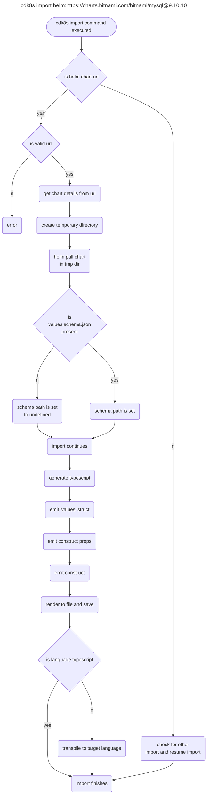

# Helm Import 

* **Original Author(s):** @vinayak-kukreja
* **Tracking Issue:** https://github.com/cdk8s-team/cdk8s/issues/1271
* **API Bar Raiser:** @iliapolo

Users are now able to import helm charts into their cdk8s app with `cdk8s import` command.

## Working Backwards

### README

You can import a helm chart to your cdk8s application. If the helm chart contains a `values.schema.json` then the `values` properties within the 
construct properties for the chart would be typed. And if the schema file is not present, then the values properties would not be typed. 

For example, you can run the following to import a [MySql](https://artifacthub.io/packages/helm/bitnami/mysql) chart. A `values.schema.json` file is
present in this chart.

```
cdk8s import helm:https://charts.bitnami.com/bitnami/mysql@9.10.10
```

Here, `mysql` is the helm chart and `9.10.10` is the chart version.

Then you can use this chart within your application:

```typescript
import { Construct } from 'constructs';
import { App, Chart, ChartProps } from 'cdk8s';
import { Mysql, MysqlArchitecture } from './imports/mysql';

export class MyChart extends Chart {
  constructor(scope: Construct, id: string, props: ChartProps = { }) {
    super(scope, id, props);

    new Mysql(this, 'demo', {
      values: {
        architecture: MysqlArchitecture.STANDALONE,
        common: {
          anyProp: 'foo',
        },
        global: {
          anyGlobalProp: 'bar',
        }
      }
    });

  }
}

const app = new App();
new MyChart(app, 'Typescript-App');
app.synth();
```

Since a `values.schema.json` file was present in the chart, the `values` properties are strongly typed. For instance, `architecture` property is of
type `MysqlArchitecture`. `global` here is for any 
[global chart values](https://helm.sh/docs/chart_template_guide/subcharts_and_globals/#global-chart-values) and `common` here is a 
dependency([subchart](https://helm.sh/docs/chart_template_guide/subcharts_and_globals/)) of the `mysql` parent chart. For instance, this is how some 
of the generated file would look like for `mysql` helm chart:

```typescript
// generated by cdk8s
import { Helm } from 'cdk8s';
import { Construct } from 'constructs';

export interface MysqlValuesProps extends SchemaGeneratedValues {
  readonly common?: { [key: string]: any };
  readonly global?: { [key: string]: any };
}
export interface MysqlProps {
  readonly namespace?: string;
  readonly releaseName?: string;
  readonly helmExecutable?: string;
  readonly helmFlags?: string[];
  readonly values?: MysqlValuesProps;
}

export class Mysql extends Helm {
  public constructor(scope: Construct, id: string, props: MysqlProps = {}) {
    const finalProps = {
      chart: 'mysql',
      repo: 'https://charts.bitnami.com/bitnami',
      version: '9.10.10',
      ...props,
    };
    super(scope, id, {
      ...finalProps,
    });
  }
}

/**
 * @schema mysql
 */
export interface SchemaGeneratedValues {
  /**
   * Allowed values: `standalone` or `replication`
   *
   * @schema mysql#architecture
   */
  readonly architecture?: MysqlArchitecture;

  /**
   * @schema mysql#auth
   */
  readonly auth?: MysqlAuth;

  /**
   * @schema mysql#primary
   */
  readonly primary?: MysqlPrimary;

  /**
   * @schema mysql#secondary
   */
  readonly secondary?: MysqlSecondary;

}
```

> **Note:**
>
> * You would need `helm` to be installed on your machine for using this feature. 
> * For accessing private helm repositories, you must be authenticated to the repository in a way that the `helm pull` command recognizes.

---

Ticking the box below indicates that the public API of this RFC has been
signed-off by the API bar raiser (the `api-approved` label was applied to the
RFC pull request):

```
[ ] Signed-off by API Bar Raiser @iliapolo
```

## Public FAQ

### What are we launching today?

We have added a new feature to the `cdk8s import` command which allows users to import helm charts into their cdk8s app.

### Why should I use this feature?

You should use this feature if you would like to use helm charts within your cdk8s app. This feature would allow you to add values for helm chart 
in a type safe manner if a `values.schema.json` file is present within the chart being used.

## Internal FAQ

### Why are we doing this?

Our current support for including helm charts to cdk8s app adds churn for the user to setup the 
[Helm construct](https://cdk8s.io/docs/latest/basics/helm/) and pass in values to the construct. This feature would have two advantages over the 
current solution:

1. It would make it easier for the user to setup a construct for helm charts. They would just need to run the `cdk8s import` command with a valid url 
and we would auto generate the construct for them.
2. If a `values.schema.json` file is present in the helm chart that the user is referring, then our generated construct would have type safe values 
properties. This is not supported in our current implementation.

### Why should we _not_ do this?

As mentioned above, we do currently have a [solution]((https://cdk8s.io/docs/latest/basics/helm/)) for including helm charts in cdk8s app. 
The proposed feature is definitely an enhancement but would take up developers time and effort to implement and maintain.

### What is the technical solution (design) of this feature?

#### Helm chart url

The following would be the format for a helm url being passed into the import command:

```
cdk8s import helm:<repo-url>/<chart-name>@<chart-version>
```

We can mention an example in [cdk8s import](https://github.com/cdk8s-team/cdk8s-cli/blob/2.x/src/cli/cmds/import.ts#L16-L28) of what an accepted 
helm url format will be for importing a helm chart into a cdk8s app.

```
'cdk8s import helm:https://charts.bitnami.com/bitnami/mysql@9.10.10'
```

Here,
* `helm:`: Is how we will identify if the url being passed in supposed to be a helm chart.
* `https://charts.bitnami.com/bitnami/mysql@9.10.10`: Is the helm chart url.
    * `https://charts.bitnami.com/bitnami/mysql`: Is the helm repo. 
    * `mysql`: Is the name of the helm chart.
    * `9.10.10`: Is the helm chart version.

#### `ImportHelm` class

We would create a new class for importing helm charts called as `ImportHelm` which would extends 
[ImportBase class](https://github.com/cdk8s-team/cdk8s-cli/blob/2.x/src/import/base.ts#L39). In this class we will,

* __Validating and getting information from the url__

  If the url is valid, we can then get the information about the helm chart like, chart name, repo url and chart version from the url.

* __Getting `values.schema.json` file__

  When the user would run the import command, we would need to identify if a `values.schema.json` is present in the helm chart being mentioned. 
  To do so, we can create a temporary directory and pull in and extract the chart in that directory. 

  We can do this with the help of `helm pull` command. 

  ```
  helm pull chart-name --repo chart-url --version chart-version --untar --untardir working-directory
  ```

  ```typescript
  const args = new Array<string>();
  args.push('pull');
  args.push(chartName);
  args.push('--repo', chartUrl);
  args.push('--version', chartVersion);
  args.push('--untar');
  args.push('--untardir', workdir);

  const command = 'helm';

  const helm = spawnSync(command, args, {
    maxBuffer: MAX_HELM_BUFFER,
  });
  ```

  So after extraction, we would look for the `values.schema.json` in the root of the helm chart.

#### Code Generation

ImportBase class has abstract methods [moduleNames](https://github.com/cdk8s-team/cdk8s-cli/blob/2.x/src/import/base.ts#L40) and 
[generateTypeScript](https://github.com/cdk8s-team/cdk8s-cli/blob/2.x/src/import/base.ts#L42). 

As part of the new class `ImportHelm` we also need to define these. Because, when the 
[import](https://github.com/cdk8s-team/cdk8s-cli/blob/2.x/src/import/base.ts#L44) function is 
[invoked]((https://github.com/cdk8s-team/cdk8s-cli/blob/2.x/src/import/dispatch.ts#L17)), it invokes the 
[generateTypeScript](https://github.com/cdk8s-team/cdk8s-cli/blob/2.x/src/import/base.ts#L80-L82) function. 

* __`moduleNames`__

  This method is used to set the name of the generated file.

  ```typescript
  public get moduleNames() {
    return [this.chartName];
  }
  ```

* __`generateTypeScript`__

  This method would generate the typescript code for the helm chart.

  ```typescript
  protected async generateTypeScript(code: CodeMaker) {

    emitHelmHeader(code);

    let schema: JSONSchema4 | undefined;

    if (this.chartSchemaPath !== undefined) {
      JSON.parse(fs.readFileSync(this.chartSchemaPath, 'utf-8'));
    } else {
      schema = undefined;
    }

    const types = new TypeGenerator({
      definitions: schema?.definitions,
    });

    generateHelmConstruct(types, {
      schema: schema,
      chartName: this.chartName,
      chartUrl: this.chartUrl,
      chartVersion: this.chartVersion,
      fqn: this.chartName,
    });

    code.line(types.render());

    cleanup(this.tmpDir);
  }
  ```

In the prior code snippet, for code generation, we utilize [codemaker](https://www.npmjs.com/package/codemaker). 

* __`emitHelmHeader(code)`__

  The function would be responsible for adding any relevant imports for the generated construct.

```typescript
/**
 * Emit imports for generated helm construct
 * @param code CodeMaker instance
 */
export function emitHelmHeader(code: CodeMaker) {
  code.line('// generated by cdk8s');
  code.line('import { Helm } from \'cdk8s\';');
  code.line('import { Construct } from \'constructs\';');
  code.line();
}
```

* __Type generation__

  If a `values.schema.json` file was present in the helm chart, the definitions of the schema as passed in to the 
  [TypeGenerator](https://github.com/cdklabs/json2jsii). TypeGenerator makes it possible to emit structs for a schema and 
  also enables to emit custom types.

  We then invoke `generateHelmConstruct` function. In this function, we are emitting: 
    * A custom type. This would be our helm construct.
    * A `values` property interface which extends schema generated `struct` if a schema file was present in the root of the chart. Otherwise, it would
    be `{ [key: string]: any }` i.e properties will not be typed.
      * If it is typed, it would also have `global` and `dependencies/sub-charts` as properties within the values interface. Currently, these will be 
      not strongly typed.
    * An interface representing properties of the construct.

  ```typescript
  export function generateHelmConstruct(typegen: TypeGenerator, def: HelmObjectDefinition) {

  const chartName = TypeGenerator.normalizeTypeName(def.chartName);
  const schema = def.schema;
  const repoUrl = def.chartUrl;
  const chartVersion = def.chartVersion;

  // Create custom type
  typegen.emitCustomType(chartName, code => {

    const valuesInterface = `${chartName}ValuesProps`;
    if (schema !== undefined) {
      // Interface for schema generated props
      let schemaGenValuesInterface: string = 'SchemaGeneratedValues';
      schemaGenValuesInterface = typegen.emitType(schemaGenValuesInterface, schema, def.fqn);

      // Creating values interface
      emitValuesInterface();

      function emitValuesInterface() {
        code.openBlock(`export interface ${valuesInterface} extends ${schemaGenValuesInterface}`);

        // Sub charts or dependencies
        for (const dependency of def.chartDependencies) {
          code.line(`readonly ${dependency}?: { [key: string]: any };`);
        }

        // Global values
        code.line('readonly global?: { [key: string]: any };');

        code.closeBlock();
      }
    }

    // Creating construct properties
    emitPropsInterface();

    code.line();

    // Creating construct for helm chart
    emitConstruct();

    function emitPropsInterface() {
      code.openBlock(`export interface ${chartName}Props`);

      code.line('readonly namespace?: string;');
      code.line('readonly releaseName?: string;');
      code.line('readonly helmExecutable?: string;');
      code.line('readonly helmFlags?: string[];');

      if (schema === undefined) {
        code.line('readonly values?: { [key: string]: any };');
      } else {
        code.line(`readonly values?: ${valuesInterface};`);
      }

      code.closeBlock();
    }

    function emitConstruct() {
      code.openBlock(`export class ${chartName} extends Helm`);

      emitInitializer();

      code.closeBlock();
    }

    function emitInitializer() {
      code.openBlock(`public constructor(scope: Construct, id: string, props: ${chartName}Props = {})`);

      code.open('const finalProps = {');
      code.line(`chart: \'${def.chartName}\',`);
      code.line(`repo: \'${repoUrl}\',`);
      code.line(`version: \'${chartVersion}\',`);
      code.line('...props,');
      code.close('};');

      code.open('super(scope, id, {');
      code.line('...finalProps,');
      code.close('});');

      code.closeBlock();
    }
  });
  ```

  The generated construct would just be invoking [Helm construct](https://github.com/cdk8s-team/cdk8s-core/blob/2.x/src/helm.ts) constructor and 
  that would use [helm template](https://github.com/cdk8s-team/cdk8s-core/blob/2.x/src/helm.ts#L137-L159) command to generate the manifest with the 
  values that the user has passed in. 

> **Note:**
> 
> The interface being generated here is similar to [HelmProps](https://github.com/cdk8s-team/cdk8s-core/blob/2.x/src/helm.ts#L15-L77) with the 
> difference being in `chart` and `values` properties. Unfortunately, 
> [Omit](https://www.typescriptlang.org/docs/handbook/utility-types.html#omittype-keys) is not supported by jsii and hence the code repetition. 
> There is a [project](https://github.com/mrgrain/jsii-struct-builder) by `mgrain` to support this use case but has not been added to jsii yet. 


#### Transpiling to other languages

After the code is successfully generated in typescript, we transpile it to other languages in our 
[ImportBase](https://github.com/cdk8s-team/cdk8s-cli/blob/2.x/src/import/base.ts#L90-L150) class using 
[jsii srcmak](https://github.com/cdklabs/jsii-srcmak). There are no changes required here for this feature.

> **Note:**
>
> The language naming conventions are followed when typescript code is transpiled. This results in casing changes for the properties of the 
>generated construct. But, this does not impact the manifest generation since as part of transpiling the casing corelation between properties 
>and transpiled properties is added. For instance, following is some of the properties mapping for `mysql` helm chart in python:
> ```python
> @jsii.data_type(
>    jsii_type="mysql.MysqlAuth",
>    jsii_struct_bases=[],
>    name_mapping={
>        "password": "password",
>        "username": "username",
>        "create_database": "createDatabase",
>        "database": "database",
>        "replication_password": "replicationPassword",
>        "replication_user": "replicationUser",
>        "root_password": "rootPassword",
>    },
>)
> ```

#### Sub scenarios

* **cdk8s import Demo:=helm:https://charts.bitnami.com/bitnami/mysql@9.10.10**

  This would work as expected and will add "Demo" as the 
  [module name prefix](https://github.com/cdk8s-team/cdk8s-cli/blob/2.x/src/cli/cmds/import.ts#L57-L62).

* **cdk8s import helm:https://charts.bitnami.com/bitnami/mysql**

  This would fail the regex since no chart version is being mentioned in the url.

* **cdk8s import helm:https://charts.bitnami.com/**

  This would fail since no chart has been mentioned in the url.

* **cdk8s import helm:www.google.com/mysql@9.10.10**

  This would fail since the url would not lead to a helm chart.

### Flowchart



### Is this a breaking change?

This is not a breaking change. This is adding new functionality to the cdk8s cli import command. 

### What alternative solutions did you consider?

* **Using omit utility type**

  In the proposed solution we are recreating a similar interface to [HelmProps](https://github.com/cdk8s-team/cdk8s-core/blob/2.x/src/helm.ts#L15-L77). This is unideal since it adds redundancy. The reason for doing this is because:
  
    1. We already would know the `chart` value and it would not make sense to ask the user for it which is required in HelmProps.
    2. `values` could have data types associated with its properties which is not supported in HelmProps.
  
  I initially used [Omit utility type](https://www.typescriptlang.org/docs/handbook/utility-types.html#omittype-keys) and it works but just for typescript. When trying to transpile it to other languages it gives out an error due to jsii limitation. 

* **--helm as a flag**

  Instead of using `cdk8s import helm:url`, I initially thought of using a flag `--helm` where if present, it would mean that the url is supposed to be leading to a helm chart. This adds a flag to the import command and keeping it as `helm:` makes it similar to what we have for `github:`.

* **Reusing ApiObjectDefinition**

  In the proposed solution, I have added `HelmObjectDefinition` as an interface instead of reusing and adding to [ApiObjectDefinition](https://github.com/cdk8s-team/cdk8s-cli/blob/2.x/src/import/codegen.ts#L10-L37). I think the two interface represent different things and it would not make sense to combine them for this feature.

### What are the drawbacks of this solution?

* **Interface similar to HelmProps**
  
  As mentioned in the previous sections, there is an interface similar to HelmProps in the proposed solution due to a jsii limitation. We can use 
  `mgrain's` [project](https://github.com/mrgrain/jsii-struct-builder) to reduce code but the emitted interface would still be similar to HelmProps. 

### What is the high-level project plan?

* Implementing the feature and adding tests for it. 
* Create a blog post about this feature demonstrating an end to end development workflow for the user.

### Are there any open issues that need to be addressed later?

During my research, I encountered couple of errors when processing different `values.schemas.json` for code generation. 
Taking an example of Airflow helm chart, some of the errors that I encountered were:

* **`unsupported array type undefined`**
  * [Error Link](https://github.com/cdklabs/json2jsii/blob/main/src/type-generator.ts#L538)
  * Impacting property in schema: [resultBackendConnection](https://github.com/apache/airflow/blob/main/chart/values.schema.json#L1038-L1095)

* **`for "properties", if "type" is specified it has to be an "object"`**
  * [Error Link](https://github.com/cdklabs/json2jsii/blob/main/src/type-generator.ts#L229)
  * Impacting properties in schema:
    * [precedingPaths](https://github.com/apache/airflow/blob/main/chart/values.schema.json#L261-L265)
    * [succeedingPaths](https://github.com/apache/airflow/blob/main/chart/values.schema.json#L266-L270)
    * [extraMappings](https://github.com/apache/airflow/blob/main/chart/values.schema.json#L4241-L4245)
    * [overrideMappings](https://github.com/apache/airflow/blob/main/chart/values.schema.json#L4246-L4250)

Before releasing the feature, we need to invest into testing the solution with different schemas and add sanitization to properties where possible and callout schema patterns that cannot be supported.

## Appendix

### Prototype

Here is a [draft PR](https://github.com/cdk8s-team/cdk8s-cli/pull/1202) of current implementation for Helm Import.