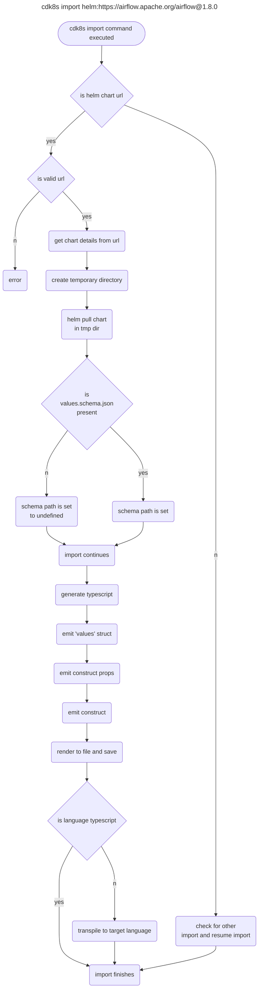

# HELM IMPORT

* **Original Author(s):** @vinayak-kukreja
* **Tracking Issue:** https://github.com/cdk8s-team/cdk8s/issues/1271
* **API Bar Raiser:** @iliapolo

Users are now able to import helm charts into their cdk8s application with `cdk8s import` command.

## Working Backwards

### README

You can add a helm chart to your cdk8s application by running:

```
cdk8s import helm:https://airflow.apache.org/airflow@1.8.0
```

Here, `airflow` is the helm chart and `1.8.0` is the chart version.

Then you can use this chart within your application:

```typescript
import { Construct } from 'constructs';
import { App, Chart, ChartProps } from 'cdk8s';
import { Airflow } from './imports/airflow';

export class MyChart extends Chart {
  constructor(scope: Construct, id: string, props: ChartProps = { }) {
    super(scope, id, props);

    new Airflow(this, 'airflow', {
      values: {
        fullnameOverride: 'Foo',
      }
    });
  }
}

const app = new App();
new MyChart(app, 'typescript-demo');
app.synth();
```

> **Note:**
>
> * You would nee `Helm` to be installed on your machine for using this feature. 
> * We assume that you are authenticated to access the helm chart being mentioned in the url.
> * If a helm chart contains a `values.schema.json` then the `values` properties within the construct properties for the chart would be associate with specific types. For instance, in the prior example `fullnameOverride` is not of `any` type and instead is of `string` type since `airflow` chart has a `values.schema.json` file in it.

---

Ticking the box below indicates that the public API of this RFC has been
signed-off by the API bar raiser (the `api-approved` label was applied to the
RFC pull request):

```
[ ] Signed-off by API Bar Raiser @iliapolo
```

## Public FAQ

### What are we launching today?

We have added a new feature to the `cdk8s import` command which allows users to import helm charts into their cdk8s application.

### Why should I use this feature?

You should use this feature if you would like to manage your helm chart within your cdk8s application. This feature would allow you to add values for your helm chart in a type safe manner if a `values.schema.json` file is present within the chart being used.

## Internal FAQ

### Why are we doing this?

Our current support for including helm charts to cdk8s application adds churn for the user to setup the [helm construct](https://cdk8s.io/docs/latest/basics/helm/) and pass in values to the construct. This feature would have two advantages over the current solution:
1. It would make it easier for the user to setup a construct for their helm chart. They would just need to run the `cdk8s import` command with a valid url and we would auto generate the construct for them with some default values.
2. If a `values.schema.json` file is present in the helm chart that the user is referring, then our generated construct would have type safe values properties. This is not supported in Helm construct currently.

### Why should we _not_ do this?

As mentioned above, we do currently have a [solution]((https://cdk8s.io/docs/latest/basics/helm/)) for including users helm charts in their cdk8s application. The proposed feature is definitely an enhancement but would take up developers time and effort to implement and maintain.

### What is the technical solution (design) of this feature?

#### Helm chart url

The following would be the format for a helm url being passed in to the import command:

```
cdk8s import helm:<repo-url>/<chart-name>@<chart-version>
```

We can mention an example in [cdk8s import](https://github.com/cdk8s-team/cdk8s-cli/blob/2.x/src/cli/cmds/import.ts#L16-L28) of what an accepted helm url format will be for importing a helm chart into a cdk8s app.

```
.example('cdk8s import helm:https://airflow.apache.org/airflow@1.8.0', 'Imports the specified version of helm chart')
```

Here,
* **helm:** - Is how we will identify if the url being passed in supposed to be a helm chart.
* **https://airflow.apache.org/airflow@1.8.0** - Is the helm chart url.
    * **https://airflow.apache.org/** - Is the helm repo. 
    * **airflow** - Is the name of the helm chart.
    * **1.8.0** - Is the helm chart version.

#### Identifying a helm chart

For the url being passed in, we need to [check if the url](https://github.com/cdk8s-team/cdk8s-cli/blob/2.x/src/import/dispatch.ts#L24) is supposed to be a helm chart.

```typescript
async function matchImporter(importSpec: ImportSpec, argv: any): Promise<ImportBase> {

  // ----------- Existing Code -----------

  const helm = importSpec.source.split(':')[0];

  if (helm === 'helm') {
    return new ImportHelm(importSpec);
  }

  // ----------- Existing Code -----------
}
```

#### `ImportHelm` class

We would create a new class for importing called as `ImportHelm` which would extends [ImportBase class](https://github.com/cdk8s-team/cdk8s-cli/blob/2.x/src/import/base.ts#L39). The following are sections explaining what would be added to this class.

##### Validating and getting information from the url

If the url is valid, we can then get the information about the helm chart like, chart name, repo url and chart version from the url.

```typescript
/**
 * Validating if a helm chart url is in an expected format
 * @param url
 */
function validateHelmUrl(url: string): RegExpExecArray {
  const helmRegex = /^helm:([A-Za-z0-9_.-:]+)\/([A-Za-z0-9_.-:]+)\@([0-9]+)\.([0-9]+)\.([0-9]+)$/;
  const match = helmRegex.exec(url);

  if (match) {
    return match;
  } else {
    throw Error(`There was an error processing the helm chart url you passed in: ${url}. Make sure it matches the format of 'helm:<repo-url>/<chart-name>@<chart-version>'.`);
  }
}

/**
 * Gets information about the helm chart from the helm url
 * @param url
 * @returns chartUrl, chartName and chartVersion
 */
function getHelmChartDetails(url: string) {

  const helmChartDetails = validateHelmUrl(url);
  const chartUrl = helmChartDetails[1];
  const chartName = helmChartDetails[2];
  const major = helmChartDetails[3];
  const minor = helmChartDetails[4];
  const patch = helmChartDetails[5];

  const chartVersion = `${major}.${minor}.${patch}`;

  return [chartUrl, chartName, chartVersion];
}
```

##### `values.schema.json`

When the user would run the import command, we would need to identify if a `values.schema.json` is present in the helm chart being mentioned. To do so, we can create a temporary directory and pull in and extract the chart in that directory. 

```typescript
/**
 * Pulls the helm chart in a temporary directory
 * @param chartUrl Chart url
 * @param chartName Chart name
 * @param chartVersion Chart version
 * @returns Temporary directory path
 */
function pullHelmRepo(chartUrl: string, chartName: string, chartVersion: string): string {
  const workdir = fs.mkdtempSync(path.join(os.tmpdir(), 'cdk8s-helm-'));

  const args = new Array<string>();
  args.push('pull');
  args.push(chartName);
  args.push('--repo', chartUrl);
  args.push('--version', chartVersion);
  args.push('--untar');
  args.push('--untardir', workdir);

  const command = 'helm';

  const helm = spawnSync(command, args, {
    maxBuffer: MAX_HELM_BUFFER,
  });

  if (helm.error) {
    const err = helm.error.message;
    if (err.includes('ENOENT')) {
      throw new Error(`unable to execute '${command}' to pull the Helm chart. Is it installed on your system?`);
    }

    throw new Error(`error while pulling a helm chart: ${err}`);
  }

  if (helm.status !== 0) {
    throw new Error(helm.stderr.toString());
  }

  return workdir;
}
```

After extraction, we would look for the `values.schema.json` in the root of the helm chart.

```typescript
  if (fs.existsSync(this.tmpDir)) {
    this.chartSchemaPath = path.join(this.tmpDir, this.chartName, this.schemaFileName);
  } else {
    this.chartSchemaPath = undefined;
  }
```

> **Note:**
>
> After the typescript code generation is successful, we would cleanup the temporary directory created which had the helm chart.
>   ```typescript
>    /**
>     * Cleanup temp directory created
>     * @param tmpDir Temporary directory path
>     */
>    function cleanup(tmpDir: string) {
>       fs.rmSync(tmpDir, { recursive: true });
>    }
>   ```

#### Code Generation

ImportBase class has an abstract methods [moduleNames](https://github.com/cdk8s-team/cdk8s-cli/blob/2.x/src/import/base.ts#L40) and [generateTypeScript](https://github.com/cdk8s-team/cdk8s-cli/blob/2.x/src/import/base.ts#L42). As part of the new class `ImportHelm` we also need to define these.

Now, when the [import](https://github.com/cdk8s-team/cdk8s-cli/blob/2.x/src/import/base.ts#L44) function is [invoked]((https://github.com/cdk8s-team/cdk8s-cli/blob/2.x/src/import/dispatch.ts#L17)), it invokes the [generateTypeScript](https://github.com/cdk8s-team/cdk8s-cli/blob/2.x/src/import/base.ts#L80-L82) function. 

```typescript
  public get moduleNames() {
    return [this.chartName];
  }

  protected async generateTypeScript(code: CodeMaker) {

    emitHelmHeader(code);

    let schema: JSONSchema4 | undefined;

    if (this.chartSchemaPath !== undefined) {
      JSON.parse(fs.readFileSync(this.chartSchemaPath, 'utf-8'));
    } else {
      schema = undefined;
    }

    const types = new TypeGenerator({
      definitions: schema?.definitions,
    });

    generateHelmConstruct(types, {
      schema: schema,
      chartName: this.chartName,
      chartUrl: this.chartUrl,
      chartVersion: this.chartVersion,
      fqn: this.chartName,
    });

    code.line(types.render());

    cleanup(this.tmpDir);
  }
```

For code generation, we already utilize [codemaker](https://www.npmjs.com/package/codemaker). Let's start with `emitHelmHeader(code)`. This function would be responsible for adding relevant imports that the construct would need to run.

```typescript
/**
 * Emit imports for generated helm construct
 * @param code CodeMaker istance
 */
export function emitHelmHeader(code: CodeMaker) {
  code.line('// generated by cdk8s');
  code.line('import { Helm } from \'cdk8s\';');
  code.line('import { Construct } from \'constructs\';');
  code.line();
}
```

After this, we check if there was a schema found in the helm chart. If we did find any, the definitions of the schema as passed in to the [TypeGenerator](https://github.com/cdklabs/json2jsii). TypeGenerator makes it possible to emit structs for a schema and also enables to emit custom types.

We then invoke `generateHelmConstruct` function. In this function, we are emitting: 
  * A custom type. This would be our helm construct.
    * It's constructor/initializer.
  * A `values` property `struct` if schema is defined.
  * An interface representing properties of the construct.

```typescript
export function generateHelmConstruct(typegen: TypeGenerator, def: HelmObjectDefinition) {

  const chartName = TypeGenerator.normalizeTypeName(def.chartName);
  const schema = def.schema;
  const repoUrl = def.chartUrl;
  const chartVersion = def.chartVersion;

  typegen.emitCustomType(chartName, code => {                   // <--------------- Creating custom type

    const valuesInterface = `${chartName}ValuesProps`;          // <--------------- Creating 'values' struct
    if (schema !== undefined) {
      typegen.emitType(valuesInterface, schema, def.fqn);
    }

    emitPropsInterface();                                       // <--------------- Creating construct properties

    code.line();

    emitConstruct();                                            // <--------------- Creating construct for helm chart

    function emitPropsInterface() {
      code.openBlock(`export interface ${chartName}Props`);

      code.line('readonly chart?: string;');
      code.line('readonly repo?: string;');
      code.line('readonly version?: string;');
      code.line('readonly namespace?: string;');
      code.line('readonly releaseName?: string;');
      code.line('readonly helmExecutable?: string;');
      code.line('readonly helmFlags?: string[];');

      if (schema === undefined) {
        code.line('readonly values?: { [key: string]: any };');
      } else {
        code.line(`readonly values?: ${valuesInterface};`);
      }

      code.closeBlock();
    }

    function emitConstruct() {
      code.openBlock(`export class ${chartName} extends Helm`);

      emitInitializer();

      code.closeBlock();
    }

    function emitInitializer() {
      code.openBlock(`public constructor(scope: Construct, id: string, props: ${chartName}Props = {})`);

      code.open('const finalProps = {');
      code.line(`chart: \'${def.chartName}\',`);
      code.line(`repo: \'${repoUrl}\',`);
      code.line(`version: \'${chartVersion}\',`);
      code.line('...props,');
      code.close('};');

      code.open('super(scope, id, {');
      code.line('...finalProps,');
      code.close('});');

      code.closeBlock();
    }
  });
}
```

The generated construct would just be invoking [Helm Construct](https://github.com/cdk8s-team/cdk8s-core/blob/2.x/src/helm.ts) constructor and that would use [helm template](https://github.com/cdk8s-team/cdk8s-core/blob/2.x/src/helm.ts#L137-L159) command to generate the manifest with the values that the user has passed in. 

> **Note:**
> 
> The interface being generated here is similar to [HelmProps](https://github.com/cdk8s-team/cdk8s-core/blob/2.x/src/helm.ts#L15-L77) with the difference being in `chart` and `values` properties. Unfortunately, [Omit](https://www.typescriptlang.org/docs/handbook/utility-types.html#omittype-keys) is not supported by jsii and hence the code repetition. There is a [project](https://github.com/mrgrain/jsii-struct-builder) by `mgrain` to support this use case but has not been added to jsii yet. 


#### Transpiling to other languages

After the code is successfully generated in typescript, we transpile it to other languages in our [ImportBase](https://github.com/cdk8s-team/cdk8s-cli/blob/2.x/src/import/base.ts#L90-L150) class using [jsii srcmak](https://github.com/cdklabs/jsii-srcmak). There are no changes required in this for this feature.

> **Note:**
>
> The language naming conventions are followed when typescript code is transpiled. This results in casing changes for the properties of the generated construct. But, this does not impact the manifest generation since as part of transpiling the corelation between properties is maintained. For instance, following is some of the properties for `airflow` helm chart in python:
> ```python
> @jsii.data_type(
>    jsii_type="airflowtest.AirflowValuesProps",
>    jsii_struct_bases=[],
>    name_mapping={
>        "affinity": "affinity",
>        "airflow_config_annotations": "airflowConfigAnnotations",
>        "airflow_home": "airflowHome",
>        "airflow_local_settings": "airflowLocalSettings",
>        "airflow_pod_annotations": "airflowPodAnnotations",
>        "airflow_version": "airflowVersion",
>        "allow_pod_launching": "allowPodLaunching",
>    },
> )
> ```

#### Flowchart



#### Sub scenarios

* **cdk8s import Demo:=helm:https://airflow.apache.org/airflow@1.8.0**

This would work as expected and will add "Demo" as the [module name prefix](https://github.com/cdk8s-team/cdk8s-cli/blob/2.x/src/cli/cmds/import.ts#L57-L62).

* **cdk8s import helm:https://airflow.apache.org/airflow**

This would fail the regex since no chart version is being mentioned in the url.

* **cdk8s import helm:https://airflow.apache.org/**

This would fail since no chart has been mentioned in the url.

* **cdk8s import helm:www.google.com/airflow@1.8.0**

This would fail since the url would not lead to a helm chart.


### Is this a breaking change?

This is not a breaking change. This is adding new functionality to the cdk8s cli import command. 

### What alternative solutions did you consider? TODO:

* Omit
* --helm
* APIObjectDefinition

### What are the drawbacks of this solution? TODO:

Redundancy HelmProps
Multiple values.schema.json

### What is the high-level project plan? TODO:

> Describe your plan on how to deliver this feature from prototyping to GA.
> Especially think about how to "bake" it in the open and get constant feedback
> from users before you stabilize the APIs.
>
> If you have a project board with your implementation plan, this is a good
> place to link to it.

### Are there any open issues that need to be addressed later? TODO:

Errors in schemas

## Appendix TODO: