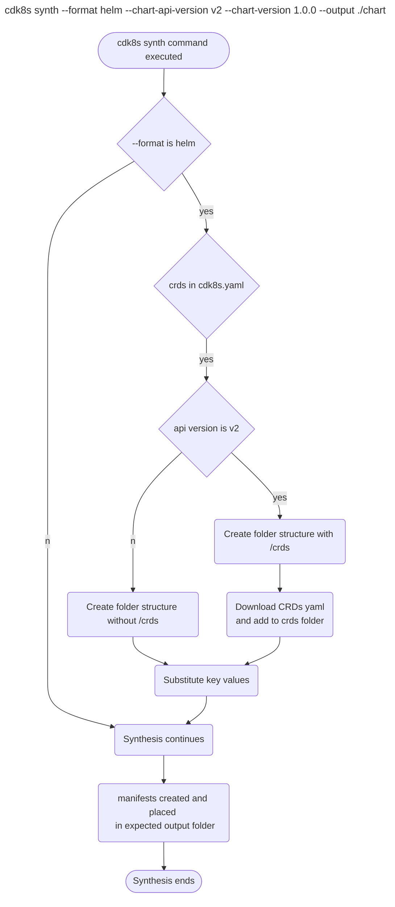

# Helm Synthesis

* **Original Author(s):** @vinayak-kukreja
* **Tracking Issue:** https://github.com/cdk8s-team/cdk8s/issues/1251
* **API Bar Raiser:** @iliapolo

Users can now synthesize a cdk8s application into a helm chart. This will make it easier for them to deploy cdk8s applications using helm.

---

## Working Backwards
### README

You can synthesize your cdk8s application into a Helm chart, that can be directly passed to helm. This allows you to deploy cdk8s applications with Helm. To do so, pass `--format helm` and `--chart-version` for the version you would like to set for the chart to the synthesis command. 

```
cdk8s synth --format helm --chart-version 1.0.0
```

Execution of prior command would create a helm chart directory structure:
```
dist/              
├── Chart.yaml      
├── Readme.md      
└── templates/      
└── crds/           
```

The synthesized manifests of the cdk8s app would be present in the `templates` folder and, your chart's `Chart.yaml` would be:
```
apiVersion: v2                        
name: <app-directory-name>                                 
version: 1.0.0                             
description: Generated chart for <app-directory-name>  
type: application
```

With this generated chart, now you can run `helm install <release-name> ./dist` to install the chart to your Kubernetes cluster.


> **Note:**
Templates within the generated Helm chart are pure and static Kubernetes manifests; they don't contain any helm template directives. This means they cannot be customized with a `values.yaml` file or the release name. One important implication of this is that you cannot deploy two releases of the chart, as resource names will collide. If you need customization, you can do this within the cdk8s application (for example by explicitly reading a `values.yaml` file).

---

> Ticking the box below indicates that the public API of this RFC has been signed-off by the API bar raiser (the `api-approved` label was applied to the RFC pull request):

```
[ ] Signed-off by API Bar Raiser @iliapolo
```

---

## Public FAQ

### What are we launching today?

We have added a new option to `cdk8s synth` command that allows users to synthesize their apps into helm charts.

### Why should I use this feature?

You should use this feature if you'd like to deploy your cdk8s application using Helm.

---

## Internal FAQ

### Why are we doing this?

Helm is a powerful package manager for Kubernetes and is also popular among developers as a deployment tool. It eases the process of deploying to Kubernetes cluster for its users.

Currently, a cdk8s application produces a directory of pure Kubernetes manifests. Deploying those manifests using helm requires user intervention because helm expect a different directory structure, with custom metadata files.

Now, with the implementation of this feature, the user can run,
```
cdk8s synth --format helm --chart-api-version v2 --chart-version 1.0.0 && helm install <release-name> ./dist
```
This will create a helm chart containing the generated manifests and deploy them to the Kubernetes cluster via helm. Also note that until now, they only way to **easily** deploy the output of `cdk8s synth` was using `kubectl apply`, which is less common in production workloads. This feature opens the door for robust and easy deployment of cdk8s applications in a production environment. 

### Why should we _not_ do this?

Customers are not currently blocked for deploying to helm with our synthesized manifests. They would need to create the appropriate helm chart folder structure by themselves and place the synthesized manifests in the templates folder of the chart. With this structure, they can deploy the manifests to their Kubernetes cluster. Now, since a workaround already exists, if we proceed with implementing this RFC, this would take up developers time and effort and will add to maintenance load of cdk8s.

### What is the technical solution (design) of this feature?

We plan on adding a few new options to the `cdk8s synth` command:
* `--format`: Allows users to specify `helm` as a synthesis format. By default, this would be cdk8s, which means synthesis would take place as usual.
* `--chart-api-version`: This is the chart API version of the helm chart. The two possible values here are `v1` for Helm 2 and below, and `v2` for Helm 3. If not passed in by the user, it would default to `v2` API version. 
* `--chart-version`: This is the chart version that user wants for their helm chart. It follows the [SemVer 2](https://semver.org/) standard. This is *required* to be passed in by the user when synthesis format is helm. 

For helm to consume our generated manifests for deployment, we would need to generate a structure similar to what [Helm Charts](https://v2.helm.sh/docs/developing_charts/) look like. The following is a simpler folder structure complying with helm structure. 

```
chart/              # Directory where chart is stored. It is the value of --output. Defaults to `/dist`
├── Chart.yaml      # Information about your chart
├── Readme.md       # A generic readme conveying this chart is generated by cdk8s
└── templates/      # The templates folder. This would contain the generated manifest files
└── crds/           # The crds folder. This would host all the custom resource definitions needed by the helm chart
```

> Note: Any user changes to this structure would be overwritten the next time synthesis takes place.
    
This structure would be created using [sscaff](https://github.com/cdklabs/node-sscaff) in the directory mentioned by `--output` flag. `sscaff` will allow us to copy an entire folder structure as suggested above, with capability of substituting keys and applying pre/post node.js hooks on it.

**Chart.yaml and templates**

[Chart.yaml](https://v2.helm.sh/docs/developing_charts/#the-chart-yaml-file) is required to be part of the helm chart structure for a successful deployment. The following is how the templated `Chart.yaml` file would look like:

```
apiVersion: {{ api-version }}                       # The chart API version. v2 is for Helm 3 and v1 is for previous versions. 
name: {{ app }}                                     # cdk8s app name. This is equal to the current directory name.
version: {{ version }}                              # Chart version.
description: Generated chart for {{ app }}          # Description for the chart
type: application                                   # The chart type can either be ‘application’ or ‘library’. Application charts can be deployed to Kubernetes.
```

Here, `{{ key }}` will be substituted with a value with the help of sscaff. The values are:

* `{{ api-version }}` key is retrieved from `--chart-api-version` cli flag. The allowed values for this would be `v1 and v2`. If not passed in, it would default to `v2`. 
* `{{ version }}` key would be *required* if format is set to `helm`. This is because when helm is generating a package, the helm package command will use the version that it finds in the Chart.yaml as a token in the package name. If not present in Chart.yaml file, this will lead to errors.
    Helm chart version value is not present in cdk8s app. And, defaulting to a value for this can result in an unexpected chart version to be used when user is installing the chart. So we would have the `--chart-version` cli flag to let user pass in the chart version they desire. 

The synthesis process would resume as normal after the substitution of keys is finished. And since format was `helm`, the template that is generated by synthesizing is placed in the `<--output value>/templates` folder. A user can then run the following to deploy to their Kubernetes cluster: 

```
helm install <release-name> ./<--output value>
```

**CRDs**

If the `apiVersion` mentioned is `v2` in `--chart-api-version`, that means the user is utilizing Helm V3. This version of helm provides users with a dedicated folder named `crds` to store the necessary CRDs. 

There would have two separate template structure for `sscaff`, one with `crds` folder and another without it. If the user passes in `--chart-api-version` as `v1`, then the folder structure without the `crds` folder would be used. And if no value is passed in(defaults to v2) or passed in value is `v2` then the folder structure with `crds` will be used.

So, if the CRDs are mentioned in the `cdk8s.yaml` file in the user's cdk8s app, then those would be downloaded and added to the `crds` folder.

> NOTE:  
> * We do not support CRDs functionality for Helm V2 or lower. To support CRDs in these versions Helm adds a custom hook [crd-install](https://v2.helm.sh/docs/charts_hooks/#defining-a-crd-with-the-crd-install-hook) as part of `annotations` in the CRD's yaml file. This would be complex to achieve on our end. 
> * We cannot be aware of CRDs installed with `cdk8s import <crd>`. The CRD needs to be present in the [cdk8s.yaml](https://cdk8s.io/docs/latest/cli/import/#module-name) file for us to add it to the `crds` folder. There is a [feature request](https://github.com/cdk8s-team/cdk8s-cli/issues/886) opened to add crd url being imported via cdk8s cli to cdk8s.yaml file.



### Is this a breaking change?

This is not a breaking change. This is adding new functionality to the cdk8s CLI Synth command. 

### What alternative solutions did you consider?

* **`helm create` command to generate chart structure**

  [helm create](https://helm.sh/docs/helm/helm_create/) is a helm command that generates a templated chart with the necessary folder structure and files needed to deploy the chart with helm. I did not use this to create the chart structure for two reasons:
  1. This would mean that we need to take a dependency with helm or mention to the user that helm needs to be present on their machine for the synthesis to work in this scenario.
  2. This command creates all the necessary structure but also creates files for simple `nginx` application. For our purposes, these files would either needed to be deleted or modified to work with the manifests we are generating. This feels like an over kill to accomplish our requirements.

* **[helm-x](https://github.com/mumoshu/helm-x) and [chartify](https://github.com/helmfile/chartify) libraries**
  
  * One of the functionality that these libraries provide users is to convert Kubernetes resource YAMLs to Helm Charts. These can be used to generate helm charts from our generated manifests from cdk8s app. Currently, these are version `0.x.x`, which means adding these to support our feature could result in added maintenance load for the team. I believe adding a solution of our own would give us more control and not limit us to a library's functionality.
  * Another reason to not use these is that it would add a dependency on a binary file.

### What are the drawbacks of this solution?

In this solution the folder structure for the generated chart is being created by us and not by `helm create` command. If helm introduces any new changes to the chart structure, we would need to accommodate those manually and would need to keep track of these changes. 
If such changes occur frequently then it would add to maintenance of this feature and would take up developers time and effort. To mitigate it, we can then switch to `helm create` for our folder structure generation.

### What is the high-level project plan?

* Implementing the feature and adding tests for it. 
* Initially this feature can be marked as experimental for the users. In this time we can keep track of issues being created for the feature and if there are feature requests for it.
* Once stable, we can create a blog post about this feature demonstrating an end to end development workflow for the user.

### Are there any open issues that need to be addressed later?

No.

---

## Appendix

* **Can cdk8s libraries be synthesized to helm charts?**

  CDK8s libraries are reusable components that defines constructs but cdk8s app contains initialization of these constructs with necessary inputs. Without the initialization of the constructs, cdk8s would not be able to synthesize the manifests for the user.

---