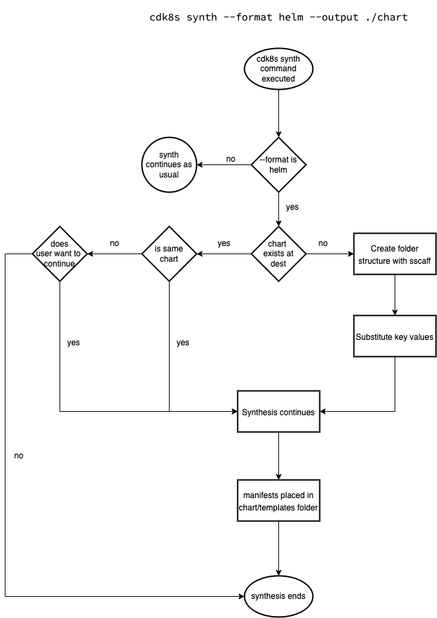

# HELM CHART SYNTHESIS

* **Original Author(s):**: @vinayak-kukreja
* **Tracking Issue**: TODO:
* **API Bar Raiser**: @iliapolo

Users can now choose helm as a synthesis format for their generated manifests which would make it easier for them to deploy manifests using helm.

---

## Working Backwards
### README

**Synthesize CDK8s app to helm format**

You can generate manifest in a helm supported format which can then be used for deploying to Kubernetes cluster with helm. This can be done by using the `--format` flag set to `helm`. 

```
cdk8s synth --format helm --output ./chart
```

> **Note:**
This is only possible for CDK8s app right now and not CDK8s libraries since libraries are reusable components that defines constructs but CDK8s app contains initialization of these constructs with necessary inputs.

---

> Ticking the box below indicates that the public API of this RFC has been signed-off by the API bar raiser (the `api-approved` label was applied to the RFC pull request):

```
[ ] Signed-off by API Bar Raiser @iliapolo
```

---

## Public FAQ

### What are we launching today?

We have added a new feature to CDK8s CLI synth command. Now, the users can synthesize manifests for a CDK8s app to a helm chart supported format. This chart can then be used to deploy to Kubernetes cluster with `helm install`.

### Why should I use this feature?

Currently, the deployment process is not straight forward after generation of manifests with a CDK8s app. This feature would enable you to generate helm charts hosting your generated manifests. This would ease the deployment since helm can accept this chart and deploy it to your Kubernetes cluster. 

---

## Internal FAQ

### Why are we doing this?

The motivation for this change is to ease the deployment process for the users by providing them with `helm` as a synthesis format option.

### Why should we _not_ do this?

There are no downside of adding this features. This would add on to the value of our product.

### What is the technical solution (design) of this feature?

CDK8s CLI currently provides users with a `synth` command that helps with generating manifests for the given CDK8s app. This design focuses on adding more functionality to this command, like this feature would enable users to generate manifests in a structure that is supported by helm and can ease the helm deployment with CDK8s experience for the user.

For instance, once implemented the user would be able to run,
```
cdk8s synth --format helm --output ./chart && helm install <release-name> ./chart
```
where,
* `cdk8s synth`: Is the synth command provided by CDK8s CLI for synthesizing a CDK8s application.
* `--format`: **[NEW]** This would be the flag that can take helm as an option. This would mean that the manifests we would generate for the user would be structured in such a format that it's easier to deploy with helm. By default, this would be cdk8s, which means synthesis would take place as usual.
* `--output`: This is an existing flag where user can specify in which directory they would like the generated manifests to be stored in.
* `helm install`:
   - [Command](https://helm.sh/docs/helm/helm_install/) to deploy manifests hosted within a helm chart to Kubernetes cluster. 
   - `<release-name>`: The release name for the helm deployment.
   - `./chart`: Is the folder here where we have the generated helm chart by CDK8s app.

_An example is worth a thousand words_. Let's go through a couple of user scenarios to understand more about the design being proposed.

**Synthesize CDK8s Apps into Helm Charts**

**Assumptions**
- The user is running synthesis with `--format helm` for a [CDK8s app and not a CDK8s library](##Appendix).

**User runs `cdk8s synth --format helm --output ./chart`** 



For helm to consume our generated manifests for deployment, we would need to generate a structure similar to what [Helm Charts](https://v2.helm.sh/docs/developing_charts/) look like. The following is a simpler folder structure complying with helm structure. The user can add more to it if they desire but this would work for our purpose.

```
chart/              # Value of --output. Defaults to directoryName if format is helm
├── Chart.yaml      # [REQUIRED] Information about your chart
├── Readme.md       # A generic readme conveying this chart is generated by CDK8s
└── templates/      # The template files. These would contain the generated manifest files
```

* **If chart does not exists at --output destination**
    
    This structure would be created using [sscaff](https://github.com/cdklabs/node-sscaff) in the directory mentioned by `--output` flag. `sscaff` will allow us to copy an entire folder structure as suggested above, with capability of substituting keys and applying pre/post node.js hooks on it.

    Now, [Chart.yaml](https://v2.helm.sh/docs/developing_charts/#the-chart-yaml-file) is required to be part of the helm chart structure for a successful deployment. The following is how the templated `Chart.yaml` file would be,

    ```
    apiVersion: v2                                      # [REQUIRED] The chart API version. v2 is for Helm 3 and v1 is for previous versions. 
    name: {{ library }}                                 # [REQUIRED] CDK8s library name. Defaults to current directory name.
    description: Generated chart for {{ library }}      # Description for the chart
    type: application                                   # The chart type can either be ‘application’ or ‘library’. Application charts can be deployed to Kubernetes.
    version: 0.1.0                                      # [REQUIRED] Chart version. Defaults to 0.1.0. Needs to be manually set/increased by user.
    {{ app-version }}                                   # App version. Is not present by default.
    ```

    Here, `{{ key }}` can be substituted with a value with the help of sscaff. We would have two scenarios in this case, running this command for,
    * **_A locally hosted CDK8s app_**
        
        Here, values for,
        * `{{ library }}` and `{{ app-version }}` is substituted from files that provide context about the project like `package.json` or `pyproject.toml`.
        * If these files are not present, the `{{ library }}` key would be substituted with name of the current folder and `{{ app-version }}` would not be set.
    
    * **_A remotely hosted CDK8s library_**
        
        Here, values for,
        * `{{ library }}` is substituted from URL specified by user and `{{ app-version }}` is substituted from argument file that is passed in. If value for `{{ app-version }}` is not present, then the latest version of the library is used. Format for the argument file that would be passed in is as follows,
        ```yaml
        library:                                      # Required
            version: libraryVersion                   # Defaults to latest
            constructs:                               # Required
            - name: constructName                     # Required
                properties:                           # Required
                property-1-name:
                    type: someDataType                # Type and Value are required for a property
                    value: someValue                  
                property-2-name:
                    type: anotherDataType
                    value:
                    someKey: someValue
                    anotherKey: anotherValue
        ```

* **If chart exists at --output destination**
    
    If the chart already exists at the destination, we will read the `chart.yaml` file present,
    * **If the value of library name is not same to what we are expecting**, then the user will be prompted if they would like to go ahead with the change. This is to confirm that the user wants the generated manifests to be stored in mentioned directory and is not a mistake. 
    * **If library name value is similar**, the generated manifests are the only new changes to be added to the existing chart and there is no changes to the chart structure. This is to accommodate any manual changes made to the chart after its initial generation.

    > Call-Out:
    The existing manifests in the `templates` folder would be overwritten during synthesis.


The synthesis process would resume as normal after the substitution of keys is finished or existing chart.yaml has been validated. And since format was `helm`, the template that is generated by synthesizing is placed in the `<--output value>/templates` folder. And the user can now run,

```
helm install <release-name> ./<--output value>
```

to deploy to their Kubernetes cluster.

**User runs `cdk8s synth --format helm`**

This command would execute successfully and will store the chart to the default location. 

For the default directory, since the directory name is suggested to be the chart name by [helm](https://v2.helm.sh/docs/developing_charts/#the-chart-file-structure). So, the `--output` value would be set to the default of library name(if no code synthesis) or directory name(if CDK8s app is local) if `--format` is helm, which is true in this scenario.

### Is this a breaking change?

This is not a breaking change. This is adding new functionality to the CDK8s CLI Synth command. 

### What alternative solutions did you consider?

* **`helm create` command to generate chart structure**

  [helm create](https://helm.sh/docs/helm/helm_create/) is a helm command that generates a templated chart with the necessary folder structure and files needed to deploy the chart with helm. I did not use this to create the chart structure for two reasons,
  1. This would mean that we need to take a dependency with helm or mention to the user that helm needs to be present on their machine for the synthesis to work in this scenario.
  2. This command creates all the necessary structure but also creates files for simple `nginx` application. For our purposes, these files would either needed to be deleted or modified to work with the manifests we are generating. This feels like an over kill to accomplish our requirements.

* **[helm-x](https://github.com/mumoshu/helm-x) and [chartify](https://github.com/helmfile/chartify) libraries**
  
  One of the functionality that these libraries provide users is to convert Kubernetes resource YAMLs to Helm Charts. These can be used to generate helm charts from our generated manifests from CDK8s app. Currently, these are version `0.x.x`, which means adding these to support our feature could result in added maintenance load for the team. I believe adding a solution of our own would give us more control and not limit us to a library's functionality.

### What are the drawbacks of this solution?

* **Synthesis would result in overwriting existing manifests**

    If we generate a helm chart with this approach and re-run synthesis with some changes to our resources. This would result in overwriting the existing manifests completely without any checks. 

### What is the high-level project plan?

* **Support helm format**

   - Add support for `--format` flag and set default to CDK8s. Set flag to [hide](https://github.com/yargs/yargs/pull/190) for now.
   - Create helm chart structure and template relevant files 
   - Synthesize application to helm chart structure
   - Un-hide the flag

### Are there any open issues that need to be addressed later?

* **Generated Manifest Diff**

    This solution currently does not provide with a way to diff between existing manifests within a generated helm chart and incoming changes to the manifest with a new synthesis run. This can be really helpful in understanding what are the incoming changes to the manifests. Currently, this can either be done with having chart under version control or looking at [helm diff](https://github.com/databus23/helm-diff) once the changes are present in the chart. But this brings validation to a later stage of development.

---

## Appendix

* **What is the difference between CDK8s library and CDK8s app?**

  Libraries are reusable components that defines constructs but CDK8s app contains initialization of these constructs with necessary inputs.

---