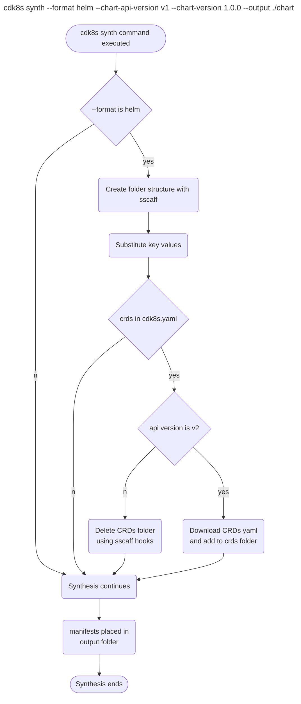

# Helm Synthesis

* **Original Author(s):**: @vinayak-kukreja
* **Tracking Issue**: https://github.com/cdk8s-team/cdk8s/issues/1251
* **API Bar Raiser**: @iliapolo

Users can now synthesize a cdk8s application into a helm chart. This will make it easier for them to deploy cdk8s applications using helm.

---

## Working Backwards
### README

**Synthesize cdk8s applications into helm charts**

You can synthesize your cdk8s application into a Helm chart, that can be directly passed to helm. This allows you to deploy cdk8s applications with Helm. To do so, pass `--format helm` to the synthesis command. 

```
cdk8s synth --format helm --chart-version 1.0.0
```

> **Note:**
* This is only possible for cdk8s app right now and not cdk8s libraries since libraries are reusable components that defines constructs but cdk8s app contains initialization of these constructs with necessary inputs.
* The Helm chart your cdk8s app synthesizes to would be missing `values.yaml` file. This is because the manifests will already contain all the values defined in the cdk8s app.
* The generated templates within the Helm chart are fully static. A limitation that this creates is that you won't be able to have multiple releases with this chart since there will be resource name collisions in the cluster.

---

> Ticking the box below indicates that the public API of this RFC has been signed-off by the API bar raiser (the `api-approved` label was applied to the RFC pull request):

```
[ ] Signed-off by API Bar Raiser @iliapolo
```

---

## Public FAQ

### What are we launching today?

We have added a new option to `cdk8s synth` command that allows users to synthesize their apps into helm charts.

### Why should I use this feature?

You should use this feature if you'd like to deploy your cdk8s application using Helm.

---

## Internal FAQ

### Why are we doing this?

Helm is a renowned package manager for Kubernetes and is also popular among developers as a deployment tool. It eases the process of deploying to Kubernetes cluster for its users.
If a user currently have a cdk8s app, the process of deploying the generated manifests is complex. There is no functionality currently provided by cdk8s that helps with deploying the manifests. Currently the deployment process would look like the following for users cdk8s app,
1. User creates a repository hosting their cdk8s application. They can create the repository using `cdk8s init <project-type>` command and then add their custom code to it.
2. Then user builds and synthesizes their application using `cdk8s synth`. This generates manifests by default to the `dist` folder.
3. Now to deploy these to the user Kubernetes cluster, they would have to run,
   ```
    kubectl apply -f ./dist
   ```

Now, with the implementation of this feature, the user can run,
```
cdk8s synth --format helm --chart-api-version v2 --chart-version 1.0.0 | helm install <release-name> ./dist
```
which would create a helm chart hosting the generated manifests and deploy the resources to their Kubernetes cluster. There are two benefits of this,
1. It would make the manifest authoring process much easier for the user. They would now be writing code in a familiar programming language instead of complex yaml files to create Kubernetes manifests.
2. And, this would ease deployment, as well as let them integrate this with their established workflow that already uses helm. 

### Why should we _not_ do this?

* CDK8s currently does not offer a solution for Kubernetes deployment on its own. But, this does not block the user in any way. They can still deploy the generated manifests using `kubectl apply -f <folder>`. Enabling output format as helm is just us meeting the customers where they are and not creating our own custom solution for deployments.
* If we proceed with implementing this RFC, this would take up developer time and effort and that needs to be weigh against customer demand for such a feature when we know a workaround exists for deploying manifests to Kubernetes cluster.


### What is the technical solution (design) of this feature?

CDK8s CLI currently provides users with a `synth` command that helps with generating manifests for the given cdk8s app. This design focuses on enabling users to generate manifests in a structure that is supported by helm. This can ease the helm deployment with cdk8s experience for the user.

For instance, once implemented the user would be able to run,
```
cdk8s synth --format helm --chart-api-version v1 --chart-version 1.0.0 --output ./chart && 
helm install <release-name> ./chart
```
where,
* `cdk8s synth`: Is the synth command provided by cdk8s CLI for synthesizing a cdk8s application.
* `--format`: **[NEW]** This would be the flag that can take helm as an option. This would mean that the manifests we would generate for the user would be structured in such a format that it's easier to deploy with helm. By default, this would be cdk8s, which means synthesis would take place as usual.
* `--chart-api-version`: **[NEW]** This is the chart API version of the helm chart that user wants to use. This is used in `Charts.yaml` file and determines the chart API to be used for helm.
* `--chart-version`: **[NEW]** This is the chart version that user wants for their helm chart. It follows the [SemVer 2](https://semver.org/) standard.
* `--output`: This is an existing flag where user can specify in which directory they would like the generated manifests to be stored in. If not passed in, and format is set to helm, we will have it default to `/chart` folder.
* `helm install`:
   - [Command](https://helm.sh/docs/helm/helm_install/) to deploy manifests hosted within a helm chart to Kubernetes cluster. 
   - `<release-name>`: The release name for the helm deployment.
   - `./chart`: Is the folder here where we have the generated helm chart by cdk8s app.

_An example is worth a thousand words_. Let's go through a couple of user scenarios to understand more about the design being proposed.

**Synthesize cdk8s Apps into Helm Charts**

**Assumptions**
- The user is running synthesis with `--format helm` for a [cdk8s app and not a cdk8s library](##Appendix).

**User runs `cdk8s synth --format helm --chart-api-version v2 --chart-version 1.0.0 --output ./chart`** 



For helm to consume our generated manifests for deployment, we would need to generate a structure similar to what [Helm Charts](https://v2.helm.sh/docs/developing_charts/) look like. The following is a simpler folder structure complying with helm structure. 

NOTE:
* Any user changes to this structure would be overwritten the next time synthesis takes place.

```
chart/              # Value of --output. Defaults to directoryName if format is helm
├── Chart.yaml      # [REQUIRED] Information about your chart
├── Readme.md       # A generic readme conveying this chart is generated by cdk8s
└── templates/      # The templates folder. This would contain the generated manifest files
└── crds/           # The crds folder. This would host all the custom resource definitions needed by the helm chart
```
    
This structure would be created using [sscaff](https://github.com/cdklabs/node-sscaff) in the directory mentioned by `--output` flag. `sscaff` will allow us to copy an entire folder structure as suggested above, with capability of substituting keys and applying pre/post node.js hooks on it.

**Chart.yaml and templates**

Now, [Chart.yaml](https://v2.helm.sh/docs/developing_charts/#the-chart-yaml-file) is required to be part of the helm chart structure for a successful deployment. The following is how the templated `Chart.yaml` file would be,

```
apiVersion: {{ api-version }}                       # [REQUIRED] The chart API version. v2 is for Helm 3 and v1 is for previous versions. 
name: {{ library }}                                 # [REQUIRED] cdk8s library name. Defaults to current directory name.
version: {{ version }}                              # [REQUIRED] Chart version.
description: Generated chart for {{ library }}      # Description for the chart
type: application                                   # The chart type can either be ‘application’ or ‘library’. Application charts can be deployed to Kubernetes.
```

Here, `{{ key }}` can be substituted with a value with the help of sscaff.    
The values for,
    * `{{ api-version }}` key is retrieved from `--chart-api-version` cli flag. The allowed values for this would be `v1 and v2`. If not passed in, it would default to `v2`. 
    * `{{ library }}` key would be substituted with name of the `--output` directory. If not set, it would default to the name of the current directory.
    * `{{ version }}` key would be **required** if format is set to `helm`. This can be retrieved from the `--chart-version` cli flag. Helm [relies on this value](https://v2.helm.sh/docs/charts/#charts-and-versioning) for multiple things, one of them being,
        ```
        The version field inside of the Chart.yaml is used by many of the Helm tools, including the CLI and the Tiller server. When generating a package, the helm package command will use the version that it finds in the Chart.yaml as a token in the package name. The system assumes that the version number in the chart package name matches the version number in the Chart.yaml. Failure to meet this assumption will cause an error.
        ```

NOTE: 
There are no difference in `apiVersion` [v1](https://helm.sh/docs/topics/charts/) and [v2](https://v2.helm.sh/docs/charts/) for required properties in `Chart.yaml`.

The synthesis process would resume as normal after the substitution of keys is finished. And since format was `helm`, the template that is generated by synthesizing is placed in the `<--output value>/templates` folder. And the user can now run,

```
helm install <release-name> ./<--output value>
```

to deploy to their Kubernetes cluster.

**CRDs**

If the API Version mentioned is v2 in `--chart-api-version`, that means the user is utilizing Helm V3. This version of helm provides users with a dedicated folder named `crds` to store the necessary CRDs. 
So, if the CRDs are mentioned in the `cdk8s.yaml` file in the user's cdk8s app, then those would be downloaded and added to the `crds` folder.

NOTE:
* We do not support CRDs functionality for Helm V2 or lower. To support CRDs in these versions Helm adds a custom hook [crd-install](https://v2.helm.sh/docs/charts_hooks/#defining-a-crd-with-the-crd-install-hook) as part of `annotations` in the CRD's yaml file. This would be complex to achieve on our end. 
    * We will delete the `crds` folder in this scenario using post sscaff hooks.
* We cannot be aware of CRDs installed with `cdk8s import <crd>`. The CRD needs to be present in the [cdk8s.yaml](https://cdk8s.io/docs/latest/cli/import/#module-name) file for us to add it to the `crds` folder.

### Is this a breaking change?

This is not a breaking change. This is adding new functionality to the cdk8s CLI Synth command. 

### What alternative solutions did you consider?

* **`helm create` command to generate chart structure**

  [helm create](https://helm.sh/docs/helm/helm_create/) is a helm command that generates a templated chart with the necessary folder structure and files needed to deploy the chart with helm. I did not use this to create the chart structure for two reasons,
  1. This would mean that we need to take a dependency with helm or mention to the user that helm needs to be present on their machine for the synthesis to work in this scenario.
  2. This command creates all the necessary structure but also creates files for simple `nginx` application. For our purposes, these files would either needed to be deleted or modified to work with the manifests we are generating. This feels like an over kill to accomplish our requirements.

* **[helm-x](https://github.com/mumoshu/helm-x) and [chartify](https://github.com/helmfile/chartify) libraries**
  
  * One of the functionality that these libraries provide users is to convert Kubernetes resource YAMLs to Helm Charts. These can be used to generate helm charts from our generated manifests from cdk8s app. Currently, these are version `0.x.x`, which means adding these to support our feature could result in added maintenance load for the team. I believe adding a solution of our own would give us more control and not limit us to a library's functionality.
  * Another reason to not use these are that it would add a dependency on a binary file.

### What are the drawbacks of this solution?

* CDK8s generated manifests are static

    When cdk8s app generates manifests, the resource names remain the same with each synthesis. In helm, the resource names are prefixed with the release name. This helps deploying the same helm chart multiple times in the same namespace. This is not possible with cdk8s currently. 

* No customizability for generated helm chart

    In this solution, there is no way for us to maintain any information that user adds to the generated helm charts. We would be overwriting any changes to the chart if the synthesis is performed again. This is true for our current manifest synthesis too and is an established contract with the user. 

### What is the high-level project plan?

* **Support helm format**

   - Add support for 
        - `--format` flag and set default to cdk8s. 
        - `--chart-api-version` flag and set default to `v2`.
        - `--chart-version` flag and set as required when `--format` is set to helm. No defaults for this flag.
        - Set flags to [hide](https://github.com/yargs/yargs/pull/190) for now.
   - Create helm chart structure and template relevant files 
   - Download CRDs present in the cdk8s.yaml file
   - Synthesize application to helm chart structure
   - Un-hide the flag

### Are there any open issues that need to be addressed later?

* **Generated Manifest Diff**

    This solution currently does not provide with a way to diff between existing manifests within a generated helm chart and incoming changes to the manifest with a new synthesis run. This can be really helpful in understanding what are the incoming changes to the manifests. Currently, this can either be done with having chart under version control or looking at [helm diff](https://github.com/databus23/helm-diff) once the changes are present in the chart. But this brings validation to a later stage of development.

---

## Appendix

* **What is the difference between cdk8s library and cdk8s app?**

  Libraries are reusable components that defines constructs but cdk8s app contains initialization of these constructs with necessary inputs.

---