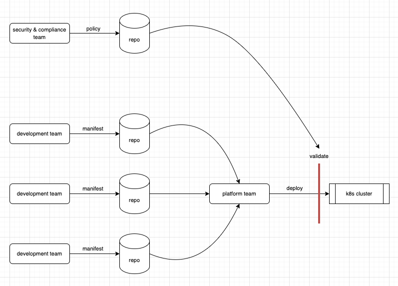
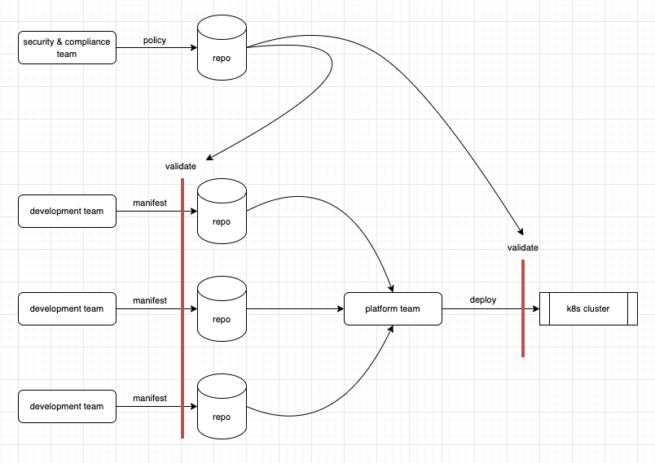
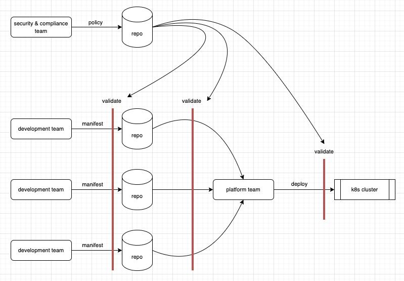

# Manifest validation with cdk8s

This is a working document to propose adding manifest validation mechanisms to the cdk8s toolchain.

## Why

In this section, we’ll answer the following questions:

1. Why are k8s manifest validations needed in general?
2. Why should *cdk8s* in particular offer manifest validation mechanisms?

*So, why is k8s manifest validation needed in general?*

Kubernetes offers an incredibly rich set of resources, each containing a vast number of configuration properties.
Navigating through all of these, to create a “well-written” manifest, can be fairly complicated; making it a bit
too easy to make mistakes that can have a dire affect on your system.

As [mentioned](https://github.com/cdk8s-team/cdk8s/discussions/936#discussioncomment-2954962) by Shimon Tolts, CEO of [Datree](https://datree.io/),
and cited in the [“2022 State Of Kubernetes Security Report”](https://www.redhat.com/rhdc/managed-files/cl-state-of-kubernetes-security-report-2022-ebook-f31209-202205-en.pdf):


> “Human error continues to lead the causes of data breaches. A recent study revealed that human error was a major
> contributing factor in 95% of breaches. Kubernetes and containers, while powerful, were designed for developer
> productivity, not necessarily security. Default pod-to-pod network settings, as an example, allow open communication
> to quickly get a cluster up and running, at the expense of security hardening. Not surprisingly, nearly 53% of respondents
> have experienced a misconfiguration incident in their environments over the last 12 months.”

In light of this, many validation tools have emerged:

* https://github.com/datreeio/datree
* https://www.checkov.io/
* https://docs.snyk.io/’
* ...

*These tools were designed to enforce that manifests are “well-written”, that is:*

1. Comply with the [Kubernetes schema](https://github.com/cdk8s-team/cdk8s/tree/master/kubernetes-schemas).
Every k8s resource has a well defined schema, and if resources diverge from this schema - their deployment will be rejected by the engine.

2. Comply with Kubernetes out-of-schema validations. Sometimes, a resource can be properly configured according to
the schema, but still fail at deployment time. This is because kubernetes does not encode all its deploy time
validations in the schema. For example, the [mutual exclusivity of properties](https://github.com/cdk8s-team/cdk8s/discussions/936#discussioncomment-3054573)
is not encoded in the schema. Another example is restrictions on label string values (length, character set).

3. Follow best practices. Over the years, Kubernetes user base has converged into quite a few common best practices. For example:

    - Every container must configure a memory limit.
    - Every container must configure a liveness and readiness probe.<br><br>

As opposed to the previous two, these violations will not be rejected by the engine, and Kubernetes will
happily deploy a container without any memory limit, potentially starving or crashing other containers.
In most organizations, this behavior is unacceptable, and such manifests should also be rejected.
In addition, while there are commonly known best practices, each organization may also want to define its own
policies (i.e “Organizational best practices”), and would like a mechanism that can validate and reject
manifests that don’t comply to its policies.<br><br>

4. Security and Compliance. Organizations must have control points and gates that prevent the deployment of the
systems that are violating internal company standards and policies (security, compliance, provenance and other risk factors).
Those are often defined as a go/no go policies and each deploy should be validated against those.
The policies should be managed centrally by an authorized personnel. The validation must be automated in order not to impact the velocity.

Throughout this doc, we are going to mainly refer to organizations which are structured as follows:

* *Security & Compliance Team*: Mostly consists of non developer domain experts. They define global policies pertaining to security and data compliance.
* *Platform (DevOps) Team*: Mixed IT and developers. Responsible for deploying and operating the Kubernetes cluster.
* *Development Teams*: Software developers writing both application code *and k8s manifests.*

Such organizations can utilize these tools to protect themselves against misconfigured manifests fairly easily;
The platform team sets up a deploy time gate, either in the form of
an [Admissions Controller](https://kubernetes.io/docs/reference/access-authn-authz/admission-controllers/)<sup>1</sup>,
or by running the validation tools in the deployment pipeline. It looks something like this:




The validate gate is placed *just before the deployment*. It consumes policies produced by the security &
compliance team, and fails the *deployment* if any of the manifests (produced by the development teams) violate said policies.

> <sup>1</sup> Many of the validation tools offer an Admissions Controller off the shelf. It simply invokes the same tool behind the Kubernetes API line.

This brings us to the first assumption we need to make:

_Assumption #1:_

“Companies already have this deploy time validation gate in place.”

If this assumption is wrong, companies should first attend to it. Whether or not they choose to use cdk8s here is up to them.
This use case is not where cdk8s shines, so we are not so focused on it.

---------------------------------------------------

*So, why should cdk8s in particular offer manifest validation mechanisms?*

The deploy time gate described above is the last and most crucial line of defense. It is a must have,
and while it does protect your system, it also presents a problem with respect to the velocity of
development teams; Detecting misconfigurations at deploy time carries a significant delay in the feedback
loop for developers. That is, the elapsed time between a developer introducing a misconfiguration,
and them being notified about it, can be rather long. When an organizations has many development teams,
this can cripple its ability to move fast (and safe). To tackle this problem, organizations should perform
a so called “left-shift” of the validation gate, bringing it as close as possible to the developer.

So the short answer would be:* cdk8s is well positioned to help companies achieve this “left-shift” process.*

One could argue that, since cdk8s produces native k8s manifests, users can simply invoke any validation tool
they want after running cdk8s synth, and that there really is no need for explicit cdk8s support for it.
While this is technically true, it’s a lot easier said than done. To understand why, and how cdk8s can help,
we need to describe the process and the challenges it comes with.

The fastest feedback loop is achieved by adding an authoring time validation gate. That is, developers should be
notified about misconfigurations *before* pushing their manifests, without waiting on any external dependencies.



The validate gate is placed *in the developer’s local workflow*. It consumes policies produced by the security & compliance team,
and *rejects manifests* that violate said policies. Note that the deploy time gate is still in place as well.
This gate is really tricky to setup. How can an organization control what a developer runs on their local dev box?
Well, they can’t really. There are normally two courses of action:

* Provide guides that instruct developers to run specific commands before pushing manifests.
* Create wrapper tools and instruct developer to interact with them.

The problem is that guides usually evolve into a long list of outdated commands that developers copy & paste.
And wrapper tools require non trivial code maintenance, in addition to setting up a publishing and consumption mechanism.
In most cases, as requirements change and development teams grow larger, these “mechanisms” fall short.

To mitigate this, organizations should also setup a build time validation gate. That is, execute the
validation in the CI pipeline as part of the build process, *after* the developer pushes the manifest.
This way, even if the developer neglected to validate the manifest locally, it will be validated in
the CI pipeline as part of pull request status checks.



The validate gate is placed *inside the build process*. It consumes policies produced by the security & compliance team,
and fails the *build* if any of the manifests violate said policies. Note that the deploy and authoring time gates
are still in place as well.

However, setting this up is almost just as tricky. How can organizations inject themselves into the build process
of every single development team? When companies are small, this might be doable; But as they grow,
build processes become more and more complex, and require high flexibility. Normally, this results in
development teams setting up their own builds, with the help of libraries and tools provided by central platform teams.
At the end of the day, setting this up always relies on some good intent from the developers.

(Another) One could argue, that given the presence of a centralized deploy time gate, it doesn’t really matter.
If developers choose to use guides and wrapper tools, great, they’re making their development cycle faster; if not,
the misconfigurations they introduce will eventually be caught, and no harm done. This is not accurate, slow
development cycles don’t just hurt the sole developer, they affect the company as a whole. Our goal here is not
only to protect the cluster, but make the entire development cycle as efficient as possible. As we already mentioned,
there’s no way to completely avoid relying on well intended actions. What companies should focus on, is
creating and/or integrating with tools that minimize these actions, and make them as frictionless as possible.

And this is where cdk8s comes in. At its core, the complexities around setting up validation gates stem from
the fact that authoring a manifest is decoupled from validating it. As long as this holds, developers are
able to create and push misconfigured manifests. Since cdk8s is used to author manifests, adding validation
mechanisms to it creates this necessary coupling, and makes sure that every manifest it generates is also valid.
To complete the picture, we need to make another assumption:

_Assumption #2_

“As part of build and local development workflows, teams are running cdk8s synth”

This might not be true. Manifests are not necessarily checked into source control, and their generation
might only take place at deployment time. If this is the case, then for validation sake,
we will recommend adding cdk8s synth to these workflows.

-----------------------------------------------------

So, the slightly longer answer is: *since cdk8s is an
inherent part of the build and local development process, it can, given sufficient support,
be used to implement the validation hooks organizations are looking for.*

Here’s another avenue to consider. Some organizations are still reluctant to give their developers the
freedom to author k8s manifests. This is partly because, as we’ve seen, setting up authoring and build
time validation gates is complex. And without them, development velocity really slows down. For such organizations,
baking validation capabilities into cdk8s can be an enabler for a more decentralized and flexible development
environment. In addition, this capability can attract organizations that have yet to adopt cdk8s for
their manifest authoring needs.

The last point we want to make is a somewhat technical one, but still very important. When authoring manifests
with cdk8s, and especially true for cdk8s-plus, resource names are not easily backtracked to their source in
the cdk8s application. An out-of-band validation will most likely produce a report that lacks the necessary
context to quickly diagnose and fix the violation.

_FAQ_

*Q.* Why does validation with cdk8s make for a frictionless experience? cdk8s can’t magically
know how to validate, and would require manual configuration as well.
*A.* True. However, the cdk8s toolchain is assumed to already be part of the organization.
This is a major integration obstacle that is avoided. In addition, as we’ll see later on, the manual configuration itself will be a very simple one-time operation.

*Q.* Can’t the deploy time gate validate manifests using cdk8s as well?
*A.* As we’ll see later on, It can. Though this is not our main use case.

*Q.* We are proposing many validation gates here, how will companies keep them all in sync?
*A.* At the end of the day, all of these gates can be configured to run the same validation tool.
The deploy time gate will run datree test directly, and the build and authoring time gates will configure cdk8s to do the same.

*Q.* Can we shift even further left? As-you-type validation gate?
*A.* We discuss this in the “Future Possibilities” section.

## What

In this section, we’ll answer the following questions:

1. What are we proposing?
2. What are the requirements from this mechanism?

The proposal here is to allow cdk8s to integrate with third-party k8s manifest validation tools.
Based on user configuration, cdk8s will invoke these tools during synthesis, and optionally reject
manifests that exhibit violations. For example, given the following cdk8s code:

```ts
export class MyChart extends Chart {
  constructor(scope: Construct, id: string) {
    super(scope, id);

    new k8s.KubeDeployment(this, 'Deployment', {
      spec: {
        template: {
          containers: [{ image: 'nginx', name: 'main' }]
        }
      }
    });

  }
}

const app = new App();
new MyChart(app, 'Chart');
app.synth();
```

Along with configuring<sup>2</sup> [datree](https://datree.io/) as the validation tool, running cdk8s synth should
produce something similar to:

```console
❌  Ensure each container has a configured CPU request  [1 occurrence]
    - construct: Chart/Deployment (kind: Deployment)
💡  Missing property object `requests.cpu` - value should be within the accepted boundaries recommended by the organization

❌  Ensure each container image has a pinned (tag) version  [1 occurrence]
    - construct: Chart/Deployment (kind: Deployment)
💡  Incorrect value for key `image` - specify an image version to avoid unpleasant "version surprises" in the future
```

> <sup>2</sup> How exactly this configuration looks like is outlined in the “How” section.

### Requirements

So, let’s define the requirements of this proposed validation mechanism.

#### 1) Open System

There are many validation tools out there. We would like cdk8s to be able to support all of them, without requiring
code changes in the core library for every new tool. Ideally, these integrations will be maintained by the authors
of the validation tools, and not by the cdk8s team.

#### 2) Construct Aware

By default, the validation tools operate on k8s resources. The reports they generate usually point to specific
resources by name. However, when writing cdk8s applications, providing a resource name is actually discouraged,
so the report needs to point to a specific construct instead. In addition, because of the imperative nature of
cdk8s, it’s not always easy to figure out where exactly in the code a construct was even created.
We would like the report to also provide a sort of traceback to help developers locate the specific code being used.

#### 3) Distributable Config

As mentioned earlier, we are operating under the assumption that validation config (e.g which tool, what policy)
is defined by central compliance and security teams, not by the developers themselves. This means that these
teams need a way to publish common configuration that all developer teams can then easily consume.

## How

In this section, we’ll answer the following question:

1. What technical changes / additions are needed in order to fulfill all requirements?

### Distributable Config

Validations will be declared in the cdk8s.yaml configuration file, and the cdk8s CLI will try to
load and execute them. For example, a configuration will look something like:

```yaml
app: node main.js
language: typescript
imports:
  - k8s
validations:
  - http://mycompany.com/cdk8s-validations.yaml

Where http://mycompany.com/cdk8s-validations.yaml is a file published by the central team, and contains:

- package: datree-cdk8s-plugin
  class: DatreeValidation
  config:
    policyUrl: http://mycompany.com/k8s-datree-policy.yaml
- package: checkov-cdk8s-plugin
  class: CheckovValidation
  config:
    rulesUrl: http://mycompany.com/k8s-checkov-policy.yaml
```

We intentionally use `policyUrl` and `rulesUrl` to emphasize that the config of each validation can be different.

Every manifest generated as part of a cdk8s app that uses this config, will undergo both datree and checkov validations,
based on the configuration properties provided by the central team. This way, central teams only maintain the validations
config and policies, and developers only need to point their config file to the appropriate validations URL.

At this point you might be wondering - how would organizations ensure developers actually configure the validations
property to point to the right location? What prevents them from simply omitting it, or making a mistake?
Well, nothing really, when developers are writing manifests, there’s always going to be some setup they need to do.
Our goal is to minimize it, and make it as easy as possible. The way I see this playing out is:

1. Developer writes a cdk8s application without the correct validations config.
2. Developer pushes non-compliant manifests.
3. Deployment guardrails catch these violations, and instruct the developer to add a validations property to their config file.
4. Developer adds the validations property, and avoids these violations going forward.

_FAQ_

*Q*. Why not inline the validations config in the cdk8s.yaml file? Why this level of indirection?
*A*. We are trying to minimize the amount of local setup developers need to do. Adding this level of indirection
means that no matter how the configuration changes, they will always need to perform just a single change.

### Open System

For the validation mechanism to be an open system, we need to create a sort of plugin mechanism.
As already alluded in the previous section, third-parties should be able to implement and publish a
validation plugin, and cdk8s should be able to load and execute it.

Essentially what this means is that we need to define an interface, that third-parties can implement:

```ts
export interface Validation {

  /**
   * Run the validation tool and produce a report.
   */
  validate(manifests: string[]): Violation[];

}

Where the Violation struct is defined as follows:

/**
 * Represents a distinct violation in the manifest.
 */
export interface Violation {
  /**
   * The name of resource exhibiting the violation.
   */
  readonly resourceName: string;
  /**
   * The violation message.
   */
  readonly message: string;

  /**
   * The manifest file this violation originated in.
   */
  readonly manifestPath: string;
}
```

With these interfaces in-place, this is how a datree implementation would potentially look like:

```ts
import { Validation, Violation } from 'cdk8s-cli';

export interface DatreeValidationProps {
  /**
   * URL for the policy to use.
   */
  readonly policyUrl: string;
}

export class DatreeValidation implements Validation {

  private readonly policyUrl: string;

  constructor(props: DatreeValidationProps) {
    this.policyUrl = props.policyUrl;
  }

  public validate(manifests: string[]): Violation[] {
    const report: Violation[] = [];
    for (const manifest of manifests) {
      const out = execSync(`datree test --output json ${manifest}`);
      report.push(...parseOutput(out));
    }
    return report;
  }
}
```

During cdk8s synth, the CLI will look at the validations config property, download it from
the remote source if necessary, and proceed to load and execute the plugins.

Optionally, we could also provide a cdk8s validate command that can operate independently from synthesis.
Instead of synthesizing manifests, it can accept them as a command line argument. This command can then
be used in processes that don’t have access to the original source code, and operate solely on the output
of cdk8s synth. One such example can be the deploy time validation gate we mentioned in the beginning.

_FAQ_

*Q*. Who is responsible for datree CLI to exist on the system? the user? the plugin? cdk8s?
*A. *This would be for the plugin to decide. If embedding the tool inside an npm package is viable,
they can do that. If not, the plugin will probably need to provide installation instructions.

*Q*. Should cdk8s synth fail if the validation results in violations?
*A.* Intuitively I’d say yes, but in order to debug the violation, the manifest itself will most likely be needed.
So we will need to generate it, even if the validation fails. We should probably still exist with non-zero though, to indicate an error.

### Construct Aware

The ability to traceback to constructs world, will be enabled by adding a few annotations to the manifests generated
by cdk8s. More concretely, we add cdk8s.io/construct.path and cdk8s.io/construct.traceback annotations:

```yaml
apiVersion: apps/v1
kind: Deployment
metadata:
  name: chart-deployment-c8a3b439
  annotations:
    cdk8s.io/construct.path: Chart/Deployment
    cdk8s.io/construct.traceback:
      - deployment.ts:25
      - main.ts:15
...
...
```

This should be fairly easy to do by adding this logic in our base
[ApiObject](https://github.com/cdk8s-team/cdk8s-core/blob/2.x/src/api-object.ts) class.
Once we have it, since the violating resource is specified in the report, we can extract
both the traceback and path from these annotations, to produce the final report we show to users.

### Future Possibilities

#### Advanced in-memory validations

The mechanism described here suggests the validations are executed by the CLI. We could however, run
the validations in the framework as well, as part of App.synth. This is somewhat more involved, but
can allow writing more advanced plugins and validations, since they can have access to the
entire in-memory construct tree.

#### As-you-type validations

The furthest left we can go, is providing immediate feedback as soon as a developer types a misconfiguration in their manifest.
This can be achieved by editor plugins and can be extremely useful (but also very annoying if done poorly).
Realistically, we don’t see them team ever creating this alone. Perhaps, if we see demand, we can team up with the IDE
team or the community to work on this.
