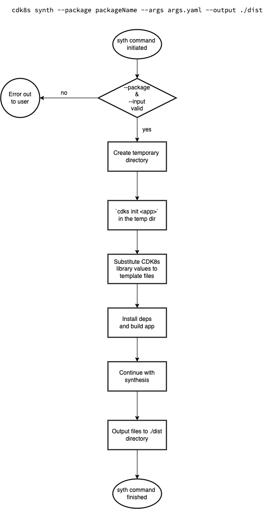

# NO CODE SYNTHESIS

* **Original Author(s):**: @vinayak-kukreja
* **Tracking Issue**: TODO:
* **API Bar Raiser**: @iliapolo

Users are now able to synthesize CDK8s libraries hosted on package registries like npm, pypi without the need of setting up a CDK8s app locally. 

---

## Working Backwards
### README

**No Code Synthesis**

You can synthesize CDK8s libraries hosted on remote package registries. To do that, use the `--package` flag mentioning the remote repository and pass in arguments for the construct you want to use by passing in an arguments YAML file in `--args` flag. 

For instance, considering repository like [cdk8s-jenkins](https://pypi.org/project/cdk8s-jenkins/), the input file would look like,

```yaml
library:                    
  name: cdk8s-jenkins
  version: 0.0.218
  constructs:
    - name: Jenkins
      properties:
        disableCsrfProtection:
          type: boolean
          value: true
        plugins:
          type: object
          value:
            - name: kubernetes
              version: 3893.v73d36f3b_9103
```

Now, you can run the synthesis with,
```
cdk8s synth --package https://pypi.org/project/cdk8s-jenkins/ --args args.yaml
```
---

> Ticking the box below indicates that the public API of this RFC has been signed-off by the API bar raiser (the `api-approved` label was applied to the RFC pull request):

```
[ ] Signed-off by API Bar Raiser @iliapolo
```

---

## Public FAQ

### What are we launching today?

We have added a new features to CDK8s CLI synth command. Now, the users can synthesize manifests for CDK8s libraries hosted on remote package registries like NPM, PYPI.

### Why should I use this feature?

This would enable you to generate manifests without hosting any code locally. For instance, right now, you would need to have a CDK8s App locally and initialize constructs in these libraries and then run synthesis to generate new manifests. With this feature, you can do that just by mentioning the remote repository and passing in an arguments file in the synthesis command and it would generate the manifests for you. 

Another use case could be as part of your CI/CD process where you just need to add a manifest to your repository each time a new change is introduced to your manifests. 

---

## Internal FAQ

### Why are we doing this?

The motivation for this change is to reduce the churn with synthesizing one-off CDK8s libraries by enabling them to generate manifests by synthesizing libraries hosted on remote package registries.

### Why should we _not_ do this?

There are no downside of adding this feature. This would add on to the value of our product.

### What is the technical solution (design) of this feature?

CDK8s CLI provides users with a `synth` command that helps with generating manifests for the given CDK8s App. This design focuses on adding more functionality to this command, like, this would give users the capability of generating manifests for CDK8s libraries existing on remote package registries.

For instance, once implemented the user would be able to run,
```
cdk8s synth --package packageName --args args.yaml --output ./dist
```
where,
* `cdk8s synth`: Is the synth command provided by CDK8s CLI for synthesizing a CDK8s application.
* `--package`: **[NEW]** This would be a URL to the CDK8s library hosted on a remote package registry. 
* `--args`: **[NEW]** This would be the input file that would contain the arguments to be supplied to the CDK8s library's construct. The following is how its format would look like,
  ```yaml
  library:                                    # Required
    name: libraryName                         # Required
    version: libraryVersion                   # Defaults to latest
    constructs:                               # Required
      - name: constructName                   # Required
        properties:                           # Required
          property-1-name:
            type: someDataType                # Type and Value are required for a property
            value: someValue                  
          property-2-name:
            type: anotherDataType
            value:
              someKey: someValue
              anotherKey: anotherValue
  ```
* `--output`: This is an existing flag where user can specify in which directory they would like the generated manifests to be stored in.

_An example is worth a thousand words_. Let's go through a couple of user scenarios to understand more about the design being proposed.

> **Assumption**
The `args.yaml` file is being authored by someone who has context regarding what values can be passed to the construct in library they want to synthesize. For instance, this can be added as guidance by CDK8s library authors for the users to be aware of how to utilize.

**User runs `cdk8s synth --package packageName --args args.yaml --output ./dist`**



Let's consider a scenario where the user wants to utilize a CDK8s Python library that is hosted on `pypi`(a remote package registry), like, https://pypi.org/project/cdk8s-jenkins/. The command would look like,

```
cdk8s synth --package https://pypi.org/project/cdk8s-jenkins/ --args args.yaml --output ./dist
```

The user would be passing in `args.yaml` which would provide inputs for the requested library which here is `cdk8s-jenkins`. The following is how the yaml file would look like for this [construct](https://github.com/cdk8s-team/cdk8s-jenkins/blob/main/src/jenkins.ts), 

```yaml
library:                    
  name: cdk8s-jenkins
  version: 0.0.218
  constructs:
    - name: Jenkins
      properties:
        disableCsrfProtection:
          type: boolean
          value: true
        plugins:
          type: object
          value:
            - name: kubernetes
              version: 3893.v73d36f3b_9103
```

The equivalent JSON would look like,

```json
{
  "library": {
    "version": "0.0.218", 
    "constructs": [
      {
        "name": "Jenkins", 
        "properties": {
          "disableCsrfProtection": {
            "type": "boolean", 
            "value": true
          }, 
          "plugins": {
            "type": "object", 
            "value": [
              {
                "version": "3893.v73d36f3b_9103", 
                "name": "kubernetes"
              }
            ]
          }
        }
      }
    ], 
    "name": "cdk8s-jenkins"
  }
}
```

Here,
* `cdk8s-jenkins`: The example remote CDK8s library here.
* `Jenkins`: The construct within the CDK8s library that user wants to utilize.
* `properties`: The properties that can be passed to the construct. Here they are `disableCsrfProtection` and `plugins`. The `type` here represents the data type and `value` is the property value. The data type here could only be _pure data types_.

#### Pre-Setup and cdk8s init

Now, when execution begins for this command, we are able to capture values for all of the args being passed in using the [yargs](https://github.com/yargs/yargs) module. We currently use this already for our [CDK8s CLI commands](https://github.com/cdk8s-team/cdk8s-cli/blob/2.x/src/cli/cmds/synth.ts#L10-L22) and the new flags can be added here.

Since these are [CDK8s libraries and not CDK8s Apps](##Appendix), these would need to be initialized within an App for them to synthesize a manifest. 

To accomplish this, an empty temporary directory will be created to host the temporary CDK8s application which would execute the requested libraries from the user. This can be done by using [mkdtempSync](https://nodejs.org/api/fs.html#fsmkdtempsyncprefix-options). 

We would utilize the `cdk8s init <type-of-app>` command to initialize a sample repository and the `type-of-app` here would be determined based on the package registry URL that user is passing to us. 

>**CallOut:**
Currently, CDK8s synth requires an `app` value which is `cdk8s.yaml` file for synthesis, which is correct. But if  `--package` is present, the cdk8s.yaml file would be in the temporary directory. So essentially app value would depend upon where synthesis would take place. And hence, if keep it as required we would need to access the properties with,
`process.argv.slice(2).findIndex((element) => element === '--package')`. Instead, we can keep `required: false` and validate this later within the [handler](https://github.com/cdk8s-team/cdk8s-cli/blob/2.x/src/cli/cmds/synth.ts#L24).
```
.option('app', { default: config.app, required: true, desc: 'Command to use in order to execute cdk8s app', alias: 'a' })
```

#### Template Files

[Template files](https://github.com/cdk8s-team/cdk8s-cli/tree/2.x/templates) that are utilized for `cdk8s init` can be used for accommodating these changes too. For instance, following would be the modified template file for our CDK8s Python App,

```python
#!/usr/bin/env python
from constructs import Construct
from cdk8s import App, Chart
{{ dependencies }}

class MyChart(Chart):
    def __init__(self, scope: Construct, id: str):
        super().__init__(scope, id)

        # define resources here
        {{ initialization }}


app = App()
MyChart(app, "{{ $base }}")

app.synth()
```

Here, I am introducing two keys that are `dependencies` and `initialization` that can be substituted with [sscaff](https://github.com/cdklabs/node-sscaff) which substitute values based on keys it encounters in the template. We can get these values based on the inputs passed in the `args.yaml` file. 

For instance, the following would be substituted based on what language we are working with,
- `{{ dependencies }}`: `from cdk8s_jenkins import Jenkins`.
- `{{ initialization }}`: `Jenkins(self, 'jenkins')`

So with substitution this file would look like,

```python
#!/usr/bin/env python
from constructs import Construct
from cdk8s import App, Chart
from cdk8s_jenkins import Jenkins   # <--------

class MyChart(Chart):
    def __init__(self, scope: Construct, id: str):
        super().__init__(scope, id)

        # define resources here
        Jenkins(self, 'jenkins')    # <--------


app = App()
MyChart(app, "{{ $base }}")

app.synth()
```

The dependency `cdk8s_jenkins` would be installed using [sscaff hooks](https://github.com/cdklabs/node-sscaff#hooks) similar to what we already have for [current template files](https://github.com/cdk8s-team/cdk8s-cli/blob/2.x/templates/python-app/.hooks.sscaff.js#L29-L33). So, our template `pipfile` would also have values substituted as,

```
[[source]]
name = "pypi"
url = "https://pypi.org/simple"
verify_ssl = true

[requires]
python_version = "3"

[packages]
constructs = "~={{ constructs_version }}"
{{ library }} = "~={{ library_version }}"   # <--------
```

where `library` is the CDK8s library name and `library_version` is the requested library version. Both of these values will be retrieved from the `args.yaml` file that the user passes in. And the library would be installed as part of post sscaff hook where we run [pipenv install](https://github.com/cdk8s-team/cdk8s-cli/blob/2.x/templates/python-app/.hooks.sscaff.js#L29). 

#### Synthesizing

Since the initial setup is now completed, we continue with synthesizing the application. Now we have our application in place, the `synth` command needs to be aware of the [app](https://github.com/cdk8s-team/cdk8s-cli/blob/2.x/src/cli/cmds/synth.ts#L16) that should be synthesized. Be default, it looks for the `cdk8s.yaml` file in the current folder which would not be present since we are trying to synthesize a remote repository. And since, we had created a temporary directory earlier which hosts our temporary CDK8s application, we can check for the [config file](https://github.com/cdk8s-team/cdk8s-cli/blob/2.x/src/config.ts#L7) present at the temporary directory location which would be `os` dependent: `path.join(os.tmpdir(), 'cdk8s.yaml')`. 

With this, the synthesis process would resume as normal and generate the manifests in the output folder.

#### Cleanup

At the end, the temporary directory would be deleted and if there is an error to delete it, a console message would be displayed for the user to do it manually since it can impact future synthesis. 

#### Sub Scenarios

* **User runs `cdk8s synth --package packageName`**

  This command would result in an error because no input file is being passed. For synthesizing remote libraries we would required the user to pass in an input file.

* **User runs `cdk8s synth --args args.yaml`**

  This would fail since the `--package` flag is not specified. The synthesis process would not be aware of what to work on.

* **User runs `cdk8s synth --package packageName --args args.yaml`**

  This would work as expected given the values passed are correct. Here the manifest files will be generated and placed it in a `./dist` folder in the directory this command is run at. 

### Is this a breaking change?

This is not a breaking change. This is adding new functionality to the CDK8s CLI Synth command. 

### What alternative solutions did you consider?

* **JSII Assemblies and Abstract Syntax Trees**

  [JSII assemblies](https://aws.github.io/jsii/user-guides/language-support/assembly/) give us a lot of context about what the file consists of. For instance, it can help us understand what construct are present in the library and what properties are related to them. This can be very useful and would decrease the user input for the argument's file that they need to pass in for remote synthesis of CDK8s library. 
  Unfortunately, this would only work for libraries that support JSII. We do not force our users to use JSII and hence I looked into similar libraries in different languages that can provide with a similar functionality. Where if presented with a file, the library can generate an abstract syntax tree for it which can provide us with meaningful results. There are two problems with this approach,
  1. This would add more dependencies to our product which in turn adds to more things to maintain or keep up with. 
  2. The experience with AST generation would vary from language to language due to the quality and features of libraries present in each language. This would not give our users a similar experience when working on different languages.

### What are the drawbacks of this solution?

**Running init while no code synthesis would make synth slower**

We need to rely on cdk8s init as part of synthesizing for **No Code Synthesis** since CDK8s libraries are hosted on package registries and not CDK8s apps. So we need to create an app to host them as per the design proposed. This would add to the time we already spend to synthesize manifest. For instance, following are the approximate time taken to run `cdk8s init python-app` five times,

```
59s
46s
42s
42s
43s
```

### What is the high-level project plan?

  - Add support for `--package` flag and `--args` flag. Set flag to [hide](https://github.com/yargs/yargs/pull/190) for now.
  - Add validations for `--args` file format and `--package` inputs. 
  - Update template files to support new keys for substitution
  - Update cdk8s synth command. This would involve,
    - Invoke cdk8s init 
    - Pass in arguments to the templated files
    - Set config file to temp folder
  - Un-hide the flag

### Are there any open issues that need to be addressed later?

* **Support other programming languages like Java, and Go**
This phase of implementation starts with supporting Typescript(NPM) and Python(PYPI) package registries. The next step would be to add support for Java and Go.

* **Additional features for CDK8s libraries supporting JSII**
The `No Code Synthesis` functionality experience can be much smoother if the CDK8s library is supporting JSII. This would enable us to access the JSII assembly for the library and get much of the contextual data that is being passed in the arguments YAML file during synthesis.

---

## Appendix

* **What is the difference between CDK8s library and CDK8s app?**

  Libraries are reusable components that defines constructs but CDK8s App contains initialization of these constructs with necessary inputs.

---