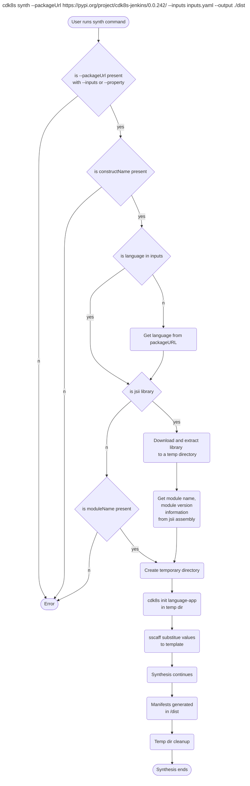

# No Code Synthesis

* **Original Author(s):** @vinayak-kukreja
* **Tracking Issue:** https://github.com/cdk8s-team/cdk8s/issues/1266
* **API Bar Raiser:** @iliapolo

Users are now able to synthesize cdk8s libraries hosted on package registries like npm, pypi without the need of setting up a cdk8s app locally. 

---

## Working Backwards
### README

You can synthesize cdk8s libraries present on remote package registries. To do that, use the `--packageUrl` flag mentioning the remote library and pass in inputs for the construct you want to use by passing in an inputs yaml file in `--inputs` flag.

For instance, for cdk8s jsii library [cdk8s-jenkins](https://pypi.org/project/cdk8s-jenkins/), the following is how `inputs.yaml` file would look like:

```yaml
language: typescript                    # Optional
constructName: Jenkins                  # Required
constructProperties:                    # Optional
  disableCsrfProtection: true
  plugins:
    - name: kubernetes
      version: 3893.v73d36f3b_9103
```

Now to synthesize manifests, you can run:

```
cdk8s synth --packageUrl https://pypi.org/project/cdk8s-jenkins/0.0.242/ --inputs inputs.yaml
```

Instead of passing in an `inputs.yaml` file, you can also pass in inputs by using `--property` flag:

```
cdk8s synth --packageUrl https://pypi.org/project/cdk8s-jenkins/0.0.242/ \
--property language:typescript \
--property constructName:Jenkins \
--property disableCsrfProtection:true \
--property plugins:[{name:kubernetes, version:3893.v73d36f3b_9103}]
```

You can also choose synthesis format as helm for the remote library and deploy to your Kubernetes cluster using helm:

```
cdk8s synth --packageUrl https://pypi.org/project/cdk8s-jenkins/0.0.242/ --inputs inputs.yaml --format helm --chart-version 1.0.0 && helm install <release-name> ./dist
```

> **Note:**
>* This feature currently only supports single constructs from a cdk8s library.
>* The construct constructor may only accept pure data types, not classes or enums.
>* This feature currently is only supporting public library urls. Private library urls is a future enhancement that will be supported.
>* The format for inputs file varies for jsii and non-jsii libraries. For instance, following are examples of how `inputs.yaml` file would look like in different scenarios: 
>
>   * **cdk8s node jsii library**
>     ```yaml
>     language: typescript
>     constructName: Jenkins                # Required
>     constructProperties:
>       disableCsrfProtection: true
>       plugins:
>         - name: kubernetes
>           version: 3893.v73d36f3b_9103
>     ```
>
>   * **cdk8s node non-jsii library**
>     ```yaml
>     language: typescript
>     moduleName: cdk8s-jenkins             # Required 
>     constructName: Jenkins                # Required
>     constructProperties:
>       disableCsrfProtection: true
>       plugins:
>         - name: kubernetes
>           version: 3893.v73d36f3b_9103
>     ```
>   * **cdk8s python jsii library**
>     ```yaml
>     language: python
>     constructName: Jenkins                # Required
>     constructProperties:
>     disable_csrf_protection: true
>     plugins:
>       - name: kubernetes
>         version: 3893.v73d36f3b_9103
>     ```
>   * **cdk8s python non-jsii library**
>     ```yaml
>     language: python
>     moduleName: cdk8s_jenkins             # Required
>     constructName: Jenkins                # Required
>     constructProperties:
>       disable_csrf_protection: true
>       plugins:
>         - name: kubernetes
>           version: 3893.v73d36f3b_9103
>     ```
---

> Ticking the box below indicates that the public API of this RFC has been signed-off by the API bar raiser (the `api-approved` label was applied to the RFC pull request):

```
[ ] Signed-off by API Bar Raiser @iliapolo
```

---

## Public FAQ

### What are we launching today?

We have added a new option to `cdk8s synth` command that allows users to synthesize manifests for cdk8s libraries present on remote package registries.

### Why should I use this feature?

You should use this feature if you do not want to setup a cdk8s app locally to initialize a single construct for synthesizing manifests.

---

## Internal FAQ

### Why are we doing this?

Currently if a user wants to synthesize even a single construct from a cdk8s library: 
1. They would need to create a cdk8s app locally.
2. Add the library to their app & install dependencies.
3. Initialize the construct with necessary values within the app.
4. Compile the app. This step depends on what programming language being used in the user's cdk8s app.
5. Synthesize the app to generate the manifest.

With this feature, this workflow would be simplified for the user and reduce churn to synthesize manifests for single constructs from a cdk8s library.


### Why should we _not_ do this?

As mentioned above there is a workaround existing for the users currently. Since a workaround already exists, if we proceed with implementing this RFC, this would take up developers time and effort and will add to maintenance load of cdk8s.

### What is the technical solution (design) of this feature?

We plan on adding a few new options to the `cdk8s synth` command:
* `--packageUrl`: This would be a url to a cdk8s library present on a remote package registry. It is required to be passed in if the user wants to synthesize a library present on a package registry.
* `--inputs`: This would be the input file that would contain the inputs for a cdk8s library's construct.
* `--property`: This would allow the users to pass in inputs without the `inputs.yaml` file.

> Note: 
> 
> With the `--packageUrl`, either the `--inputs` or `--property`s needs to be passed in with required properties for synthesis to work correctly.

#### `--packageUrl` is a cdk8s jsii library

The `inputs.yaml` file would differ between a cdk8s jsii library and a non-jsii library. The following is what it would be for jsii library:

```yaml
language: programmingLanguage         # Optional
constructName: constructName          # Required
constructProperties:                  # Optional                              
  property-1-name: someValue                  
  property-2-name:
    someKey: someValue
    anotherKey: anotherValue
```

Considering a scenario where the user wants to utilize a cdk8s jsii python library that is present on `pypi`(a remote package registry), like, [cdk8s-jenkins](https://pypi.org/project/cdk8s-jenkins/). Following is what `inputs.yaml` file would be for this library:

```yaml
language: python                      
constructName: Jenkins
constructProperties:
  disable_csrf_protection: true
  plugins:
    - name: kubernetes
      version: 3893.v73d36f3b_9103
```

And, the synth command would be:

```
cdk8s synth --packageUrl https://pypi.org/project/cdk8s-jenkins/0.0.242/ --inputs inputs.yaml --output ./dist
```

##### Pre-Setup and cdk8s init

When cdk8s synth command is executed, we are able to capture values for all of the args being passed in using the [yargs](https://github.com/yargs/yargs) module. We currently use this already for our [cdk8s CLI commands](https://github.com/cdk8s-team/cdk8s-cli/blob/2.x/src/cli/cmds/synth.ts#L10-L22) and the new flags can be added here.

The `--packageUrl` refers to a [cdk8s library and not a cdk8s app](##Appendix). The library would need to be initialized within an app to synthesize manifests. 

To accomplish this, an empty temporary directory will be created. This can be done by using [mkdtempSync](https://nodejs.org/api/fs.html#fsmkdtempsyncprefix-options). The temporary cdk8s application would be created within the temporary directory. It would instantiate the mentioned construct of the library. 

We would utilize the `cdk8s init <type-of-app>` command to initialize the temporary cdk8s app. The `type-of-app` here would be determined based on the `language` property in the `inputs.yaml`. If property is not present, then we would try to get this information from the package url that user is passing in the synth command. 

> **Note:**
> 
> Currently, cdk8s synth requires an [app](https://github.com/cdk8s-team/cdk8s-cli/blob/2.x/src/cli/cmds/synth.ts#L16) value which is [cdk8s.yaml](https://github.com/cdk8s-team/cdk8s-cli/blob/2.x/src/config.ts#L7) file for synthesis, which is correct. But if  `--packageUrl` is present, the `cdk8s.yaml` file would be in the temporary directory. So essentially app value would depend upon where synthesis would take place. 
> 
> So, if keep it as required we would need to access the properties with, `process.argv.slice(2).findIndex((element) => element === '--packageUrl')`. Instead, we can keep `required: false` and validate this later within the [handler](https://github.com/cdk8s-team/cdk8s-cli/blob/2.x/src/cli/cmds/synth.ts#L24).
> ```
> .option('app', { default: config.app, required: true, desc: 'Command to use in order to execute cdk8s app', alias: 'a' })
> ```

##### JSII assembly

[aws-delivlib](https://github.com/cdklabs/aws-delivlib/blob/main/lib/package-integrity/handler/integrity.ts#L239-L278) provides a way to download the library and extract its content. We can use this to extract the library in a temporary directory and look for [.jsii assembly](https://aws.github.io/jsii/user-guides/language-support/assembly/) within it. This assembly provides us with information about the library and limits the inputs we need from the user.

##### Template Files

[Template files](https://github.com/cdk8s-team/cdk8s-cli/tree/2.x/templates) are utilized for `cdk8s init`. The following could be the modified template file for our temporary cdk8s python app:

```python
#!/usr/bin/env python
from constructs import Construct
from cdk8s import App, Chart
{{ dependencies }}                                  # <--------

class MyChart(Chart):
    def __init__(self, scope: Construct, id: str):
        super().__init__(scope, id)

        # define resources here
        {{ initialization }}                        # <--------


app = App()
MyChart(app, "{{ $base }}")

app.synth()
```

Here, I am introducing two keys that are `dependencies` and `initialization` that can be substituted with [sscaff](https://github.com/cdklabs/node-sscaff) which substitute values based on keys it encounters in the template. 

* `{{ dependencies }}`: We can detect the respective module name from the jsii assembly for the library and construct name would be present in the `inputs.yaml` file. For instance, following is where we can find python module name(i.e. cdk8s_jenkins) for the `cdk8s-jenkins` library:
  ```
  "targets": {
    "dotnet": {
      "namespace": "Org.Cdk8s.Jenkins",
      "packageId": "Org.Cdk8s.Jenkins"
    },
    "java": {
      "maven": {
        "artifactId": "cdk8s-jenkins",
        "groupId": "org.cdk8s"
      },
      "package": "org.cdk8s.jenkins"
    },
    "js": {
      "npm": "cdk8s-jenkins"
    },
    "python": {
      "distName": "cdk8s-jenkins",
      "module": "cdk8s_jenkins"
    }
  }
  ```
* `{{ initialization }}`: This would be initializing the construct. The construct name value would be present in the `inputs.yaml` file as `constructName` property. The construct properties values could also be referred from input file from `constructProperties` property. If not present, the construct would be initialized without any properties. 

For instance, for `cdk8s-jenkins` library:
* `{{ dependencies }}`: `from cdk8s_jenkins import Jenkins`
* `{{ initialization }}`: `Jenkins(self, 'jenkins')`.

So with substitution this file would look like,

```python
#!/usr/bin/env python
from constructs import Construct
from cdk8s import App, Chart
from cdk8s_jenkins import Jenkins   # <--------

class MyChart(Chart):
    def __init__(self, scope: Construct, id: str):
        super().__init__(scope, id)

        # define resources here
        Jenkins(self, 'jenkins')    # <--------


app = App()
MyChart(app, "{{ $base }}")

app.synth()
```

The dependency `cdk8s_jenkins` would be installed using [sscaff hooks](https://github.com/cdklabs/node-sscaff#hooks) similar to what we already have for [current template files](https://github.com/cdk8s-team/cdk8s-cli/blob/2.x/templates/python-app/.hooks.sscaff.js#L29-L33). So, our template `pipfile` would also have values substituted as:

```
[[source]]
name = "pypi"
url = "https://pypi.org/simple"
verify_ssl = true

[requires]
python_version = "3"

[packages]
constructs = "~={{ constructs_version }}"
{{ module }} = "~={{ module_version }}"   # <--------
```

`module` is the cdk8s library name(here, cdk8s_jenkins). The `module_version` is the requested library version and it can retrieved from the jsii assembly too. 

And the library would be installed as part of post sscaff hook where we run [pipenv install](https://github.com/cdk8s-team/cdk8s-cli/blob/2.x/templates/python-app/.hooks.sscaff.js#L29). 

##### Synthesizing

Since the initial setup is now completed, we continue with synthesizing the application. The `synth` command needs to be aware of the [app](https://github.com/cdk8s-team/cdk8s-cli/blob/2.x/src/cli/cmds/synth.ts#L16) that should be synthesized. 

Be default, it looks for the `cdk8s.yaml` file in the current folder which would not be present since we are trying to synthesize a remote repository. And since, we had created a temporary directory earlier which has our temporary cdk8s application, we can check for the [config file](https://github.com/cdk8s-team/cdk8s-cli/blob/2.x/src/config.ts#L7) present at the temporary directory location which would be `os` dependent: `path.join(os.tmpdir(), 'cdk8s.yaml')`. 

With this, the synthesis process would resume as normal and generate the manifests in the output folder.

##### Cleanup

At the end, the temporary directories would be deleted. If there is an error to delete it, a console message would be displayed for the user to do it manually since it can impact future synthesis.

#### CDK8s non-jsii library

When the `--packageUrl` library is a non-jsii library, it would be missing `.jsii` assembly which helps us in getting some of the information without the user's input. With a non-jsii library, user would need to add more information in the `inputs.yaml` file: 

```yaml
language: programmingLanguage         # Optional
moduleName: libraryName               # Required
constructName: constructName          # Required   
constructProperties:                  # Optional                      
  property-1-name: someValue                  
  property-2-name:
    someKey: someValue
    anotherKey: anotherValue
```

The `moduleName` would be required to be passed in by the user and would help with `{{ dependencies }}` and `{{ module }}` substitution. The `module_version` would be retrieved from the `--packageUrl` url. If not present, we would use the latest version of the library. 

Rest of the information is similar to what jsii library synthesis needed and would proceed similar to what has been mentioned earlier.

#### `--property` flag

User can also pass in `property` flags with `property:value` instead of passing in `inputs.yaml` file. `yargs` supports passing in [duplicate arguments](https://www.npmjs.com/package/yargs-parser/v/18.1.3#duplicate-arguments-array).


#### Sub Scenarios

* **User runs `cdk8s synth --inputs inputs.yaml`**

  This would fail since the `--packageUrl` flag is not specified. The synthesis process would not be aware of what to work on.

* **User runs `cdk8s synth --property sampleProperty:sampleValue`**

  This would fail since the `--packageUrl` flag is not specified. The synthesis process would not be aware of what to work on.

* **User runs `cdk8s synth --packageUrl packageUrl --inputs inputs.yaml --property sampleProperty:sampleValue`**

  This would fail since the user should only pass either `--inputs` or `--property` and not both. 

### Is this a breaking change?

This is not a breaking change. This is adding new functionality to the cdk8s cli synth command. 

### What alternative solutions did you consider?

**Creating a hosted service**

Current solution relies on utilizing the user's setup to run this synthesis. Instead we could also create our hosted service that does this processing for the users and return the manifests to them. An advantage with this approach is that we would have control over cleanup of the temporary directories created for synthesis. In the proposed solution, if cleanup is not done correctly, it would lead to errors. 

The disadvantage of this solution is that this would be a much higher effort to implement and also would lead to us maintaining servers being utilized for this processing. Also, setting up new servers and maintaining them would incur cost. In my opinion, the disadvantages here outweigh the advantages of this approach.

### What are the drawbacks of this solution?

**Increase in user's disk usage**

This solution relies on creating a temporary directory and cleaning it up. In a scenario where user runs this command for multiple libraries and there is an issue with cleaning up the temporary cdk8s apps created for synthesis, then that can lead to an increase in user's disk usage.
### What is the high-level project plan?

* Implementing the feature and adding tests for it. 
* Initially this feature can be marked as experimental for the users. In this time we can keep track of issues being created for the feature and if there are feature requests for it.
* Once stable, we can create a blog post about this feature demonstrating an end to end development workflow for the user.
### Are there any open issues that need to be addressed later?

No.

---

## Appendix

* **Can cdk8s libraries be synthesized to kubernetes manifests?**

  CDK8s libraries are reusable components that defines constructs but cdk8s app contains initialization of these constructs with necessary inputs. Without the initialization of the constructs, cdk8s would not be able to synthesize the manifests for the user.

---