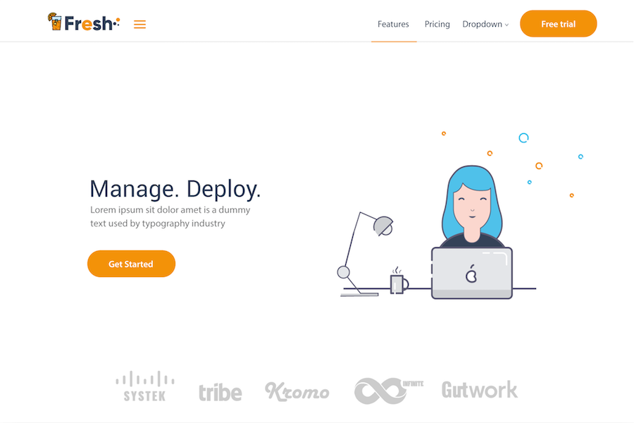

# The Fresh theme for Hugo

**Fresh** is a theme for the [Hugo](https://gohugo.io) static site generator adapted from the gorgeous, [Bulma](https://bulma.io)-based theme of the same name from [CSS Ninja](https://cssninja.io/themes/fresh). You can find a live demo of the original theme [here](https://cssninjastudio.github.io) and a live demo of the Hugo theme [here](https://hugo-fresh.now.sh/).



## Getting started

To create a new site using this theme:

```bash
# Create site and cd into it
hugo new site my-site && cd my-site

# Clone the Fresh theme
git clone https://github.com/StefMa/hugo-fresh themes/hugo-fresh

# Remove the default config
rm config.toml

# Fetch the example config
curl -O https://raw.githubusercontent.com/StefMa/hugo-fresh/master/exampleSite/config.yaml

# Run the site locally
hugo server

# Open the site in your browser
open http://localhost:1313
```

## Customizing your page

### Landing page
There's a wide variety of customizations that you can make to your Hugo Fresh landing page by modifying the `config.yaml` file that you downloaded.

#### navbarlogo
Define the logo of the navigationbar in the upper left corner.

<details>
<summary>Code</summary>

```
navbarlogo:
 image: logos/fresh.svg # Logo (from static/images/logos/)
 link: /
```

</details>

#### font
Set the font of the site.

<details>
<summary>Code</summary>

```
font:
  name: "Open Sans"
  sizes: [400,600]
```

</details>

#### hero
The "main" page which you see when you open the website.

<details>
<summary>Code</summary>
```
hero:
  title: Manage. Deploy.
  subtitle: Lorem ipsum sit dolor amet is dummy text used by the typography industry
  buttontext: Get started
  buttonlink: "#"
  image: illustrations/worker.svg
  # Footer logos (from static/images/logos/clients/*.svg)
  clientlogos:
  - systek
  - tribe
  - kromo
  - infinite
  - gutwork
```

</details>

#### navbar
The navigation bar which is at the top of the site.
For a dropdown, add a "sublinks" list.

<details>
<summary>Code</summary>

```
navbar:
- title: Features
  url: /
- title: Pricing
  url: /
- title: Dropdown
  sublinks:
  - title: Dropdown item
    url: /
  - title: Dropdown item
    url: /
  - title: Dropdown item
    url: /
- title: Log in
  url: /
- title: Sign up
  url: /
  button: true
```

</details>

#### section1
Describes the second "page" which you will see when you scroll down. Currently it will have **always** three `titles`.

<details>
<summary>Code</summary>

```
section1:
  title: Great power comes
  subtitle: with great responsibility
  tiles:
  - title: App builder
    icon: mouse-globe
    text: This is some explanatory text that is on two rows
    url: /
    buttonText: Free trial
  - title: Cloud integration
    icon: laptop-cloud
    text: This is some explanatory text that is on two rows
    url: /
    buttonText: Get started
  - title: Add-ons & plugins
    icon: plug-cloud
    text: This is some explanatory text that is on two rows
    url: /
    buttonText: Get started
```

</details>

#### section2
Shows information why someone should use this product.

<details>
<summary>Code</summary>

```
section2:
  title: You're here because you want the best
  subtitle: And we know it
  features:
  - title: Powerful and unified interface
    text: Lorem ipsum dolor sit amet, consectetur adipiscing elit. Proin ornare magna eros, eu pellentesque tortor vestibulum ut. Maecenas non massa sem. Etiam finibus odio quis feugiat facilisis.
    # Icon (from /images/illustrations/icons/___.svg)
    icon: laptop-globe
  - title: Cross-device synchronisation
    text: Lorem ipsum dolor sit amet, consectetur adipiscing elit. Proin ornare magna eros, eu pellentesque tortor vestibulum ut. Maecenas non massa sem. Etiam finibus odio quis feugiat facilisis.
    icon: doc-sync
  - title: Nomad system
    text: Lorem ipsum dolor sit amet, consectetur adipiscing elit. Proin ornare magna eros, eu pellentesque tortor vestibulum ut. Maecenas non massa sem. Etiam finibus odio quis feugiat facilisis.
    icon: mobile-feed
```

</details>

#### section3
Display a bright image of your product.

<details>
<summary>Code</summary>

```
section3:
  title: One platform
  subtitle: To rule them all
  image: illustrations/mockups/app-mockup.png
  buttonText: Get started
  buttonLink: "#"
```

</details>

#### section4
What clients says about us.

<details>
<summary>Code</summary>

```
section4:
  title: Our Clients love us!
  subtitle: Lorem ipsum sit dolor amet is a dummy text used by typography industry
  clients:
  - name: Irma Walters
    quote: Lorem ipsum dolor sit amet, elit deleniti dissentias quo eu, hinc minim appetere te usu, ea case duis scribentur has. Duo te consequat elaboraret, has quando suavitate at.
    job: Accountant
    img: 1 # From (static/images/illustrations/faces)
  - name: John Bradley
    quote: Lorem ipsum dolor sit amet, elit deleniti dissentias quo eu, hinc minim appetere te usu, ea case duis scribentur has. Duo te consequat elaboraret, has quando suavitate at.
    job: Financial Analyst
    img: 2
  - name: Gary Blackman
    quote: Lorem ipsum dolor sit amet, elit deleniti dissentias quo eu, hinc minim appetere te usu, ea case duis scribentur has. Duo te consequat elaboraret, has quando suavitate at.
    job: HR Manager
    img: 3
```

</details>

#### section5
Write us.

<details>
<summary>Code</summary>

```
section5: true # or false to hide it
```

</details>

#### footer
The footer of the site.

<details>
<summary>Code</summary>

```
footer:
  # Logo (from /staticimages/logos/___)
  logo: fresh-white-alt.svg
  # Social media links (GitHub, Twitter, etc.). All are optional.
  socialmedia:
  - link: https://github.com/lucperkins/github-fresh
    # Icons are from Font Awesome
    icon: github
  - link: https://dribbble.com/#
    icon: dribbble
  - link: https://facebook.com/#
    icon: facebook
  - link: https://twitter.com/lucperkins
    icon: twitter
  - link: https://bitbucket.org/#
    icon: bitbucket
  bulmalogo: true
  quicklinks:
    column1:
      title: "Product"
      links:
      - text: Discover features
        link: /
      - text: Why choose our product?
        link: /
      - text: Compare features
        link: /
      - text: Our roadmap
        link: /
      - text: AGB
        link: /agb
    column2:
      title: "Docs"
      links:
      - text: Get started
        link: /
      - text: User guides
        link: /
      - text: Admin guide
        link: /
      - text: Developers
        link: /
    column3:
      title: "Blog"
      links:
      - text: Latest news
        link: /blog/first
      - text: Tech articles
        link: /blog/second
```

</details>

### Single page
Single pages displays a single unit of information and are more or less independent from the landing page above.

You can create single pages in the `content` directory (even sub-dirs are possible).

If you'd like to have the footer displayed on your single page include "include_footer: true" in your front matter.

<details>
<summary>Code</summary>

```
---
title: AGB
sidebar: true # or false to display the sidebar
sidebarlogo: fresh-white-alt # From (static/images/logo/)
include_footer: true
---
```

</details>

## Troubleshooting

If you see `error: failed to transform resource: TOCSS: failed to transform "style.sass"` when attempting to run your `hugo server`, make sure you have the extended version of Hugo installed!
